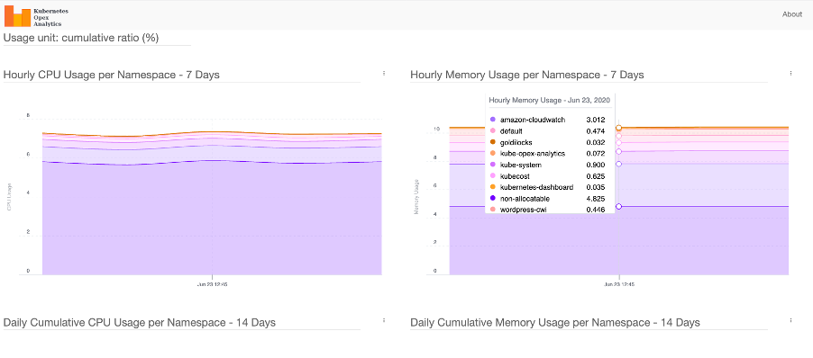

# 支出意识

支出意识是了解在您的 EKS 集群中谁、在哪里以及什么原因导致了支出。获得这些数据的准确情况将有助于提高您对支出的意识，并突出需要补救的领域。

## 建议
### 使用成本资源管理器

[AWS 成本资源管理器](https://aws.amazon.com/aws-cost-management/aws-cost-explorer/)提供了一个易于使用的界面，让您可以随时了解和管理您的 AWS 成本和使用情况。您可以使用成本资源管理器中提供的过滤器，在各个级别分析成本和使用数据。

#### EKS 控制平面和 EKS Fargate 成本

使用过滤器，我们可以查询如下图所示的 EKS 控制平面和 Fargate Pod 产生的成本：


使用过滤器，我们可以查询如下图所示的 EKS 中跨区域 Fargate Pod 产生的总成本 - 包括每 CPU 的 vCPU 小时和 GB 小时：


#### 资源标记

Amazon EKS 支持[为 Amazon EKS 集群添加 AWS 标签](https://docs.aws.amazon.com/eks/latest/userguide/eks-using-tags.html)。这使得控制对 EKS API 的访问以管理集群变得很容易。添加到 EKS 集群的标签仅特定于 AWS EKS 集群资源，它们不会传播到集群使用的其他 AWS 资源，如 EC2 实例或负载均衡器。目前，通过 AWS API、控制台和 SDK 支持为所有新的和现有的 EKS 集群添加集群标记。

AWS Fargate 是一种为容器提供按需、合适大小的计算容量的技术。在您可以在集群中调度 Fargate 上的 Pod 之前，您必须定义至少一个 Fargate 配置文件，该配置文件指定在启动时哪些 Pod 应使用 Fargate。

向 EKS 集群添加和列出标签：
```
$ aws eks tag-resource --resource-arn arn:aws:eks:us-west-2:xxx:cluster/ekscluster1 --tags team=devops,env=staging,bu=cio,costcenter=1234
$ aws eks list-tags-for-resource --resource-arn arn:aws:eks:us-west-2:xxx:cluster/ekscluster1
{
    "tags": {
        "bu": "cio",
        "env": "staging",
        "costcenter": "1234",
        "team": "devops"
    }
}
```
在您在 [AWS 成本资源管理器](https://docs.aws.amazon.com/awsaccountbilling/latest/aboutv2/cost-alloc-tags.html)中激活成本分配标签后，AWS 会使用成本分配标签来组织您的资源成本，以便您更容易在成本分配报告中对 AWS 成本进行分类和跟踪。

标签对 Amazon EKS 没有任何语义含义，并被严格解释为字符串。例如，您可以为 Amazon EKS 集群定义一组标签，以帮助您跟踪每个集群的所有者和堆栈级别。

### 使用 AWS Trusted Advisor

AWS Trusted Advisor 提供了一系列最佳实践检查和建议，涵盖五个类别：成本优化、安全性、容错能力、性能和服务限制。

对于成本优化，Trusted Advisor 有助于消除未使用和空闲的资源，并建议对预留容量进行承诺。对于 Amazon EKS 将有助于的关键操作项包括低利用率 EC2 实例、未关联的弹性 IP 地址、空闲负载均衡器、低利用率 EBS 卷等。完整的检查列表可在 https://aws.amazon.com/premiumsupport/technology/trusted-advisor/best-practice-checklist/ 上找到。

Trusted Advisor 还为 EC2 实例和 Fargate 提供了节省计划和预留实例建议，允许您承诺一致的使用量以换取折扣价格。

!!! 注意
    Trusted Advisor 的建议是通用建议，而不是针对 EKS 的特定建议。

### 使用 Kubernetes 仪表板

***Kubernetes 仪表板***

Kubernetes 仪表板是一个通用的基于 Web 的 Kubernetes 集群 UI，它提供了有关 Kubernetes 集群的信息，包括集群、节点和 Pod 级别的资源使用情况。在 [Amazon EKS 文档](https://docs.aws.amazon.com/eks/latest/userguide/dashboard-tutorial.html)中描述了在 Amazon EKS 集群上部署 Kubernetes 仪表板。

仪表板提供了每个节点和 Pod 的资源使用情况细分，以及有关 Pod、服务、Deployment 和其他 Kubernetes 对象的详细元数据。这些综合信息为您的 Kubernetes 环境提供了可见性。


***kubectl top 和 describe 命令***

使用 kubectl top 和 kubectl describe 命令查看资源使用情况指标。kubectl top 将显示集群中 Pod 或节点的当前 CPU 和内存使用情况，或特定 Pod 或节点的使用情况。kubectl describe 命令将提供有关特定节点或 Pod 的更多详细信息。
```
$ kubectl top pods
$ kubectl top nodes
$ kubectl top pod pod-name --namespace mynamespace --containers
```

使用 top 命令，输出将显示节点正在使用的总 CPU 量(以核心为单位)和内存量(以 MiB 为单位)，以及这些数字占节点可分配容量的百分比。然后，您可以通过添加 *--containers* 标志深入到下一级，即 Pod 内的容器级别。

```
$ kubectl describe node <node>
$ kubectl describe pod <pod>
```

*kubectl describe* 返回每个资源请求或限制所代表的总可用容量的百分比。

kubectl top 和 describe 跟踪 CPU、内存和存储等关键资源在 Kubernetes Pod、节点和容器中的利用率和可用性。这种意识将有助于了解资源使用情况，并有助于控制成本。

### 使用 CloudWatch 容器洞察

使用 [CloudWatch 容器洞察](https://docs.aws.amazon.com/AmazonCloudWatch/latest/monitoring/deploy-container-insights-EKS.html)收集、聚合和汇总来自容器化应用程序和微服务的指标和日志。容器洞察可用于 Amazon Elastic Kubernetes Service on EC2 和 Amazon EC2 上的 Kubernetes 平台。这些指标包括 CPU、内存、磁盘和网络等资源的利用率。

[文档](https://docs.aws.amazon.com/AmazonCloudWatch/latest/monitoring/deploy-container-insights-EKS.html)中给出了洞察的安装方法。

CloudWatch 在集群、节点、Pod、任务和服务级别创建聚合指标作为 CloudWatch 指标。

**以下查询显示了按平均节点 CPU 利用率排序的节点列表**
```
STATS avg(node_cpu_utilization) as avg_node_cpu_utilization by NodeName
| SORT avg_node_cpu_utilization DESC
```

**按容器名称查看 CPU 使用情况**
```
stats pct(container_cpu_usage_total, 50) as CPUPercMedian by kubernetes.container_name
| filter Type="Container"
```
**按容器名称查看磁盘使用情况**
```
stats floor(avg(container_filesystem_usage/1024)) as container_filesystem_usage_avg_kb by InstanceId, kubernetes.container_name, device
| filter Type="ContainerFS"
| sort container_filesystem_usage_avg_kb desc
```

更多示例查询可在 [容器洞察文档](https://docs.aws.amazon.com/AmazonCloudWatch/latest/monitoring/Container-Insights-view-metrics.html)中找到。

这种意识将有助于了解资源使用情况，并有助于控制成本。

### 使用 KubeCost 实现支出意识和指导

像 [kubecost](https://kubecost.com/) 这样的第三方工具也可以部署在 Amazon EKS 上，以获得运行 Kubernetes 集群的成本可见性。请参阅此 [AWS 博客](https://aws.amazon.com/blogs/containers/how-to-track-costs-in-multi-tenant-amazon-eks-clusters-using-kubecost/)以了解使用 Kubecost 跟踪成本的相关信息。

使用 Helm 3 部署 kubecost：
```
$ curl -sSL https://raw.githubusercontent.com/helm/helm/master/scripts/get-helm-3 | bash
$ helm version --short
v3.2.1+gfe51cd1
$ helm repo add stable https://kubernetes-charts.storage.googleapis.com/
$ helm repo add stable https://kubernetes-charts.storage.googleapis.com/c^C
$ kubectl create namespace kubecost
namespace/kubecost created
$ helm repo add kubecost https://kubecost.github.io/cost-analyzer/
"kubecost" has been added to your repositories

$ helm install kubecost kubecost/cost-analyzer --namespace kubecost --set kubecostToken="aGRoZEBqc2pzLmNvbQ==xm343yadf98"
NAME: kubecost
LAST DEPLOYED: Mon May 18 08:49:05 2020
NAMESPACE: kubecost
STATUS: deployed
REVISION: 1
TEST SUITE: None
NOTES:
--------------------------------------------------Kubecost has been successfully installed. When pods are Ready, you can enable port-forwarding with the following command:

    kubectl port-forward --namespace kubecost deployment/kubecost-cost-analyzer 9090

Next, navigate to http://localhost:9090 in a web browser.
$ kubectl port-forward --namespace kubecost deployment/kubecost-cost-analyzer 9090

注意： 如果您使用的是 Cloud 9 或需要将其转发到其他端口(如 8080)，请发出以下命令
$ kubectl port-forward --namespace kubecost deployment/kubecost-cost-analyzer 8080:9090

```
Kube Cost 仪表板 -


### 使用 Kubernetes 成本分配和容量规划分析工具

[Kubernetes Opex Analytics](https://github.com/rchakode/kube-opex-analytics) 是一个帮助组织跟踪 Kubernetes 集群消耗的资源的工具，以防止支付过多费用。为此，它生成短期(7 天)、中期(14 天)和长期(12 个月)使用报告，显示每个项目随时间的相关支出情况。



### Magalix Kubeadvisor

[KubeAdvisor](https://www.magalix.com/kubeadvisor) 持续扫描您的 Kubernetes 集群，并报告如何修复问题、应用最佳实践以及优化集群(包括围绕成本效率的 CPU/内存资源建议)。

### Spot.io(以前称为 Spotinst)

Spotinst Ocean 是一种应用程序扩缩服务。与 Amazon Elastic Compute Cloud (Amazon EC2) 自动扩缩组类似，Spotinst Ocean 旨在通过利用 Spot 实例结合按需实例和预留实例来优化性能和成本。使用自动化 Spot 实例管理和各种实例大小的组合，Ocean 集群自动扩缩器根据 Pod 资源需求进行扩缩。Spotinst Ocean 还包括一种预测算法，可以提前 15 分钟预测 Spot 实例中断，并在不同的 Spot 容量池中启动新节点。

这是由 Spotinst， Inc. 与 AWS 合作开发的 [AWS Quickstart](https://aws.amazon.com/quickstart/architecture/spotinst-ocean-eks/)。

EKS 研讨会还有一个关于 [使用 Ocean by Spot.io 优化 Amazon EKS 上的工作节点管理](https://eksworkshop.com/beginner/190_ocean/)的模块，其中包括成本分配、正确调整大小和扩缩策略等部分。

### Yotascale

Yotascale 有助于准确分配 Kubernetes 成本。Yotascale Kubernetes 成本分配功能利用实际成本数据(包括预留实例折扣和 Spot 实例定价)，而不是通用的市场价格估算，来通知总 Kubernetes 成本支出。

更多详细信息可在 [他们的网站](https://www.yotascale.com/) 上找到。

### Alcide Advisor

Alcide 是 AWS 合作伙伴网络 (APN) 的高级技术合作伙伴。Alcide Advisor 有助于确保您的 Amazon EKS 集群、节点和 Pod 配置根据安全最佳实践和内部指南进行调整。Alcide Advisor 是一种无代理的 Kubernetes 审计和合规性服务，旨在通过在转移到生产环境之前加固开发阶段，确保无摩擦和安全的 DevSecOps 流程。

更多详细信息可在此 [博客文章](https://aws.amazon.com/blogs/apn/driving-continuous-security-and-configuration-checks-for-amazon-eks-with-alcide-advisor/)中找到。

## 其他工具

### Kubernetes 垃圾收集

[Kubernetes 垃圾收集器](https://kubernetes.io/docs/concepts/worklo ads/controllers/garbage-collection/)的作用是删除某些曾经有所有者但现在没有所有者的对象。

### Fargate count

[Fargatecount](https://github.com/mreferre/fargatecount) 是一个有用的工具，它允许 AWS 客户使用自定义 CloudWatch 指标跟踪在特定区域的特定账户中部署在 Fargate 上的 EKS Pod 总数。这有助于跟踪跨 EKS 集群运行的所有 Fargate Pod。

### Kubernetes Ops View

[Kube Ops View](https://github.com/hjacobs/kube-ops-view) 是一个有用的工具，它为多个 Kubernetes 集群提供了一个通用的可视化操作图。

```
git clone https://github.com/hjacobs/kube-ops-view
cd kube-ops-view
kubectl apply -k deploy/
```


### Popeye - 一个 Kubernetes 集群清理工具

[Popeye - 一个 Kubernetes 集群清理工具](https://github.com/derailed/popeye)是一个实用程序，它扫描实时 Kubernetes 集群并报告已部署资源和配置中的潜在问题。它根据部署的内容而不是磁盘上的内容来清理您的集群。通过扫描您的集群，它可以检测到错误配置，并帮助您确保最佳实践得到落实。

### 资源
参考以下资源，了解有关成本优化最佳实践的更多信息。

文档和博客
+ [Amazon EKS 支持标记](https://docs.aws.amazon.com/eks/latest/userguide/eks-using-tags.html)

工具
+ [什么是 AWS Billing and Cost Management？](https://docs.aws.amazon.com/awsaccountbilling/latest/aboutv2/cost-alloc-tags.html)
+ [Amazon CloudWatch 容器洞察](https://docs.aws.amazon.com/AmazonCloudWatch/latest/monitoring/ContainerInsights.html)
+ [如何使用 Kubecost 跟踪多租户 Amazon EKS 集群中的成本](https://aws.amazon.com/blogs/containers/how-to-track-costs-in-multi-tenant-amazon-eks-clusters-using-kubecost/)
+ [Kube Cost](https://kubecost.com/)
+ [Kube Opsview](https://github.com/hjacobs/kube-ops-view)
+ [Kube Janitor](https://github.com/hjacobs/kube-janitor)
+ [Kubernetes Opex Analytics](https://github.com/rchakode/kube-opex-analytics)