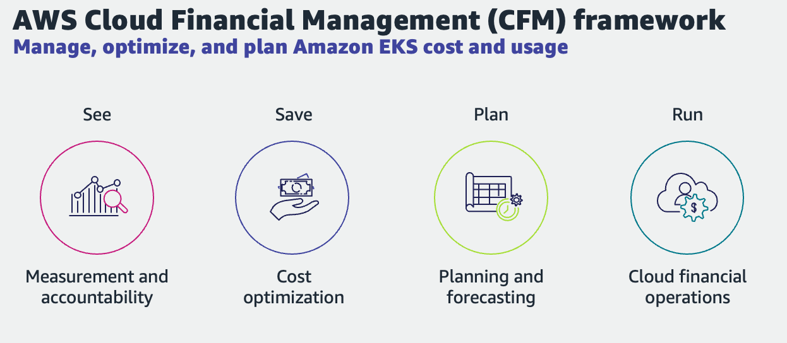
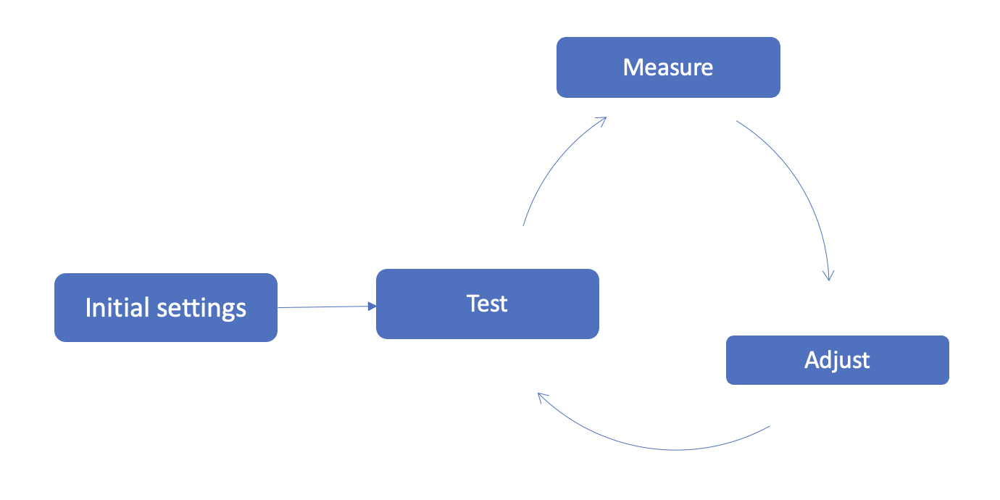

# 비용 최적화 - 소개
AWS 클라우드 이코노믹스(Economics)는 고객이 Amazon EKS와 같은 최신 컴퓨팅 기술을 채택하여 효율성을 높이고 비용을 절감할 수 있도록 지원하는 분야입니다. 이 분야에서는 4가지 기반원칙(Pillar)으로 구성된 "클라우드 재무 관리(CFM) 프레임워크"라는 방법론을 따르는 것을 권장합니다. 

## See 원칙: 측정 및 책임
See 원칙는 클라우드 지출을 측정, 모니터링 및 결정하는 방법을 정의하는 기본 활동 및 기술 세트입니다. 이를 흔히 "옵저버빌리티", "계측" 또는 "텔레메트리"라고 합니다. "옵저버빌리티" 인프라의 기능 및 한계에 따라 최적화할 수 있는 항목이 결정됩니다. 어디서부터 시작해야 하는지를 알아야 하므로 비용을 명확하게 파악하는 것이 비용 최적화의 중요한 첫 단계입니다. 이러한 유형의 가시성은 환경을 더욱 최적화하기 위해 수행해야 하는 활동 유형을 안내하기도 합니다.  

다음은 See 기둥의 모범 사례에 대한 간략한 개요입니다.

* 워크로드에 대한 태깅 전략을 정의하고 유지 관리합니다. 
    * [인스턴스 태깅](https://docs.aws.amazon.com/eks/latest/userguide/eks-using-tags.html#tag-resources-for-billing) 을 사용하면 EKS 클러스터에 태그를 지정하여 개별 클러스터 비용을 확인하고 비용 및 사용 보고서에 비용을 할당할 수 있습니다. 
* [Kubecost](https://docs.kubecost.com/install-and-configure/install/provider-installations/aws-eks-cost-monitoring) 와 같은 기술을 사용하여 EKS 사용에 대한 보고 및 모니터링을 설정합니다. 
    * [클라우드 인텔리전스 대시보드 활성화](https://wellarchitectedlabs.com/cost/200_labs/200_enterprise_dashboards/), 리소스에 적절한 태그를 지정하고 시각화를 사용하여 비용을 측정하고 추정할 수 있습니다.
* 애플리케이션, LOB(Line of Business) 및 수입원 워크로드 등에 클라우드 비용을 할당합니다.
* 효율성/가치 KPI를 정의, 측정하고 비즈니스 이해 관계자와 함께 공유합니다. 예를 들어 거래당 비용을 측정하는 "단위 지표" KPI를 만들 수 있습니다. 예를 들어, 차량 공유 서비스에는 "승차 당 비용"에 대한 KPI가 있을 수 있습니다.  

이 기반원칙과 관련된 권장 기술 및 활동에 대한 자세한 내용은 이 가이드의 [비용 최적화 - 옵저버빌리티](./cost_opt_observability.md) 섹션을 참조하십시오. 

## Save 원칙: 비용 최적화

이 기반원칙은 "See" 기반원칙에서 개발된 기술과 역량을 기반으로 합니다.일반적으로 다음과 같은 활동이 이 기반원칙에 속합니다. 

* 환경에서 불필요한 부분을 식별하고 제거하세요. 
* 비용 효율성을 위한 아키텍쳐를 구성하고 디자인하세요.
* 최적의 구매 옵션(예: 온디맨드 인스턴스와 스팟 인스턴스)을 선택하세요.
* 서비스가 발전함에 따라 (또는 AWS 서비스가 발전함에 따라) 서비스를 효율적으로 사용하는 방법도 달라질 수 있습니다. 이러한 변화에 맞춰 적극적으로 적용하세요. 

이러한 활동은 운영되므로 환경의 특성에 따라 크게 달라집니다. 비용의 주요 동인은 무엇인지 스스로 자문해 보세요. 다양한 환경이 제공하는 비즈니스 가치는 무엇입니까? 각 환경에 가장 적합한 구매 옵션과 인프라(예: 인스턴스 패밀리 유형)는 무엇입니까?  

다음은 EKS 클러스터에서 가장 일반적으로 비용을 유발하는 목록 순위입니다.

1. **컴퓨팅 비용:** 여러 유형의 인스턴스 패밀리, 구매 옵션을 결합하고 확장성과 가용성의 균형을 맞추려면 신중한 고려가 필요합니다. 자세한 내용은 이 가이드의 [비용 최적화 - 컴퓨팅](./cost_opt_compute.md) 섹션을 참조합니다. 
2. **네트워킹 비용:** EKS 클러스터에 3개의 AZ를 사용하면 잠재적으로 AZ 간 트래픽 비용이 증가할 수 있습니다. HA 요구 사항과 네트워크 트래픽 비용 절감의 균형을 맞추는 방법에 대한 권장 사항은 이 가이드의 [비용 최적화 - 네트워킹](./cost_opt_networking.md) 섹션을 참조합니다.
3. **스토리지 비용:** EKS 클러스터의 워크로드 스테이트풀/스테이트리스(Stateless) 워크로드 특성과 다양한 스토리지 유형이 사용되는 방식에 따라 스토리지는 워크로드의 일부로 간주될 수 있습니다. EKS 스토리지 비용과 관련된 고려 사항은 이 가이드의 [비용 최적화 - 스토리지](./cost_opt_storage.md) 섹션을 참조합니다.

## Plan 원칙: 플래닝 및 예측

See 기반원칙의 권장 사항이 구현되면 클러스터는 지속적으로 최적화됩니다. 클러스터를 효율적으로 운영해 본 경험이 쌓이면 계획 및 예측 활동은 다음 사항에 집중할 수 있습니다.

* 동적으로 클라우드 비용의 예산을 책정하고 예측합니다. 
* EKS 컨테이너 서비스가 제공하는 비즈니스 가치를 정량화합니다.
* EKS 클러스터 비용 관리를 IT 재무 관리 계획과 통합합니다.

## Run 원칙 

비용 최적화는 지속적인 프로세스이며 점진적인 개선이 수반됩니다. 

이러한 유형의 활동에 대한 경영진 후원을 확보하는 것은 EKS 클러스터 최적화를 조직의 "FinOps" 노력에 통합하는 데 매우 중요합니다. 이를 통해 EKS 클러스터 비용에 대한 이해를 공유하고, EKS 클러스터 비용 가드레일을 구현하고, 도구, 자동화 및 활동이 조직의 요구에 맞게 발전하도록 함으로써 이해 관계자를 조정할 수 있습니다. 

## 참고 자료
* [AWS Cloud Economics, Cloud Financial Management](https://aws.amazon.com/aws-cost-management/)

