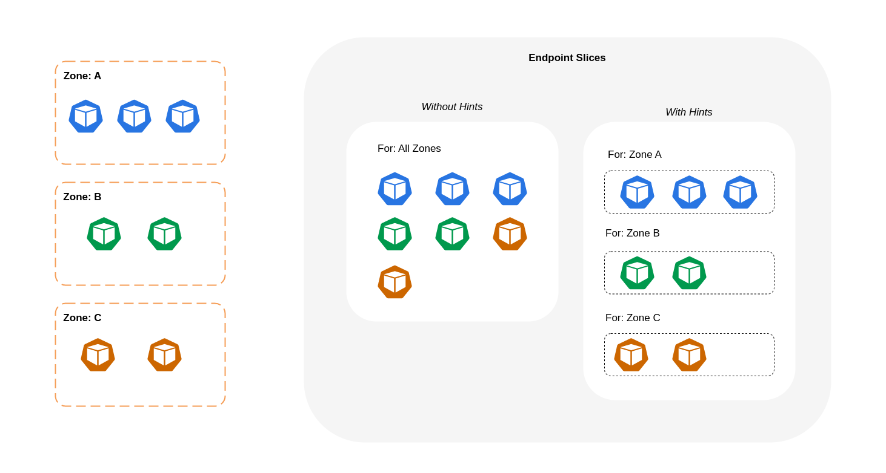
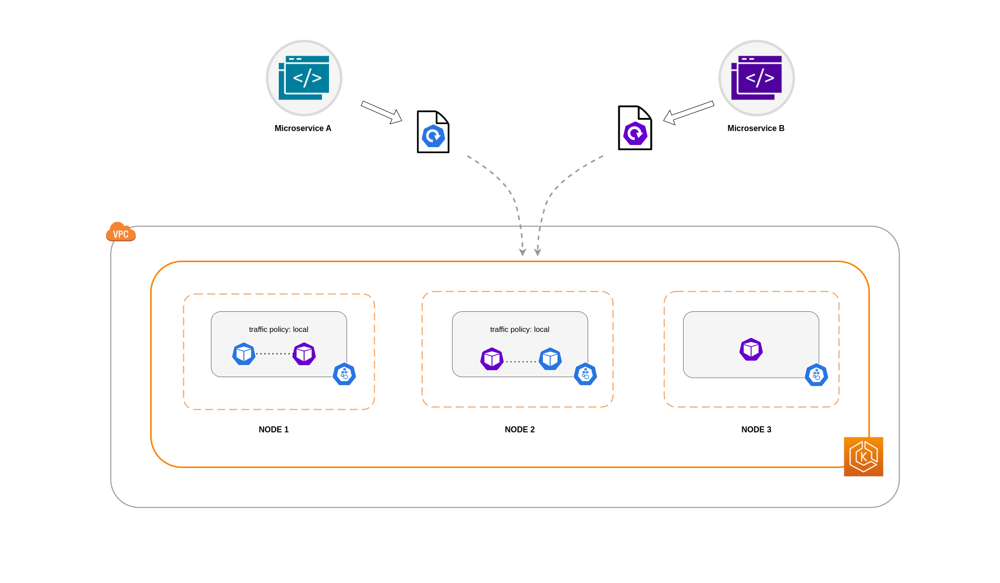
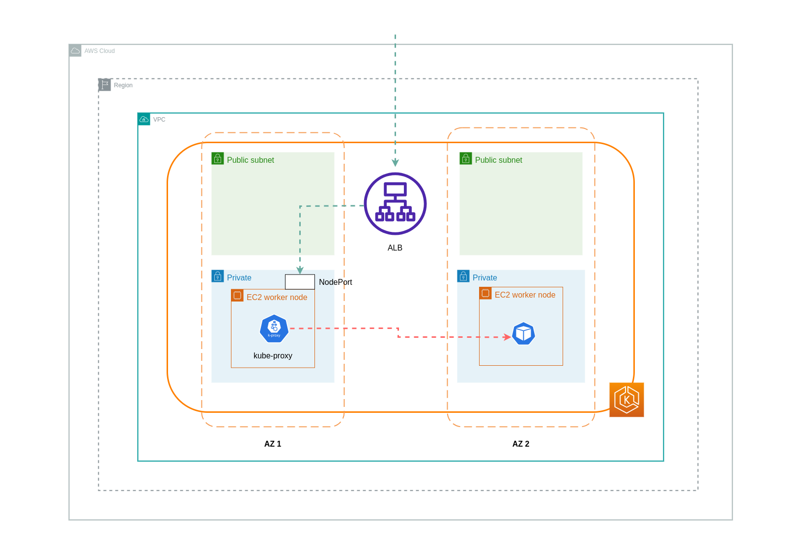
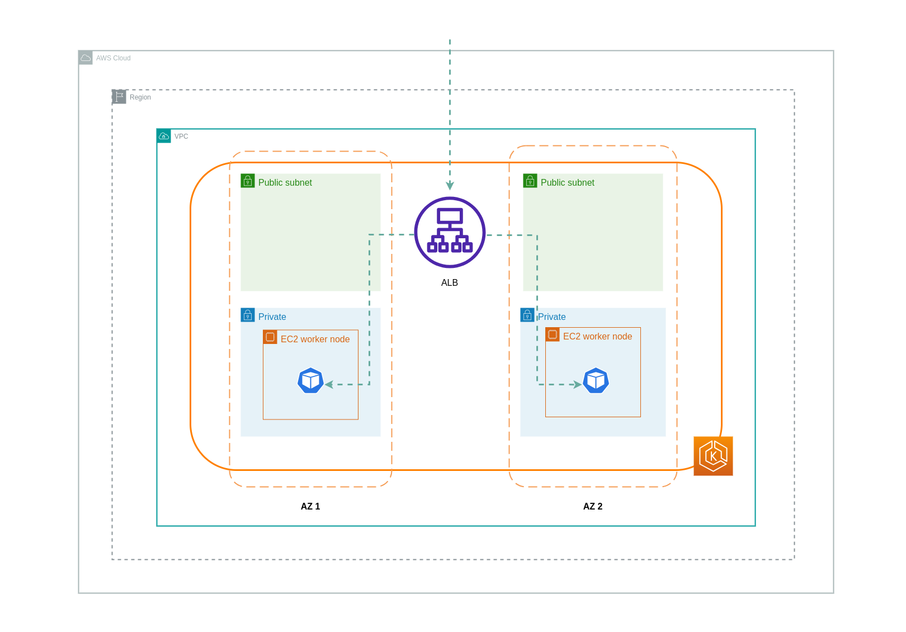
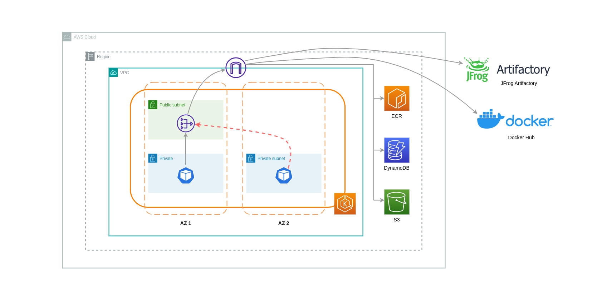
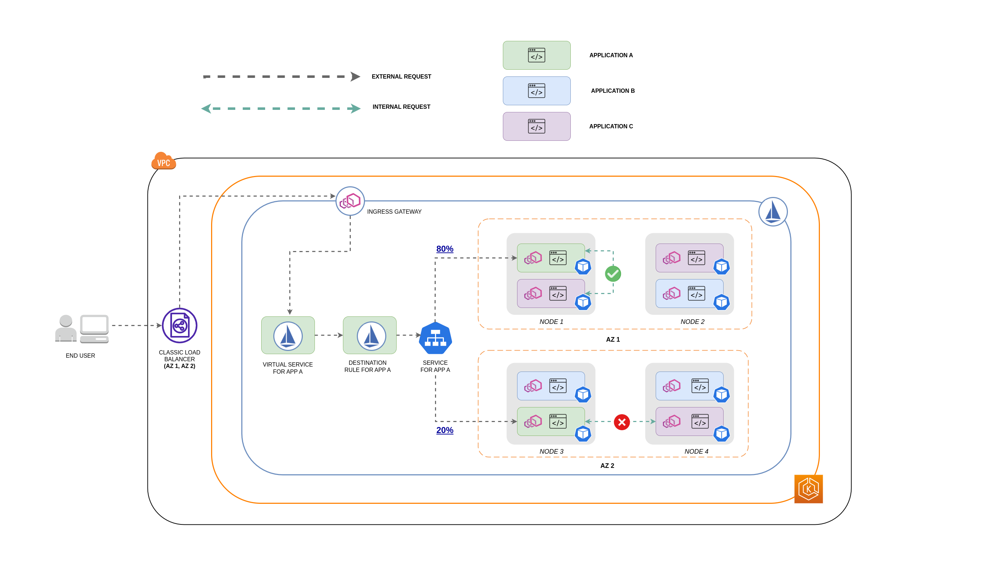
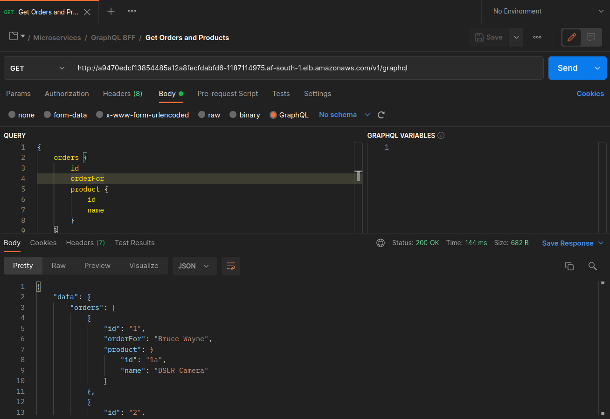
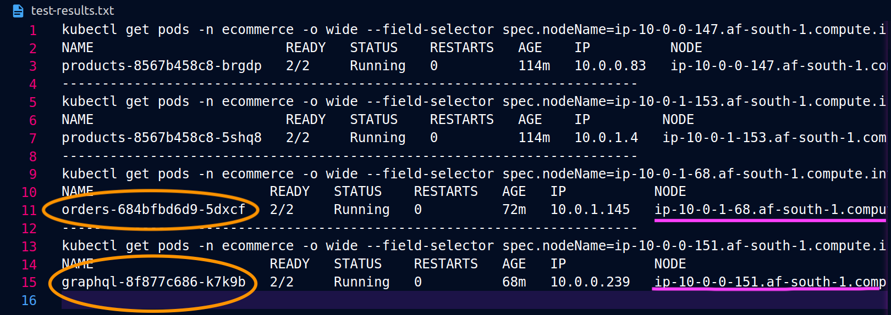
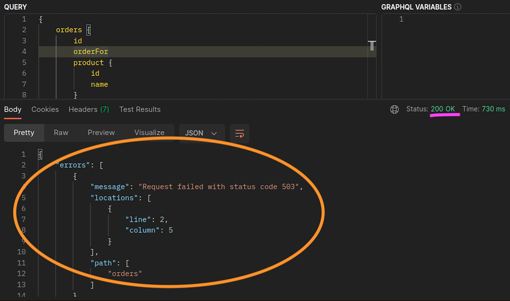

# 비용 최적화 - 네트워킹

고가용성(HA)을 위한 시스템 아키텍처는 복원력과 내결함성을 달성하기 위한 모범 사례를 통해 구현됩니다. 이는 특정 AWS 리전의 여러 가용영역(AZ)에 워크로드와 기본 인프라를 분산시키는 것을 의미합니다. Amazon EKS 환경에 이러한 특성을 적용하면 시스템의 전반적인 안정성이 향상됩니다. 이와 함께 EKS 환경은 다양한 구조(예: VPC), 구성 요소(예: ELB) 및 통합(예: ECR 및 기타 컨테이너 레지스트리)으로 구성될 가능성이 높습니다. 

고가용성 시스템과 기타 사용 사례별 구성 요소의 조합은 데이터 전송 및 처리 방식에 중요한 역할을 할 수 있습니다.이는 결국 데이터 전송 및 처리로 인해 발생하는 비용에도 영향을 미칩니다. 

아래에 자세히 설명된 실천사항은 다양한 도메인 및 사용 사례에서 비용 효율성을 달성하기 위해 EKS 환경을 설계하고 최적화하는 데 도움이 됩니다.


## 파드 간 통신

설정에 따라 파드 간 네트워크 통신 및 데이터 전송은 Amazon EKS 워크로드 실행의 전체 비용에 상당한 영향을 미칠 수 있습니다.이 섹션에서는 고가용성 (HA) 아키텍처, 애플리케이션 성능 및 복원력을 고려하면서 파드 간 통신과 관련된 비용을 줄이기 위한 다양한 개념과 접근 방식을 다룹니다. 

### 가용영역으로의 트래픽 제한

잦은 이그레스 크로스존 트래픽(AZ 간에 분산되는 트래픽)은 네트워크 관련 비용에 큰 영향을 미칠 수 있습니다. 다음은 EKS 클러스터의 파드 간 크로스 존 트래픽 양을 제어하는 방법에 대한 몇 가지 전략입니다. 

_클러스터 내 파드 간 크로스-존 트래픽 양(예: 전송된 데이터 양 또는 바이트 단위 전송)을 세밀하게 파악하려면 [이 게시물 참조](https://aws.amazon.com/blogs/containers/getting-visibility-into-your-amazon-eks-cross-az-pod-to-pod-network-bytes/)하세요._

**Topology Aware Routing (이전 명칭은 Topology Aware Hint) 활용**


Topology Aware Routing을 사용할 때는 트래픽을 라우팅할 때 서비스, EndpointSlices 및 `kube-proxy`가 함께 작동하는 방식을 이해하는 것이 중요합니다. 위 다이어그램에서 볼 수 있듯이 서비스는 파드로 향하는 트래픽을 수신하는 안정적인 네트워크 추상화 계층입니다. 서비스가 생성되면 여러 EndpointSlices가 생성됩니다. 각 EndpointSlice에는 실행 중인 노드 및 추가 토폴로지 정보와 함께 파드 주소의 하위 집합이 포함된 엔드포인트 목록이 있습니다. `kube-proxy`는 클러스터의 모든 노드에서 실행되고 내부 라우팅 역할도 수행하는 데몬셋이지만, 생성된 EndpointSlices에서 소비하는 양을 기반으로 합니다.

[*Topology aware routing*](https://kubernetes.io/docs/concepts/services-networking/topology-aware-routing/)을 활성화하고 쿠버네티스 서비스에 구현하면, EndpointSlices 컨트롤러는 클러스터가 분산되어 있는 여러 영역에 비례적으로 엔드포인트를 할당합니다. EndpointSlices 컨트롤러는 각 엔드포인트에 대해 영역에 대한 _힌트_도 설정합니다. _힌트_는 엔드포인트가 트래픽을 처리해야 하는 영역을 설명합니다.그러면 `kube-proxy`가 적용된 _힌트_를 기반으로 영역에서 엔드포인트로 트래픽을 라우팅합니다. 

아래 다이어그램은 'kube-proxy'가 영역 출발지를 기반으로 가야 할 목적지를 알 수 있도록 힌트가 있는 EndpointSlice를 구성하는 방법을 보여줍니다. 힌트가 없으면 이러한 할당이나 구성이 없으며 트래픽이 어디에서 오는지에 관계없이 서로 다른 지역 목적지로 프록시됩니다. 



경우에 따라 EndPointSlice 컨트롤러는 다른 영역에 대해 _힌트_를 적용할 수 있습니다. 즉, 엔드포인트가 다른 영역에서 발생하는 트래픽을 처리하게 될 수 있습니다. 이렇게 하는 이유는 서로 다른 영역의 엔드포인트 간에 트래픽을 균일하게 분배하기 위함입니다.

다음은 서비스에 대해 _Topology Aware Routing_을 활성화하는 방법에 대한 코드 스니펫입니다. 

```yaml hl_lines="6-7"
apiVersion: v1
kind: Service
metadata:
  name: orders-service
  namespace: ecommerce
    annotations:
      service.kubernetes.io/topology-mode: Auto
spec:
  selector:
    app: orders
  type: ClusterIP
  ports:
  - protocol: TCP
    port: 3003
    targetPort: 3003
```

아래 스크린샷은 EndpointSlices 컨트롤러가 `eu-west-1a`가용영역에서 실행되는 파드 복제본의 엔드포인트에 힌트를 성공적으로 적용한 결과를 보여준다. 


!!! note
    Topology aware routing이 아직 **베타**라는 것 인지해야 합니다. 또한 워크로드가 클러스터 토폴로지 전체에 광범위하고 균등하게 분산되어 있을 때 이 기능을 더 잘 예측할 수 있습니다. 따라서 [파드 토폴로지 확산 제약](https://kubernetes.io/docs/concepts/scheduling-eviction/topology-spread-constraints/)과 같이 애플리케이션의 가용성을 높이는 일정 제약과 함께 사용하는 것이 좋습니다.

**오토스케일러 사용: 특정 가용영역에 노드 프로비저닝**

여러 가용영역의 고가용성 환경에서 워크로드를 실행하는 것을 _강력히 권장_합니다. 이렇게 하면 애플리케이션의 안정성이 향상되며, 특히 가용영역에 문제가 발생한 경우 더욱 그렇습니다. 네트워크 관련 비용을 줄이기 위해 안정성을 희생하려는 경우 노드를 단일 가용영역로 제한할 수 있습니다. 

동일한 가용영역에서 모든 파드를 실행하려면 동일한 가용영역에 워커 노드를 프로비저닝하거나 동일한 가용영역에서 실행되는 워커 노드에 파드를 스케줄링해야 합니다. 단일 가용영역 내에서 노드를 프로비저닝하려면 [Cluster Autoscaler (CA)](https://github.com/kubernetes/autoscaler/tree/master/cluster-autoscaler)를 사용하여 동일한 가용영역에 속하는 서브넷으로 노드 그룹을 정의하십시오. [Karpenter](https://karpenter.sh/)의 경우 "[_topology.kubernetes.io/zone"_](http://topology.kubernetes.io/zone%E2%80%9D)을 사용하고 워커 노드를 만들려는 가용영역를 지정합니다. 예를 들어 아래 카펜터 프로비저닝 스니펫은 us-west-2a 가용영역의 노드를 프로비저닝합니다.

**Karpenter**

```yaml hl_lines="5-9"
apiVersion: karpenter.sh/v1alpha5
kind: Provisioner
metadata:
name: single-az
spec:
  requirements:
  - key: "topology.kubernetes.io/zone"
    operator: In
    values: ["us-west-2a"]
```

**Cluster Autoscaler (CA)**

```yaml hl_lines="7-8"
apiVersion: eksctl.io/v1alpha5
kind: ClusterConfig
metadata:
  name: my-ca-cluster
  region: us-east-1
  version: "1.21"
availabilityZones:
- us-east-1a
managedNodeGroups:
- name: managed-nodes
  labels:
    role: managed-nodes
  instanceType: t3.medium
  minSize: 1
  maxSize: 10
  desiredCapacity: 1
...
```

**파드 할당 및 노드 어피니티 사용**

또는 여러 가용영역에서 실행되는 워커 노드가 있는 경우 각 노드에는 가용영역 값(예: us-west-2a 또는 us-west-2b)과 함께 _[topology.kubernetes.io/zone](http://topology.kubernetes.io/zone%E2%80%9D)_ 레이블이 붙습니다.`nodeSelector` 또는 `nodeAffinity`를 활용하여 단일 가용영역의 노드에 파드를 스케줄링할 수 있습니다. 예를 들어, 다음 매니페스트 파일은 가용영역 us-west-2a에서 실행되는 노드 내에서 파드를 스케줄링한다.

```yaml hl_lines="7-9"
apiVersion: v1
kind: Pod
metadata:
  name: nginx
  labels:
    env: test
spec:
  nodeSelector:
    topology.kubernetes.io/zone: us-west-2a
  containers:
  - name: nginx
    image: nginx 
    imagePullPolicy: IfNotPresent
```

### 노드로의 트래픽 제한

There are cases where restricting traffic at a zonal level isn’t sufficient. Apart from reducing costs, you may have the added requirement of reducing network latency between certain applications that have frequent inter-communication. In order to achieve optimal network performance and reduce costs, you need a way to restrict traffic to a specific node. For example, Microservice A should always talk to Microservice B on Node 1, even in highly available (HA) setups. Having Microservice A on Node 1 talk to Microservice B on Node 2 may have a negative impact on the desired performance for applications of this nature, especially if Node 2 is in a separate AZ altogether. 

**Using the Service Internal Traffic Policy**

In order to restrict Pod network traffic to a node, you can make use of the _[Service internal traffic policy](https://kubernetes.io/docs/concepts/services-networking/service-traffic-policy/)_. By default, traffic sent to a workload’s Service will be randomly distributed across the different generated endpoints. So in a HA architecture, that means traffic from Microservice A could go to any replica of Microservice B on any given node across the different AZs. However, with the Service's internal traffic policy set to `Local`, traffic will be restricted to endpoints on the node that the traffic originated from. This policy dictates the exclusive use of node-local endpoints. By implication, your network traffic-related costs for that workload will be lower than if the distribution was cluster wide. Also, the latency will be lower, making your application more performant. 

!!! note
    It’s important to note that this feature cannot be combined with topology aware routing in Kubernetes.


Below is a code snippet on how to set the _internal traffic policy_ for a Service. 


```yaml hl_lines="14"
apiVersion: v1
kind: Service
metadata:
  name: orders-service
  namespace: ecommerce
spec:
  selector:
    app: orders
  type: ClusterIP
  ports:
  - protocol: TCP
    port: 3003
    targetPort: 3003
  internalTrafficPolicy: Local
```

To avoid unexpected behaviour from your application due to traffic drops, you should consider the following approaches:

* Run enough replicas for each of the communicating Pods
* Have a relatively even spread of Pods using [topology spread constraints](https://kubernetes.io/docs/concepts/scheduling-eviction/topology-spread-constraints/)
* Make use of [pod-affinity rules](https://kubernetes.io/docs/concepts/scheduling-eviction/assign-pod-node/#inter-pod-affinity-and-anti-affinity) for co-location of communicating Pods

In this example, you have 2 replicas of Microservice A and 3 replicas of Microservice B. If Microservice A has its replicas spread between Nodes 1 and 2, and Microservice B has all 3 of its replicas on Node 3, then they won't be able to communicate because of the `Local` internal traffic policy. When there are no available node-local endpoints the traffic is dropped. 


If Microservice B does have 2 of its 3 replicas on Nodes 1 and 2, then there will be communication between the peer applications. But you would still have an isolated replica of Microservice B without any peer replica to communicate with. 



!!! note
    In some scenarios, an isolated replica like the one depicted in the above diagram may not be a cause for concern if it still serves a purpose (such as serving requests from external incoming traffic).

**Using the Service Internal Traffic Policy with Topology Spread Constraints**

Using the _internal traffic policy_ in conjunction with _topology spread constraints_ can be useful to ensure that you have the right number of replicas for communicating microservices on different nodes. 


```yaml hl_lines="16-22"
apiVersion: apps/v1
kind: Deployment
metadata:
  name: express-test
spec:
  replicas: 6
  selector:
    matchLabels:
      app: express-test
  template:
    metadata:
      labels:
        app: express-test
        tier: backend
    spec:
      topologySpreadConstraints:
      - maxSkew: 1
        topologyKey: "topology.kubernetes.io/zone"
        whenUnsatisfiable: ScheduleAnyway
        labelSelector:
          matchLabels:
            app: express-test
```

**Using the Service Internal Traffic Policy with Pod Affinity Rules**

Another approach is to make use of Pod affinity rules when using the Service internal traffic policy. With Pod affinity, you can influence the scheduler to co-locate certain Pods because of their frequent communication. By applying strict scheduling constraints (`requiredDuringSchedulingIgnoredDuringExecution`) on certain Pods, this will give you better results for Pod co-location when the Scheduler is placing Pods on nodes.

```yaml hl_lines="11-20"
apiVersion: apps/v1
kind: Deployment
metadata:
  name: graphql
  namespace: ecommerce
  labels:
    app.kubernetes.io/version: "0.1.6"
    ...
    spec:
      serviceAccountName: graphql-service-account
      affinity:
        podAffinity:
          requiredDuringSchedulingIgnoredDuringExecution:
          - labelSelector:
              matchExpressions:
              - key: app
                operator: In
                values:
                - orders
            topologyKey: "kubernetes.io/hostname"
```

## Load Balancer to Pod Communication

EKS workloads are typically fronted by a load balancer that distributes traffic to the relevant Pods in your EKS cluster. Your architecture may comprise internal and/or external facing load balancers. Depending on your architecture and network traffic configurations, the communication between load balancers and Pods can contribute a significant amount to data transfer charges.

You can use the [AWS Load Balancer Controller](https://kubernetes-sigs.github.io/aws-load-balancer-controller) to automatically manage the creation of ELB resources (ALB and NLB). The data transfer charges you incur in such setups will depend on the path taken by the network traffic. The AWS Load Balancer Controller supports two network traffic modes, _instance mode_, and _ip mode_.

When using _instance mode_, a NodePort will be opened on each node in your EKS cluster. The load balancer will then proxy traffic evenly across the nodes. If a node has the destination Pod running on it, then there will be no data transfer costs incurred. However, if the destination Pod is on a separate node and in a different AZ than the NodePort receiving the traffic, then there will be an extra network hop from the kube-proxy to the destination Pod. In such a scenario, there will be cross-AZ data transfer charges. Because of the even distribution of traffic across the nodes, it is highly likely that there will be additional data transfer charges associated with cross-zone network traffic hops from kube-proxies to the relevant destination Pods.

The diagram below depicts a network path for traffic flowing from the load balancer to the NodePort, and subsequently from the `kube-proxy` to the destination Pod on a separate node in a different AZ. This is an example of the _instance mode_ setting. 



When using _ip mode_, network traffic is proxied from the load balancer directly to the destination Pod. As a result, there are _no data transfer charges_ involved in this approach. 

!!! tip
    It is recommended that you set your load balancer to _ip traffic mode_ to reduce data transfer charges. For this setup, it’s also important to make sure that your load balancer is deployed across all the subnets in your VPC. 

The diagram below depicts network paths for traffic flowing from the load balancer to Pods in the network _ip mode_. 



## Data Transfer from Container Registry

### Amazon ECR

Data transfer into the Amazon ECR private registry is free. _In-region data transfer incurs no cost_, but data transfer out to the internet and across regions will be charged at Internet Data Transfer rates on both sides of the transfer. 

You should utilize ECRs built-in[image replication](https://docs.aws.amazon.com/AmazonECR/latest/userguide/replication.html)[feature](https://docs.aws.amazon.com/AmazonECR/latest/userguide/replication.html) to replicate the relevant container images into the same region as your workloads. This way the replication would be charged once, and all the same region (intra-region) image pulls would be free.

You can further reduce data transfer costs associated with pulling images from ECR (data transfer out) by _using [Interface VPC Endpoints](https://docs.aws.amazon.com/whitepapers/latest/aws-privatelink/what-are-vpc-endpoints.html) to connect to the in-region ECR repositories_. The alternative approach of connecting to ECR’s public AWS endpoint (via a NAT Gateway and an Internet Gateway) will incur higher data processing and transfer costs. The next section will cover reducing data transfer costs between your workloads and AWS Services in greater detail. 

If you’re running workloads with especially large images, you can build your own custom Amazon Machine Images (AMIs) with pre-cached container images. This can reduce the initial image pull time and potential data transfer costs from a container registry to the EKS worker nodes. 


## Data Transfer to Internet & AWS Services

It's a common practice to integrate Kubernetes workloads with other AWS services or third-party tools and platforms via the Internet. The underlying network infrastructure used to route traffic to and from the relevant destination can impact the costs incurred in the data transfer process.

### Using NAT Gateways

NAT Gateways are network components that perform network address translation (NAT). The diagram below depicts Pods in an EKS cluster communicating with other AWS services (Amazon ECR, DynamoDB, and S3), and third-party platforms. In this example, the Pods are running in private subnets in separate AZs. To send and receive traffic from the Internet, a NAT Gateway is deployed to the public subnet of one AZ, allowing any resources with private IP addresses to share a single public IP address to access the Internet. This NAT Gateway in turn communicates with the Internet Gateway component, allowing for packets to be sent to their final destination.



When using NAT Gateways for such use cases, _you can minimize the data transfer costs by deploying a NAT Gateway in each AZ_. This way, traffic routed to the Internet will go through the NAT Gateway in the same AZ, avoiding inter-AZ data transfer. However, even though you’ll save on the cost of inter-AZ data transfer, the implication of this setup is that you’ll incur the cost of an additional NAT Gateway in your architecture. 

This recommended approach is depicted in the diagram below.


### Using VPC Endpoints

To further reduce costs in such architectures, _you should use [VPC Endpoints](https://docs.aws.amazon.com/whitepapers/latest/aws-privatelink/what-are-vpc-endpoints.html) to establish connectivity between your workloads and AWS services_. VPC Endpoints allow you to access AWS services from within a VPC without data/network packets traversing the Internet. All traffic is internal and stays within the AWS network. There are two types of VPC Endpoints: Interface VPC Endpoints ([supported by many AWS services](https://docs.aws.amazon.com/vpc/latest/privatelink/aws-services-privatelink-support.html)) and Gateway VPC Endpoints (only supported by S3 and DynamoDB).

**Gateway VPC Endpoints**

_There are no hourly or data transfer costs associated with Gateway VPC Endpoints_. When using Gateway VPC Endpoints, it's important to note that they are not extendable across VPC boundaries. They can't be used in VPC peering, VPN networking, or via Direct Connect.

**Interface VPC Endpoint**

VPC Endpoints have an [hourly charge](https://aws.amazon.com/privatelink/pricing/) and, depending on the AWS service, may or may not have an additional charge associated with data processing via the underlying ENI. To reduce inter-AZ data transfer costs related to Interface VPC Endpoints, you can create a VPC Endpoint in each AZ. You can create multiple VPC Endpoints in the same VPC even if they're pointing to the same AWS service.

The diagram below shows Pods communicating with AWS services via VPC Endpoints.


## Data Transfer between VPCs

In some cases, you may have workloads in distinct VPCs (within the same AWS region) that need to communicate with each other. This can be accomplished by allowing traffic to traverse the public internet through Internet Gateways attached to the respective VPCs. Such communication can be enabled by deploying infrastructure components like EC2 instances, NAT Gateways or NAT instances in public subnets. However, a setup including these components will incur charges for processing/transferring data in and out of the VPCs. If the traffic to and from the separate VPCs is moving across AZs, then there will be an additional charge in the transfer of data. The diagram below depicts a setup that uses NAT Gateways and Internet Gateways to establish communication between workloads in different VPCs. 


### VPC Peering Connections 

To reduce costs for such use cases, you can make use of [VPC Peering](https://docs.aws.amazon.com/vpc/latest/peering/what-is-vpc-peering.html). With a VPC Peering connection, there are no data transfer charges for network traffic that stays within the same AZ. If traffic crosses AZs, there will be a cost incurred. Nonetheless, the VPC Peering approach is recommended for cost-effective communication between workloads in separate VPCs within the same AWS region. However, it’s important to note that VPC peering is primarily effective for 1:1 VPC connectivity because it doesn’t allow for transitive networking. 

The diagram below is a high-level representation of workloads communication via a VPC peering connection. 


### Transitive Networking Connections

As pointed out in the previous section, VPC Peering connections do not allow for transitive networking connectivity. If you want to connect 3 or more VPCs with transitive networking requirements, then you should use a [Transit Gateway](https://docs.aws.amazon.com/vpc/latest/tgw/what-is-transit-gateway.html) (TGW). This will enable you to overcome the limits of VPC Peering or any operational overhead associated with having multiple VPC Peering connections between multiple VPCs. You are [billed on an hourly basis](https://aws.amazon.com/transit-gateway/pricing/) and for data sent to the TGW. _There is no destination cost associated with inter-AZ traffic that flows through the TGW._

The diagram below shows inter-AZ traffic flowing through a TGW between workloads in different VPCs but within the same AWS region.


## Using a Service Mesh

Service meshes offer powerful networking capabilities that can be used to reduce network related costs in your EKS cluster environments. However, you should carefully consider the operational tasks and complexity that a service mesh will introduce to your environment if you adopt one. 

### Restricting Traffic to Availability Zones

**Using Istio’s Locality Weighted Distribution**

Istio enables you to apply network policies to traffic _after_ routing occurs. This is done using [Destination Rules](https://istio.io/latest/docs/reference/config/networking/destination-rule/) such as [locality weighted distribution](https://istio.io/latest/docs/tasks/traffic-management/locality-load-balancing/distribute/). Using this feature, you can control the weight (expressed as a percentage) of traffic that can go to a certain destination based on its origin. The source of this traffic can either be from an external (or public facing) load balancer or a Pod within the cluster itself. When all the Pod endpoints are available, the locality will be selected based on a weighted round-robin load balancing algorithm. In the case that certain endpoints are unhealthy or unavailable, [the locality weight will be automatically adjusted](https://www.envoyproxy.io/docs/envoy/latest/intro/arch_overview/upstream/load_balancing/locality_weight.html) to reflect this change in the available endpoints. 

!!! note
    Before implementing locality weighted distribution, you should start by understanding your network traffic patterns and the implications that the Destination Rule policy may have on your application’s behaviour. As such, it’s important to have distributed tracing mechanisms in place with tools such as [AWS X-Ray](https://aws.amazon.com/xray/) or [Jaeger](https://www.jaegertracing.io/). 

The Istio Destination Rules detailed above can also be applied to manage traffic from a load balancer to Pods in your EKS cluster. Locality weighted distribution rules can be applied to a Service that receives traffic from a highly available load balancer (specifically the Ingress Gateway). These rules allow you to control how much traffic goes where based on its zonal origin - the load balancer in this case. If configured correctly, less egress cross-zone traffic will be incurred compared to a load balancer that distributes traffic evenly or randomly to Pod replicas in different AZs. 

Below is a code block example of a Destination Rule resource in Istio. As can be seen below, this resource specifies weighted configurations for incoming traffic from 3 different AZs in the `eu-west-1` region. These configurations declare that a majority of the incoming traffic (70% in this case) from a given AZ should be proxied to a destination in the same AZ from which it originates. 

```yaml hl_lines="7-11"
apiVersion: networking.istio.io/v1beta1
kind: DestinationRule
metadata:
  name: express-test-dr
spec:
  host: express-test.default.svc.cluster.local
  trafficPolicy:
    loadBalancer:                        
      localityLbSetting:
        distribute:
        - from: eu-west-1/eu-west-1a/    
          to:
            "eu-west-1/eu-west-1a/*": 70 
            "eu-west-1/eu-west-1b/*": 20
            "eu-west-1/eu-west-1c/*": 10
        - from: eu-west-1/eu-west-1b/*    
          to:
            "eu-west-1/eu-west-1a/*": 20 
            "eu-west-1/eu-west-1b/*": 70
            "eu-west-1/eu-west-1c/*": 10
        - from: eu-west-1/eu-west-1c/*    
          to:
            "eu-west-1/eu-west-1a/*": 20 
            "eu-west-1/eu-west-1b/*": 10
            "eu-west-1/eu-west-1c/*": 70**
    connectionPool:
      http:
        http2MaxRequests: 10
        maxRequestsPerConnection: 10
    outlierDetection:
      consecutiveGatewayErrors: 1
      interval: 1m
      baseEjectionTime: 30s
```

!!! note
    The minimum weight that can be distributed destination is 1%. The reason for this is to maintain failover regions and zones in the case that the endpoints in the main destination become unhealthy or unavailable.

The diagram below depicts a scenario in which there is a highly available load balancer in the _eu-west-1_ region and locality weighted distribution is applied. The Destination Rule policy for this diagram is configured to send 60% of traffic coming from _eu-west-1a_ to Pods in the same AZ, whereas 40% of the traffic from _eu-west-1a_ should go to Pods in eu-west-1b. 


### Restricting Traffic to Availability Zones and Nodes

**Using the Service Internal Traffic Policy with Istio**

To mitigate network costs associated with _external_ incoming traffic and _internal_ traffic between Pods, you can combine Istio’s Destination Rules and the Kubernetes Service _internal traffic policy_.  The way to combine Istio destination rules with the service internal traffic policy will largely depend on 3 things:

* The role of the microservices
* Network traffic patterns across the microservices
* How the microservices should be deployed across the Kubernetes cluster topology

The diagram below shows what the network flow would look like in the case of a nested request and how the aforementioned policies would control the traffic.



1. The end user makes a request to **APP A,** which in turn makes a nested request to **APP C**. This request is first sent to a highly available load balancer, which has instances in AZ 1 and AZ 2 as the above diagram shows.
2. The external incoming request is then routed to the correct destination by the Istio Virtual Service.
3. After the request is routed, the Istio Destination Rule controls how much traffic goes to the respective AZs based on where it originated from (AZ 1 or AZ 2). 
4. The traffic then goes to the Service for **APP A**, and is then proxied to the respective Pod endpoints. As shown in the diagram, 80% of the incoming traffic is sent to Pod endpoints in AZ 1, and 20% of the incoming traffic is sent to AZ 2.
5. **APP A** then makes an internal request to **APP C**. **APP C**'s Service has an internal traffic policy enabled (`internalTrafficPolicy``: Local`). 
6. The internal request from **APP A** (on *NODE 1*) to **APP C** is successful because of the available node-local endpoint for **APP C**. 
7. The internal request from **APP A** (on *NODE 3) to* **APP C** fails because there are no available _node-local endpoints_ for **APP C**. As the diagram shows, APP C has no replicas on NODE 3. **** 

The screenshots below are captured from a live example of this approach. The first set of screenshots demonstrate a successful external request to a `graphql` and a successful nested request from the `graphql` to a co-located `orders` replica on the node `ip-10-0-0-151.af-south-1.compute.internal`. 




With Istio, you can verify and export the statistics of any [upstream clusters](https://www.envoyproxy.io/docs/envoy/latest/intro/arch_overview/intro/terminology) and endpoints that your proxies are aware of. This can help provide a picture of the network flow as well as the share of distribution among the services of a workload. Continuing with the same example, the `orders` endpoints that the `graphql` proxy is aware of can be obtained using the following command:


```bash
kubectl exec -it deploy/graphql -n ecommerce -c istio-proxy -- curl localhost:15000/clusters | grep orders 
```

```bash
...
orders-service.ecommerce.svc.cluster.local::10.0.1.33:3003::**rq_error::0**
orders-service.ecommerce.svc.cluster.local::10.0.1.33:3003::**rq_success::119**
orders-service.ecommerce.svc.cluster.local::10.0.1.33:3003::**rq_timeout::0**
orders-service.ecommerce.svc.cluster.local::10.0.1.33:3003::**rq_total::119**
orders-service.ecommerce.svc.cluster.local::10.0.1.33:3003::**health_flags::healthy**
orders-service.ecommerce.svc.cluster.local::10.0.1.33:3003::**region::af-south-1**
orders-service.ecommerce.svc.cluster.local::10.0.1.33:3003::**zone::af-south-1b**
...
```

In this case, the `graphql` proxy is only aware of the `orders` endpoint for the replica that it shares a node with. If you remove the `internalTrafficPolicy: Local` setting from the orders Service, and re-run a command like the one above, then the results will return all the endpoints of the replicas spread across the different nodes. Furthermore, by examining the `rq_total` for the respective endpoints, you'll notice a relatively even share in network distribution. Consequently, if the endpoints are associated with upstream services running in different AZs, then this network distribution across zones will result in higher costs.

As mentioned in a previous section above, you can co-locate frequently communicating Pods by making use of pod-affinity.

```yaml hl_lines="11-20"
...
spec:
...
  template:
    metadata:
      labels:
        app: graphql
        role: api
        workload: ecommerce
    spec:
      affinity:
        podAffinity:
          requiredDuringSchedulingIgnoredDuringExecution:
          - labelSelector:
              matchExpressions:
              - key: app
                operator: In
                values:
                - orders
            topologyKey: "kubernetes.io/hostname"
      nodeSelector:
        managedBy: karpenter
        billing-team: ecommerce
...
```

When the `graphql` and `orders` replicas don't co-exist on the same node (`ip-10-0-0-151.af-south-1.compute.internal`), the first request to `graphql` is successful as noted by the `200 response code` in the Postman screenshot below, whereas the second nested request from `graphql` to `orders` fails with a `503 response code`. 




## Additional Resources

* [Addressing latency and data transfer costs on EKS using Istio](https://aws.amazon.com/blogs/containers/addressing-latency-and-data-transfer-costs-on-eks-using-istio/)
* [Exploring the effect of Topology Aware Hints on network traffic in Amazon Elastic Kubernetes Service](https://aws.amazon.com/blogs/containers/exploring-the-effect-of-topology-aware-hints-on-network-traffic-in-amazon-elastic-kubernetes-service/)
* [Getting visibility into your Amazon EKS Cross-AZ pod to pod network bytes](https://aws.amazon.com/blogs/containers/getting-visibility-into-your-amazon-eks-cross-az-pod-to-pod-network-bytes/)
* [Optimize AZ Traffic with Istio](https://youtu.be/EkpdKVm9kQY)
* [Optimize AZ Traffic with Topology Aware Routing](https://youtu.be/KFgE_lNVfz4)
* [Optimize Kubernetes Cost & Performance with Service Internal Traffic Policy](https://youtu.be/-uiF_zixEro)
* [Optimize Kubernetes Cost & Performance with Istio and Service Internal Traffic Policy](https://youtu.be/edSgEe7Rihc)
* [Overview of Data Transfer Costs for Common Architectures](https://aws.amazon.com/blogs/architecture/overview-of-data-transfer-costs-for-common-architectures/) 
* [Understanding data transfer costs for AWS container services](https://aws.amazon.com/blogs/containers/understanding-data-transfer-costs-for-aws-container-services/)
