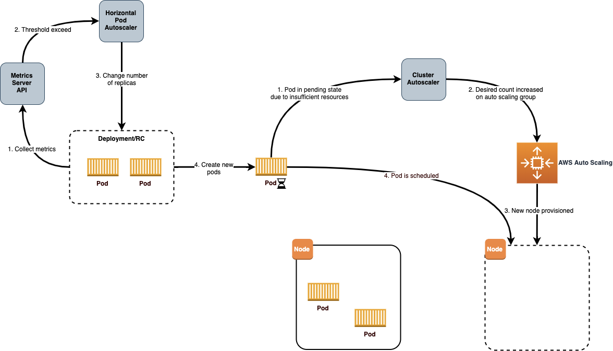
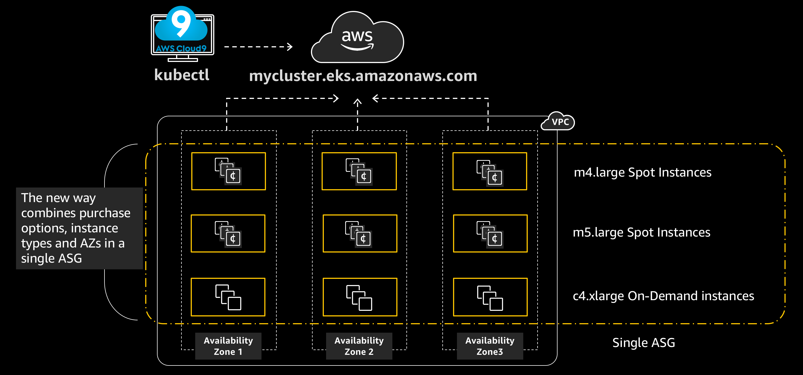

# Amazon EKS Best Practices Guide for Cost Optimization 

The cost optimization best practices includes the continual process of refinement and improvement of a system over its entire lifecycle to constantly look for ways to reduce costs. From your initial design to the ongoing operations of production workloads, adopting the practices specified in this document will help you to build and operate cost-aware systems. By doing so, you can achieve cost-effective business outcomes and maximize your return on investment.

# Design Principles

In the cloud, there are a number of principles that can help you achieve cost optimization of your microservices:
+ Ensure that workloads running on Amazon EKS are independent of specific infrastructure types for running your containers. While using Amazon EKS with EC2, there can be exceptions when we have have workloads that [require a GPU](https://docs.aws.amazon.com/eks/latest/userguide/gpu-ami.html) or specific type of EC2 Instance types are required due to the nature of the workload.
+ Select optimally profiled container instances — profile your production or pre-production environments and monitor critical metrics. like CPU and memory, using services like [Amazon CloudWatch Container Insights for Amazon EKS](https://docs.aws.amazon.com/AmazonCloudWatch/latest/monitoring/deploy-container-insights-EKS.html) or third party tools. 
+ Take advantage of the different purchasing options that are available in AWS, e.g. On-Demand, Spot and Savings Plan.

# Definition

There are three general best practice areas for cost optimization in the cloud:

+ Cost-effective resources (Auto Scaling, Down Scaling and Purchasing Options)
+ Expenditure awareness
+ Optimizing over time (Right Sizing)

As with the other best practices, there are trade-offs to consider. For example, do you want to optimize for speed to market or for cost? In some cases, it’s best to optimize for speed—going to market quickly, shipping new features, or simply meeting a deadline—rather than investing in upfront cost optimization. Design decisions are sometimes guided by haste as opposed to empirical data, as the temptation always exists to overcompensate “just in case” rather than spend time benchmarking for the most cost-optimal deployment. This often leads to drastically over-provisioned and under-optimized deployments. 

## Best Practices

### Cost-effective resources 
**Auto Scaling - Ensure that the infrastructure used to deploy the containerized service matches the application profile and scaling needs.**

Amazon EKS with EC2 managed node groups automate the provisioning and lifecycle management of nodes (Amazon EC2 instances) for Amazon EKS Kubernetes clusters. All managed nodes are provisioned as part of an Amazon EC2 Auto Scaling group that is managed for you by Amazon EKS and all resources including Amazon EC2 instances and Auto Scaling groups run within your AWS account. Amazon EKS tags managed node group resources so that they are configured to use the Kubernetes Cluster Autoscaler. 

The documentation at https://docs.aws.amazon.com/eks/latest/userguide/cluster-autoscaler.html provides detailed guidance on setting up a Managed Node Group and then deploying Kubernetes Cluster Auto Scaler. 

***To create a Kubernetes cluster 1.16 with a single managed group that spans multiple Availability Zones and deploying Kubernetes Cluster AutoScaler on Amazon EKS:***

***Create a EKS cluster with one nodegroup containing 2 m5.large nodes***
```
$ eksctl version
0.19.0
$ eksctl create cluster --name my-cluster-testscaling --version 1.16 --managed --asg-access
```

***Deploy the Cluster Autoscaler for EC2 based Worker Nodes:***
```
$ kubectl apply -f https://raw.githubusercontent.com/kubernetes/autoscaler/master/cluster-autoscaler/cloudprovider/aws/examples/cluster-autoscaler-autodiscover.yaml

$ kubectl -n kube-system annotate deployment.apps/cluster-autoscaler cluster-autoscaler.kubernetes.io/safe-to-evict="false"

$ kubectl -n kube-system edit deployment.apps/cluster-autoscaler

$ kubectl -n kube-system set image deployment.apps/cluster-autoscaler cluster-autoscaler=us.gcr.io/k8s-artifacts-prod/autoscaling/cluster-autoscaler:v1.16.5

$ kubectl -n kube-system logs -f deployment.apps/cluster-autoscaler
```
Cluster Autoscaler logs -


***Deploy Horizontal Pod Autoscaling***

Setup Metrics server:
```

$ kubectl create namespace metrics
$ helm install metrics-server \
    stable/metrics-server \
    --version 2.9.0 \
    --namespace metrics

$ kubectl get --raw "/apis/metrics.k8s.io/v1beta1/nodes"
$ kubectl get apiservice v1beta1.metrics.k8s.io -o yaml
```
Now you can deploy apps which can leverage HPA. Follow https://eksworkshop.com/beginner/080_scaling/test_hpa/ to deploy a sample app, perform a simple load test to test the autoscaling of pods.
```
kubectl run php-apache --image=us.gcr.io/k8s-artifacts-prod/hpa-example --requests=cpu=200m --expose --port=80
```
HPA scales up when CPU exceeds 50% of the allocated container resource, with a minimum of one pod and a maximum of ten pods.
```
kubectl autoscale deployment php-apache --cpu-percent=50 --min=1 --max=10
kubectl get hpa
```
You can then load test the app, and simulate pod autoscaling. 

The combination of Cluster Auto Scaler for the Kubernetes worker nodes and Horizontal Pod Autoscaler for the pods, will ensure that the provisioned resources will be as close to the actual utilization as possible.


(Image source: https://aws.amazon.com/blogs/containers/cost-optimization-for-kubernetes-on-aws/)

***Autoscaling of Pods on Amazon EKS with Fargate***

Autoscaling EKS on Fargate can be done using the following mechanisms:

1. Using the Kubernetes metrics server and configure auto-scaling based on CPU and/or memory usage.
2. Configure autoscaling based on custom metrics like HTTP traffic using Prometheus and Prometheus metrics adapter
3. Configure autoscaling based on App Mesh traffic

The above scenarios are explained in a hands-on blog on ["Autoscaling EKS on Fargate with custom metrics](https://aws.amazon.com/blogs/containers/autoscaling-eks-on-fargate-with-custom-metrics/)


**Down Scaling**

As part of controlling costs, apart from Auto-scaling of the Kubernetes cluster nodes and pods, Down-Scaling of resources when not in-use can also a huge impact on the overall costs. There are tools like [kube-downscaler](https://github.com/hjacobs/kube-downscaler), which can be used to Scale down Kubernetes deployments after work hours or during set periods of time. 


**Use pricing models for effective utilization.**

The pricing details for Amazon EKS are given in the [pricing page](https://aws.amazon.com/eks/pricing/). There is a common control plane cost for both Amazon EKS on Fargate and EC2. 

***Amazon EKS on Fargate:***

If you are using AWS Fargate, pricing is calculated based on the vCPU and memory resources used from the time you start to download your container image until the Amazon EKS pod terminates, rounded up to the nearest second. A minimum charge of 1 minute applies. See detailed pricing information on the [AWS Fargate pricing page](https://aws.amazon.com/fargate/pricing/).

***Amazon EKS on EC2:***

Amazon EC2 provides a wide selection of [instance types](https://aws.amazon.com/ec2/instance-types/) optimized to fit different use cases. Instance types comprise varying combinations of CPU, memory, storage, and networking capacity and give you the flexibility to choose the appropriate mix of resources for your applications. Each instance type includes one or more instance sizes, allowing you to scale your resources to the requirements of your target workload.

One of the key decision parameters apart from number of cpus, memory, processor family type related to the instance type is the [number of Elastic network interfaces(ENI's)](https://docs.aws.amazon.com/AWSEC2/latest/UserGuide/using-eni.html), which in-turn has a bearing on the maximum number of pods on that EC2 Instance. The list of [max pods per EC2 Instance type](https://github.com/awslabs/amazon-eks-ami/blob/master/files/eni-max-pods.txt) is maintained in a github.

****On-Demand EC2 Instances:****

With [On-Demand instances](https://aws.amazon.com/ec2/pricing/), you pay for compute capacity by the hour or the second depending on which instances you run. No longer-term commitments or upfront payments are needed. 

Amazon EC2 A1 instances deliver significant cost savings and are ideally suited for scale-out and Arm-based workloads that are supported by the extensive Arm ecosystem. You can now use Amazon Elastic Container Service for Kubernetes (EKS) to run containers on Amazon EC2 A1 Instances as part of a [public developer preview](https://github.com/aws/containers-roadmap/tree/master/preview-programs/eks-arm-preview). 

You can use the [AWS Simple Monthly Calculator](https://calculator.s3.amazonaws.com/index.html) or the new [pricing calculator](https://calculator.aws/) to get pricing for the On-Demand Ec2 instances for the EKS workder nodes.

****Spot EC2 Instances:****

Amazon [EC2 Spot instances](https://aws.amazon.com/ec2/pricing/) allow you to request spare Amazon EC2 computing capacity for up to 90% off the On-Demand price.

We can create multiple nodegroups with a mix of on-demand instance types and EC2 Spot instances to leverage the advantages of pricing between these two instance types.



A sample yaml file for eksctl to create a nodegroup with EC2 spot instances is given below. During the creation of the Node Group, we have configured a node-label so that kubernetes knows what type of nodes we have provisioned. We set the lifecycle for the nodes as Ec2Spot. We are also tainting with PreferNoSchedule to prefer pods not be scheduled on Spot Instances. This is a “preference” or “soft” version of NoSchedule – the system will try to avoid placing a pod that does not tolerate the taint on the node, but it is not required.

```
apiVersion: eksctl.io/v1alpha5
kind: ClusterConfig
metadata:
  name: my-cluster-testscaling 
  region: us-west-2
nodeGroups:
  - name: ng-spot
    labels:
      lifecycle: Ec2Spot
    taints:
      spotInstance: true:PreferNoSchedule
    minSize: 2
    maxSize: 5
    instancesDistribution: # At least two instance types should be specified
      instanceTypes:
        - m4.large
        - c4.large
        - c5.large
      onDemandBaseCapacity: 0
      onDemandPercentageAboveBaseCapacity: 0 # all the instances will be spot instances
      spotInstancePools: 2
```
Use the node-labels to identify the lifecycle of the nodes.
```
$ kubectl get nodes --label-columns=lifecycle --selector=lifecycle=Ec2Spot
```

We should also deploy the [AWS Node Termination Handler](https://github.com/aws/aws-node-termination-handler) on each Spot Instance. This will monitor the EC2 metadata service on the instance for an interruption notice. The termination handler consists of a ServiceAccount, ClusterRole, ClusterRoleBinding, and a DaemonSet.

```
$ kubectl --namespace=kube-system get daemonsets 
NAME                           DESIRED   CURRENT   READY   UP-TO-DATE   AVAILABLE   NODE SELECTOR       AGE
aws-node                       4         4         4       4            4           <none>              6d11h
aws-node-termination-handler   2         2         2       2            2           lifecycle=Ec2Spot   33m
kube-proxy                     4         4         4       4            4           <none>              6d11h
```

We can design our services to be deployed on Spot Instances when they are available. We can use Node Affinity in our manifest file to configure this, to prefer Spot Instances, but not require them. This will allow the pods to be scheduled on On-Demand nodes if no spot instances were available or correctly labelled.

```
      affinity:
        nodeAffinity:
          preferredDuringSchedulingIgnoredDuringExecution:
          - weight: 1
            preference:
              matchExpressions:
              - key: lifecycle
                operator: In
                values:
                - Ec2Spot
      tolerations:
      - key: "spotInstance"
        operator: "Equal"
        value: "true"
        effect: "PreferNoSchedule"

```

You can do a complete hands-on workshop on EC2 spot instances at the [online AWS EKS Workshop](https://eksworkshop.com/beginner/150_spotworkers/).

****Savings Plan:****

Savings Plans, a new and flexible discount model that provides you with the same discounts as Reserved Instances, in exchange for a commitment to use a specific amount (measured in dollars per hour) of compute power over a one or three year period. The details are covered in the [Savings Plan launch page](https://aws.amazon.com/blogs/aws/new-savings-plans-for-aws-compute-services/).The plans automatically apply to any EC2 instance regardless of region, instance family, operating system, or tenancy, including those that are part of EKS clusters. For example, you can shift from C4 to C5 instances, move a workload from Dublin to London benefiting from Savings Plan prices along the way, without having to do anything.

The AWS Cost Explorer will help you to choose a Savings Plan, and will guide you through the purchase process.


****Note, that the above pricing does not include the other AWS services like Data transfer charges, CloudWatch, Elastic Load Balancer and other AWS services that may be used by the Kubernetes applications.****

### Expenditure awareness
**Tagging of Resources**

Amazon EKS supports adding AWS tags to your Amazon EKS clusters. This makes it easy to control access to the EKS API for managing your clusters. Tags added to an EKS cluster are specific to the AWS EKS cluster resource, they do not propagate to other AWS resources used by the cluster such as EC2 instances or Load balancers. Today, cluster tagging is supported for all new and existing EKS clusters via the AWS API, Console, and SDKs.

Adding and Listing tags to an EKS cluster:
```
$ aws eks tag-resource --resource-arn arn:aws:eks:us-west-2:xxx:cluster/ekscluster1 --tags team=devops,env=staging,bu=cio,costcenter=1234
$ aws eks list-tags-for-resource --resource-arn arn:aws:eks:us-west-2:xxx:cluster/ekscluster1
{
    "tags": {
        "bu": "cio",
        "env": "staging",
        "costcenter": "1234",
        "team": "devops"
    }
}
```
After you activate cost allocation tags in the [AWS Cost Explorer](https://docs.aws.amazon.com/awsaccountbilling/latest/aboutv2/cost-alloc-tags.html), AWS uses the cost allocation tags to organize your resource costs on your cost allocation report, to make it easier for you to categorize and track your AWS costs.

**Using AWS Trusted Advisor**

AWS Trusted Advisor offers a rich set of best practice checks and recommendations across five categories: cost optimization; security; fault tolerance; performance; and service limits.

Under Cost Optimization, it helps in eliminating unused and idle resources or making commitments to reserved capacity. The key action items that will help Amazon EKS with EC2 will be around low utilsed EC2 instances, unassociated Elastic IP addresses, Idle Load Balancers, underutilized EBS volumes among other things. The complete list of checks are provided at https://aws.amazon.com/premiumsupport/technology/trusted-advisor/best-practice-checklist/. 

The Trusted Advisor also provides Savings Plan and Reserved Instances recommendations for EC2 instances and Fargate - which allows you to commit to a consistent usage amount in exchange for discounted rates.

**Using Kubernetes dashboard and kubectl tools**

***Kubernetes dashboard***
Kubernetes Dashboard is a general purpose, web-based UI for Kubernetes clusters, which provides information about the Kubernetes ckluster including the resource usage at a cluster, node and pod level. The deployment of the Kubernetes dashboard on an Amazon EKS cluster is described in the [Amazon EKS documentation](https://docs.aws.amazon.com/eks/latest/userguide/dashboard-tutorial.html). 

Kubernetes Dashboard 


***kubectl top command***

Viewing resource usage metrics with kubectl top and kubectl describe commands. kubectl top will show current CPU and memory usage for the pods or nodes across your cluster, or for a specific pod or node. The kubectl describe command will give more detailed information about a specific node or a pod.
```
$ kubectl top pods
$ kubectl top nodes
$ kubectl describe node <node>
$ kubectl describe pod <pod>
```
**Using Container Insights on Amazon EKS and Kubernetess**

Use [CloudWatch Container Insights](https://docs.aws.amazon.com/AmazonCloudWatch/latest/monitoring/deploy-container-insights-EKS.html) to collect, aggregate, and summarize metrics and logs from your containerized applications and microservices. Container Insights is available for Amazon Elastic Kubernetes Service on EC2, and Kubernetes platforms on Amazon EC2. The metrics include utilization for resources such as CPU, memory, disk, and network. 

The installation of insights is given in the [documentation](https://docs.aws.amazon.com/AmazonCloudWatch/latest/monitoring/deploy-container-insights-EKS.html).

**Using Kube Cost for expenditure awareness and guidance**

There are third party tools like [kubecost](https://kubecost.com/), which can also be deployed on Amazon EKS to get visibility into spend of your Kubernetes cluster.

Deploying kubecost using Helm 3:
```
$ curl -sSL https://raw.githubusercontent.com/helm/helm/master/scripts/get-helm-3 | bash
$ helm version --short
v3.2.1+gfe51cd1
$ helm repo add stable https://kubernetes-charts.storage.googleapis.com/
$ helm repo add stable https://kubernetes-charts.storage.googleapis.com/c^C
$ kubectl create namespace kubecost 
namespace/kubecost created
$ helm repo add kubecost https://kubecost.github.io/cost-analyzer/ 
"kubecost" has been added to your repositories

$ helm install kubecost kubecost/cost-analyzer --namespace kubecost --set kubecostToken="aGRoZEBqc2pzLmNvbQ==xm343yadf98"
NAME: kubecost
LAST DEPLOYED: Mon May 18 08:49:05 2020
NAMESPACE: kubecost
STATUS: deployed
REVISION: 1
TEST SUITE: None
NOTES:
--------------------------------------------------Kubecost has been successfully installed. When pods are Ready, you can enable port-forwarding with the following command:
    
    kubectl port-forward --namespace kubecost deployment/kubecost-cost-analyzer 9090
    
Next, navigate to http://localhost:9090 in a web browser.
$ kubectl port-forward --namespace kubecost deployment/kubecost-cost-analyzer 9090

Note: If you are using Cloud 9 or have a need to forward it to a different port like 8080, issue the following command
$ kubectl port-forward --namespace kubecost deployment/kubecost-cost-analyzer 8080:9090

```
Kube Cost Dashboard -

**Other tools**

***Kube janitor***

[Kubernetes Janitor](https://github.com/hjacobs/kube-janitor) cleans up (deletes) Kubernetes resources on (1) a configured TTL (time to live) or (2) a configured expiry date (absolute timestamp). 
The resources can also include unused Persistent Volume Claims (PVC) on Amazon EBS, which can result in substantial savings over time.

***Right Size Guide***

The [right size guide (rsg)](https://mhausenblas.info/right-size-guide/) is a simple CLI tool that provides you with memory and CPU recommendations for your application. This tool works across container orchestrators, including Kubernesta and easyto deploy. 

***Fargate count***

[Fargatecount](https://github.com/mreferre/fargatecount) is an useful tool, which allows AWS customers to track, with a custom CloudWatch metric, the total number of ECS tasks and EKS pods they have deployed on Fargate in a specific region of a specific account.

***Kubernetes Ops View***

[Kube Ops View](https://github.com/hjacobs/kube-ops-view) is an useful tool, which provides a common operational picture visually for multiple Kubernetes clusters.


### Optimizing over time (Right Sizing)

Right Sizing as per the AWS Well-Architected Framework, is using “… using the lowest cost resource that still meets the technical specifications of a specific workload”.

In Kubernetes, this means setting the right CPU and Memory for Amazon EKS on AWS Fargate and selecting the right EC2 Instance type, for running containers on Pods. The details of how Kubernetes manages resources for containers are given in the [documentation](https://kubernetes.io/docs/concepts/configuration/manage-resources-containers/).

***Amazon EKS on AWS Fargate***
When pods are scheduled on Fargate, the vCPU and memory reservations within the pod specification determine how much CPU and memory to provision for the pod. 

The list of vCPU and memory combinations that are available for pods running on Fargate are listed in the [Amazon EKS User Guide](https://docs.aws.amazon.com/eks/latest/userguide/fargate-pod-configuration.html). If you do not specify a vCPU and memory combination, then the smallest available combination is used (.25 vCPU and 0.5 GB memory). 

***Amazon EKS on EC2***

When we specify a Pod, we can specify how much of each resource like CPU and Memory, a Container needs. It is important we do not over-provision or under-provision the resources allocated to the containers. 

There are tools like [kube resource report](https://github.com/hjacobs/kube-resource-report) which can help with right sizing of pods deployed on Amazpn EKS with EC2 nodes.

Deployment steps for kube resource report (the installation of helm is covered in the previous section on deploying kube cost :
```
$ git clone https://github.com/hjacobs/kube-resource-report
$ cd kube-resource-report
$ helm install kube-resource-report ./unsupported/chart/kube-resource-report
$ helm status kube-resource-report
$ export POD_NAME=$(kubectl get pods --namespace default -l "app.kubernetes.io/name=kube-resource-report,app.kubernetes.io/instance=kube-resource-report" -o jsonpath="{.items[0].metadata.name}")
$ echo "Visit http://127.0.0.1:8080 to use your application"
$ kubectl port-forward $POD_NAME 8080:8080
```
Screenshots from a sample reports from this tool:


### Key AWS Services
Cost optimization is supported by the following AWS services and features:
+ Cost-effective resources – Amazon EC2 provides multiple instance types, such as Reserved Instances and Spot Instances, at different prices.
+ Matching supply and demand – Match user demand with Auto Scaling. Consider Savings Plan (Previously Reserved Instances) for predictable workloads. Use managed data stores for elasticity and durability of the application data.
+ Expenditure awareness – The Billing and Cost Management console dashboard provides an overview of your AWS usage. Use AWS Organizations for granular billing details.
+ Optimizing over time – Amazon CloudWatch Container Metrics provides metrics around usage of resources by the EKS cluster. In addition to the Kubernetes dashboard, there are several tools in the Kubernetes ecosystem that can be used to monitor Kubernetes clusters, such as Prometheus.

### Resources
Refer to the following resources to learn more about AWS best practices for cost optimization.

Videos
+	[AWS re:Invent 2019: Save up to 90% and run production workloads on Spot Instances (CMP331-R1)](https://www.youtube.com/watch?v=7q5AeoKsGJw)

Documentation and Blogs
+	[Cost optimization for Kubernetes on AWS](https://aws.amazon.com/blogs/containers/cost-optimization-for-kubernetes-on-aws/)
+ [Autoscaling EKS on Fargate with custom metrics](https://aws.amazon.com/blogs/containers/autoscaling-eks-on-fargate-with-custom-metrics/)
+	[Using Spot Instances with EKS](https://ec2spotworkshops.com/using_ec2_spot_instances_with_eks.html)
+   [Extending the EKS API: Managed Node Groups](https://aws.amazon.com/blogs/containers/eks-managed-node-groups/)
+	[Autoscaling with Amazon EKS](https://docs.aws.amazon.com/eks/latest/userguide/autoscaling.html) 
+	[Setting Up Container Insights on Amazon EKS and Kubernetes ](https://docs.aws.amazon.com/AmazonCloudWatch/latest/monitoring/deploy-container-insights-EKS.html)
+	[Amazon EKS supports tagging](https://docs.aws.amazon.com/eks/latest/userguide/eks-using-tags.html)
+	[Amazon EKS-Optimized AMI with GPU Support](https://docs.aws.amazon.com/eks/latest/userguide/gpu-ami.html)
+	[AWS Fargate pricing](https://aws.amazon.com/fargate/pricing/)
+   [Amazon EKS on AWS Fargate](https://aws.amazon.com/blogs/aws/amazon-eks-on-aws-fargate-now-generally-available/)
+	[Amazon EKS pricing](https://aws.amazon.com/eks/pricing/)
+   [Saving Cloud Costs with Kubernetes on AWS](https://srcco.de/posts/saving-cloud-costs-kubernetes-aws.html) 

Tools
+	[What is AWS Billing and Cost Management?](https://docs.aws.amazon.com/awsaccountbilling/latest/aboutv2/cost-alloc-tags.html)
+   [Kube Cost](https://kubecost.com/)
+   [Kube downscaler](https://github.com/hjacobs/kube-downscaler)
+  [Kube Janitor](https://github.com/hjacobs/kube-janitor)
+  [Right size guide](https://github.com/mhausenblas/right-size-guide)
+ [Fargate count](https://github.com/mreferre/fargatecount)

