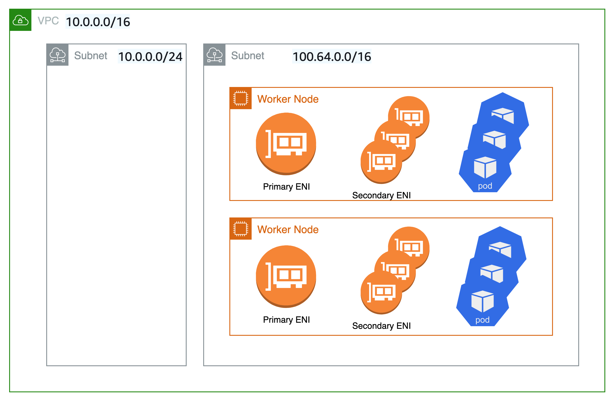

# Custom Networking

By default, Amazon VPC CNI will assign Pods an IP address selected from the primary subnet.  The primary subnet is the subnet CIDR that the primary ENI is attached to, usually the subnet of the node/host.

If the subnet CIDR is too small, the CNI may not be able to acquire enough secondary IP addresses to assign to your Pods. This is a common challenge for EKS IPv4 clusters.

Custom networking is one solution to this problem.

Custom networking addresses the IP exhaustion issue by assigning the node and Pod IPs from secondary VPC address spaces (CIDR). Custom networking support supports ENIConfig custom resource. The ENIConfig includes an alternate subnet CIDR range (carved from a secondary VPC CIDR), along with the security group(s) that the Pods will belong to. When custom networking is enabled, the VPC CNI creates secondary ENIs in the subnet  defined under ENIConfig. The CNI assigns Pods an IP addresses from a CIDR range defined in a ENIConfig CRD. 

Since the primary ENI is not used by custom networking, the maximum number of Pods you can run on a node is lower. The host network Pods continue to use IP address assigned to the primary ENI. Additionally, the primary ENI is used to handle source network translation and route Pods traffic outside the node. 

## Example Configuration

While custom networking will accept valid VPC range for secondary CIDR range, we recommend that you use CIDRs (/16) from the CG-NAT space, i.e. 100.64.0.0/10 or 198.19.0.0/16 as those are less likely to be used in a corporate setting than other RFC1918 ranges. For additional information about the permitted and restricted CIDR block associations you can use with your VPC, see [IPv4 CIDR block association restrictions](https://docs.aws.amazon.com/vpc/latest/userguide/configure-your-vpc.html#add-cidr-block-restrictions) in the VPC and subnet sizing section of the VPC documentation.

As shown in the diagram below, the primary Elastic Network Interface ([ENI](https://docs.aws.amazon.com/AWSEC2/latest/UserGuide/using-eni.html)) of the worker node still uses the primary VPC CIDR range (in this case 10.0.0.0/16) but the secondary ENIs use the secondary VPC CIDR Range (in this case 100.64.0.0/16). Now, in order to have the Pods use the 100.64.0.0/16 CIDR range, you must configure the CNI plugin to use custom networking. You can follow through the steps as documented [here](https://docs.aws.amazon.com/eks/latest/userguide/cni-custom-network.html).


If you want the CNI to use custom networking, set the `AWS_VPC_K8S_CNI_CUSTOM_NETWORK_CFG` environment variable to `true`.

```
kubectl set env daemonset aws-node -n kube-system AWS_VPC_K8S_CNI_CUSTOM_NETWORK_CFG=true
```


When `AWS_VPC_K8S_CNI_CUSTOM_NETWORK_CFG=true`, the CNI will assign Pod IP address from a subnet defined in `ENIConfig`. The `ENIConfig` custom resource is used to define the subnet in which Pods will be scheduled.

```
apiVersion : crd.k8s.amazonaws.com/v1alpha1
kind : ENIConfig
metadata:
  name: us-west-2a
spec: 
  securityGroups:
    - sg-0dff111a1d11c1c11
  subnet: subnet-011b111c1f11fdf11
```

Upon creating the `ENIconfig` custom resources, you will need to create new worker nodes and drain the existing nodes. The existing worker nodes and Pods will remain unaffected. 


## Recommendations

### Use Custom Networking When

We recommend you to consider custom networking if you are dealing with IPv4 exhaustion and can’t use IPv6 yet. Amazon EKS support for [RFC6598](https://datatracker.ietf.org/doc/html/rfc6598) space enables you to scale Pods beyond [RFC1918](https://datatracker.ietf.org/doc/html/rfc1918) address exhaustion challenges. Please consider using prefix delegation with custom networking to increase the Pods density on a node. 

You might consider custom networking if you have a security requirement to run Pods on a different network with different security group requirements. When custom networking enabled, the pods use different subnet or security groups as defined in the ENIConfig than the node's primary network interface.

Custom networking is indeed an ideal option for deploying multiple EKS clusters and applications to connect on-premise datacenter services. You can increase the number of private addresses (RFC1918) accessible to EKS in your VPC for services such as Amazon Elastic Load Balancing and NAT-GW, while using non-routable CG-NAT space for your Pods across multiple clusters. Custom networking with the [transit gateway](https://aws.amazon.com/transit-gateway/) and a Shared Services VPC (including NAT gateways across several Availability Zones for high availability) enables you to deliver scalable and predictable traffic flows. This [blog post](https://aws.amazon.com/blogs/containers/eks-vpc-routable-ip-address-conservation/) describes an architectural pattern that is one of the most recommended ways to connect EKS Pods to a datacenter network using custom networking.

### Avoid Custom Networking When

#### Ready to Implement IPv6

Custom networking can mitigate IP exhaustion issues, but it requires additional operational overhead. If you are currently deploying a dual-stack (IPv4/IPv6) VPC or if your plan includes IPv6 support, we recommend implementing IPv6 clusters instead. You can set up IPv6 EKS clusters and migrate your apps. In an IPv6 EKS cluster, both Kubernetes and Pods get an IPv6 address and can communicate in and out to both IPv4 and IPv6 endpoints. Please review best practices for [Running IPv6 EKS Clusters](../ipv6/index.md).

#### Exhausted CG-NAT Space

Furthermore, if you're currently utilizing CIDRs from the CG-NAT space or are unable to link a secondary CIDR with your cluster VPC, you may need to explore other options, such as using an alternative CNI. We strongly recommend that you either obtain commercial support or possess the in-house knowledge to debug and submit patches to the open source CNI plugin project. Refer [Alternate CNI Plugins](https://docs.aws.amazon.com/eks/latest/userguide/alternate-cni-plugins.html) user guide for more details.

#### Use Private NAT Gateway

Amazon VPC now offers [private NAT gateway](https://docs.aws.amazon.com/vpc/latest/userguide/vpc-nat-gateway.html)capabilities. Amazon's private NAT Gateway enables instances in private subnets to connect to other VPCs and on-premises networks with overlapping CIDRs. Consider utilizing the method described on this [blog post](https://aws.amazon.com/blogs/containers/addressing-ipv4-address-exhaustion-in-amazon-eks-clusters-using-private-nat-gateways/) to employ a private NAT gateway to overcome communication issues for the EKS workloads caused by overlapping CIDRs, a significant complaint expressed by our clients. Custom networking cannot address the overlapping CIDR difficulties on its own, and it adds to the configuration challenges.

The network architecture used in this blog post implementation follows the recommendations under [Enable communication between overlapping networks](https://docs.aws.amazon.com/vpc/latest/userguide/nat-gateway-scenarios.html#private-nat-overlapping-networks) in Amazon VPC documentation. As demonstrated in this blog post, you may expand the usage of private NAT Gateway in conjunction with RFC6598 addresses to manage customers' private IP exhaustion issues. The EKS clusters, worker nodes are deployed in the non-routable 100.64.0.0/16 VPC secondary CIDR range, whereas the private NAT gateway, NAT gateway are deployed to the routable RFC1918 CIDR ranges. The blog explains how a transit gateway is used to connect VPCs in order to facilitate communication across VPCs with overlapping non-routable CIDR ranges. For use cases in which EKS resources in a VPC's non-routable address range need to communicate with other VPCs that do not have overlapping address ranges, customers have the option of using VPC Peering to interconnect such VPCs. This method could provide potential cost savings as all data transit within an Availability Zone via a VPC peering connection is now free.


#### Unique network for nodes and Pods

If you need to isolate your nodes and Pods to a specific network for security reasons, we recommend that you deploy nodes and Pods to a subnet from a larger secondary CIDR block (e.g. 100.64.0.0/8). Following the installation of the new CIDR in your VPC, you can deploy another node group using the secondary CIDR and drain the original nodes to automatically redeploy the pods to the new worker nodes. For more information on how to implement this, see this [blog](https://aws.amazon.com/blogs/containers/optimize-ip-addresses-usage-by-pods-in-your-amazon-eks-cluster/) post.

Custom networking is not used in the setup represented in the diagram below. Rather, Kubernetes worker nodes are deployed on subnets from your VPC's secondary VPC CIDR range, such as 100.64.0.0/10. You can keep the EKS cluster running (the control plane will remain on the original subnet/s), but the nodes and Pods will be moved to a secondary subnet/s. This is yet another, albeit unconventional, technique to mitigate the danger of IP exhaustion in a VPC. We propose draining the old nodes before redeploying the pods to the new worker nodes.



### Automate Configuration with Availability Zone Labels

You can enable Kubernetes to automatically apply the corresponding ENIConfig for the worker node Availability Zone (AZ).

Kubernetes automatically adds the tag [`topology.kubernetes.io/zone`](http://topology.kubernetes.io/zone) to your worker nodes. Amazon EKS recommends using the availability zone as your ENI config name when you only have one secondary subnet (alternate CIDR) per AZ. Note that tag `failure-domain.beta.kubernetes.io/zone` is deprecated and replaced with the tag `topology.kubernetes.io/zone`.

1. Set `name` field to the Availability Zone of your VPC.
2. Enable automatic configuration with this command:

```
kubectl set env daemonset aws-node -n kube-system AWS_VPC_K8S_CNI_CUSTOM_NETWORK_CFG=true
```

if you have multiple secondary subnets per availability zone, you need create a specific `ENI_CONFIG_LABEL_DEF`. You might consider configuring `ENI_CONFIG_LABEL_DEF` as [`k8s.amazonaws.com/eniConfig`](http://k8s.amazonaws.com/eniConfig) and label nodes with custom eniConfig names, such as [`k8s.amazonaws.com/eniConfig=us-west-2a-subnet-1`](http://k8s.amazonaws.com/eniConfig=us-west-2a-subnet-1) and [`k8s.amazonaws.com/eniConfig=us-west-2a-subnet-2`](http://k8s.amazonaws.com/eniConfig=us-west-2a-subnet-2).

### Replace Pods when Configuring Secondary Networking

Enabling custom networking does not modify existing nodes. Custom networking is a disruptive action. Rather than doing a rolling replacement of all the worker nodes in your cluster after enabling custom networking, we suggest updating the AWS CloudFormation template in the [EKS Getting Started Guide](https://docs.aws.amazon.com/eks/latest/userguide/getting-started.html) with a custom resource that calls a Lambda function to update the `aws-node` Daemonset with the environment variable to enable custom networking before the worker nodes are provisioned.

If you had any nodes in your cluster with running Pods before you switched to the custom CNI networking feature, you should cordon and [drain the nodes](https://aws.amazon.com/premiumsupport/knowledge-center/eks-worker-node-actions/) to gracefully shutdown the Pods and then terminate the nodes. Only new nodes matching the ENIConfig label or annotations use custom networking, and hence the Pods scheduled on these new nodes can be assigned an IP from secondary CIDR. 

### Calculate Max Pods per Node

Since the node’s primary ENI is no longer used to assign Pod IP addresses, there is a decrease in the number of Pods you can run on a given EC2 instance type. To work around this limitation you can use prefix assignment with custom networking. With prefix assignment, each secondary IP is replaced with a /28 prefix on secondary ENIs. 

Consider the maximum number of Pods for an m5.large instance with custom networking.

The maximum number of Pods you can run without prefix assignment is 29

* ((3 ENIs - 1) * (10 secondary IPs per ENI - 1)) + 2 = 20

Enabling prefix attachments increases the number of Pods to 290.

* (((3 ENIs - 1) * ((10 secondary IPs per ENI - 1) * 16)) + 2 = 290

However we recommend setting max-pods to 110 instead of 290 is because the instance has a relatively low number of vCPUs. On larger instances EKS recommended value is 250. When using prefix attachments with smaller instance types (e.g, m5.large), you’re likely to exhaust the instance’s CPU and memory resources long before you exhaust its IP addresses.

However, we suggest setting max-pods to 110 rather than 290 because the instance has a rather small number of virtual CPUs. On bigger instances, EKS recommends a max pods value of 250. When utilizing prefix attachments with smaller instance types (e.g. m5.large), it is possible that you will exhaust the instance's CPU and memory resources well before its IP addresses.

!!! info
    When the CNI prefix allocates a /28 prefix to an ENI, it has to be a contiguous block of IP addresses. If the subnet that the prefix is generated from is highly fragmented, the prefix attachment may fail. You can mitigate this from happening by creating a new dedicated VPC for the cluster or by reserving subnet a set of CIDR exclusively for prefix attachments. Visit [Subnet CIDR reservations](https://docs.aws.amazon.com/vpc/latest/userguide/subnet-cidr-reservation.html) for more information on this topic.

### Identify Existing Usage of CG-NAT Space

Custom networking allows you to mitigate IP exhaustion issue, however it can’t solve all the challenges. If you already using CG-NAT space for your cluster, or simply don’t have the ability to associate a secondary CIDR with your cluster VPC, we suggest you to explore other options, like using an alternate CNI or moving to IPv6 clusters.

