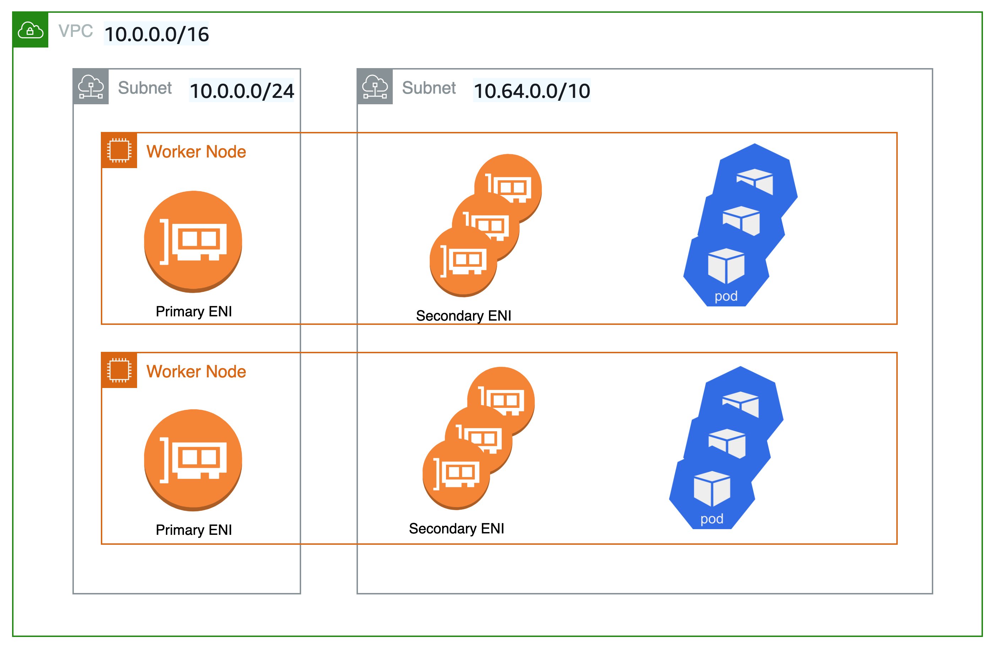

# Custom Networking

By default, the Amazon VPC CNI will assign pods a secondary IP address from the primary subnet. The primary subnet is the subnet CIDR that the primary ENI is attached to, usually the subnet of the node/host. 

If the primary subnet is too small, the CNI cannot acquire enough secondary IP addresses to assign to your pods. 

Custom networking is one solution to this problem. 

Custom networking offers an alternative to using a single (primary) subnet. Instead of assigning an IP from the primary subnet CIDR, the CNI acquires IP addresses from a CIDR range defined in a ENIConfig CRD. The ENIConfig includes an alternate subnet CIDR range, along with the security group(s) that the pods will belong to. Unless pods are configured with hostNetwork, you pods will not use the host’s primary ENI. Pods are bound to secondary ENIs that get attached to the EC2 instance by the VPC CNI. If the primary ENI is not used, the maximum number of pods on the node is reduced. 

The primary reason to use custom networking is to reduce the risk of IP exhaustion -- when there are insufficient IP addresses available to allocate to all your pods. This can occur when EKS clusters are deployed into VPCs that, at the time of creation, didn’t account for pods getting IP address from the VPC’s primary CIDR range.

## Example Configuration

While custom networking will accept all valid VPC CIDRs for secondary VPC CIDR range, we recommend that you use CIDRs from the CG-NAT space, i.e. 100.64.0.0/10 or 198.19.0.0/16 as those are less likely to be used in a corporate setting than other RFC1918 ranges. For additional information about the permitted and restricted CIDR block associations you can use with you VPC, see [IPv4 CIDR block association restrictions](https://docs.aws.amazon.com/vpc/latest/userguide/VPC_Subnets.html#VPC_Sizing) in the VPC and subnet sizing ) section of the VPC documentation.

As shown in the diagram below, the primary Elastic Network Interface ([ENI](https://docs.aws.amazon.com/AWSEC2/latest/UserGuide/using-eni.html)) of the worker node still uses the primary VPC CIDR range (in this case 10.0.0.0/20) but the secondary ENIs for pods use the secondary VPC CIDR Range (in this case 100.64.0.0/10). Now, in order to have the pods use the 100.64.0.0/8 CIDR range, you must configure the CNI plugin to use custom networking. You can follow through the steps as documented [here](https://docs.aws.amazon.com/eks/latest/userguide/cni-custom-network.html).



If you want the CNI to use custom networking, set the `AWS_VPC_K8S_CNI_CUSTOM_NETWORK_CFG` environment variable to `true`.

```shell
kubectl set env daemonset aws-node -n kube-system AWS_VPC_K8S_CNI_CUSTOM_NETWORK_CFG=true
```
When `AWS_VPC_K8S_CNI_CUSTOM_NETWORK_CFG=true`, the CNI will assign Pod IP address from a subnet defined in `ENIConfig`. The `ENIConfig` custom resource is used to define the subnet in which Pods will be scheduled.

```yaml
apiVersion: crd.k8s.amazonaws.com/v1alpha1
kind: ENIConfig
metadata: 
  name: us-west-2a
spec: 
  securityGroups: 
    - sg-0dff111a1d11c1c11
  subnet: subnet-011b111c1f11fdf11
```

You will need to create an `ENIconfig` custom resource for each subnet you want to use for Pod networking.

- The `securityGroups` field should have the ID of the security group attached to the worker nodes.
- The `name` field should be the name of the Availability Zone of your VPC. If you name your ENIConfig custom resources after each Availability Zone in your VPC, you can enable Kubernetes to automatically apply the corresponding ENIConfig for the worker node Availability Zone with the following command.

```shell
kubectl set env daemonset aws-node \
-n kube-system ENI_CONFIG_LABEL_DEF=failure-domain.beta.kubernetes.io/zone
```

Upon creating the `ENIconfig` custom resources, you will need to create new worker nodes. The existing worker nodes and Pods will remain unaffected. Create new worker nodes and [drain the existing nodes](https://aws.amazon.com/premiumsupport/knowledge-center/eks-worker-node-actions/).

To determine the maximum supported number of Pods that can be run on each worker node, you will need to know [the number of network interfaces and the IPv4 addresses per network interface the worker node supports](https://docs.aws.amazon.com/AWSEC2/latest/UserGuide/using-eni.html#AvailableIpPerENI). The formula for calculating the maximum number of pods for an EC2 instance is:

```console
maxPods = (number of interfaces - 1) * (max IPv4 addresses per interface - 1) + 2
```

For a `c3.large` EC2 instance, the calculation will be:

```console
Maximum Pods = ((number of interfaces = 3) - 1) * ((max IPv4 addresses = 10) - 1) +2 
=> Maximum Pods = (3 - 1) * (10 - 1) + 2
=> Maximum Pods = 2 * 9 + 2 = 20
```

## Recommendations

### Automate Configuration with Availability Zone Labels
You can enable Kubernetes to automatically apply the corresponding ENIConfig for the worker node Availability Zone. 

Use the availability zone as your ENI config name, to coordinate with the existing tag `topology.kubernetes.io/zone` that Kubernetes automatically applies to your worker nodes. Note that tag ```failure-domain.beta.kubernetes.io/zone``` is deprecated and replaced with the tag ```topology.kubernetes.io/zone```.

1. Set `name` field to the Availability Zone of your VPC. 

2. Enable automatic configuration with this command: 

```shell
kubectl set env daemonset aws-node \
-n kube-system ENI_CONFIG_LABEL_DEF=failure-domain.beta.kubernetes.io/zone
```

### Replace Pods when Configuring Secondary Networking

Enabling custom networking does not modify existing nodes. Custom networking is a disruptive action. If you had any nodes in your cluster with running pods before you switched to the custom CNI networking feature, you should cordon and [drain the nodes](https://aws.amazon.com/premiumsupport/knowledge-center/eks-worker-node-actions/) to gracefully shutdown the pods and then terminate the nodes. Only new nodes matching the ENIConfig label or annotations use custom networking, and hence the pods scheduled on these new nodes can be assigned an IP from secondary CIDR.

### Max Pods per Node

Since the node’s primary ENI is no longer used to assign Pod IP addresses, there is a decrease in the number of Pods you can run on a given EC2 instance type. To work around this limitation you can use prefix attachments (i.e., prefix delegation) with custom networking. This is an important because when you use custom networking, only pods that are configured to use hostNetwork are “bound” to the host’s primary ENI. All other pods are bound to secondary ENIs. However, with prefix attachments, each secondary IP is replaced with a /28 prefix which negates the IP addresses lost when you use custom networking.

Consider the maximum number of pods for an m5.large instance with custom networking. 

The maximum number of pods you can run without prefix attachments is 29 

- ((3 ENIs - 1) * (10 secondary IPs per ENI - 1)) + 2 = 20

Enabling prefix attachments increases the number of pods to 110.

- (((3 ENIs - 1) * ((10 secondary IPs per ENI - 1) * 16)) + 2 =  290

The reason we set max-pods is 110 instead of 290 is because the instance has a relatively low number of vCPUs. In addition the Kubernetes community recommends set max pods no greater than 10 * number of cores, up to 110.  For additional information, see [Kubernetes scalability thresholds](https://github.com/kubernetes/community/blob/master/sig-scalability/configs-and-limits/thresholds.md). When using prefix attachments with smaller instance types (e.g, m5.large), you’re likely to exhaust the instance’s CPU and memory resources long before you exhaust its IP addresses.

!!! info

    When the CNI prefix allocates a /28 prefix to an ENI, it has to be a contiguous block of IP addresses. If the subnet that the prefix is generated from is highly fragmented, the prefix attachment may fail. You can mitigate this from happening by creating a new dedicated VPC for the cluster or by reserving subnet a set of CIDR exclusively for prefix attachments. Visit [Subnet CIDR reservations](https://docs.aws.amazon.com/vpc/latest/userguide/subnet-cidr-reservation.html) for more information on this topic.

### Identify Existing Usage of CG-NAT Space

Custom networking allows you to mitigate IP exhaustion issue, however it can't solve all the challenges. If you already using CG-NAT space for your cluster, or simply don’t have the ability to associate a secondary CIDR with your cluster VPC, we suggest you to explore other options, like using an alternate CNI or moving to IPv6 clusters.