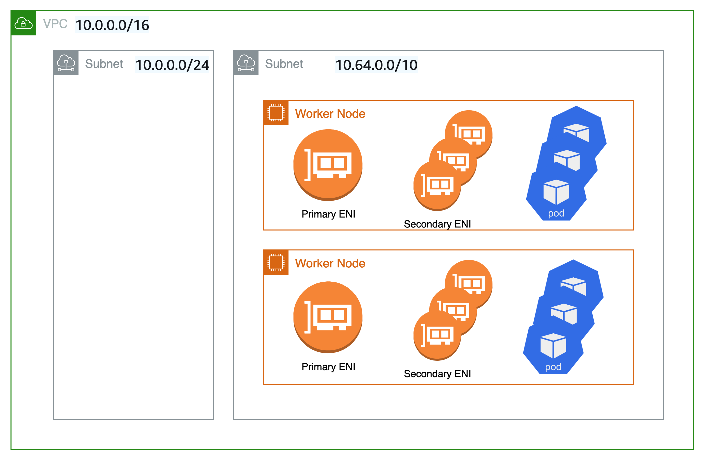

# Custom Networking

By default, the Amazon VPC CNI will assign pods a secondary IP address from the host’s subnet CIDR. However, if the host’s subnet CIDR is too small, the CNI may not be able to acquire enough secondary IP addresses to assign to your pods. Custom networking offers an alternative to using the host’s subnet CIDR range, i.e. the subnet attached to eth0. Instead of assigning an IP from the host’s subnet CIDR, the CNI acquires IP addresses from a CIDR range defined in the ENIConfig, a Custom Resource Definition (CRD) that includes an alternate subnet CIDR range, along with the security group(s) that the pods will belong to. Unless pods are configured with hostNetwork, you forfeit the use of host’s primary ENI. All other pods are bound to secondary ENIs that get attached to the EC2 instance by the VPC CNI. The result is lower pod density per worker node.

The primary reason to use custom networking is to reduce the risk of IP exhaustion where there are insufficient IP addresses available to allocate to all your pods. This can occur when EKS clusters are deployed into VPCs that, at the time of creation, didn’t account for pods getting IP address from the VPC’s primary CIDR range.

While custom networking will accept all valid VPC CIDRs for secondary VPC CIDR range, we generally recommend that you use CIDRs from the CG-NAT space, i.e. 100.64.0.0/10 or 198.19.0.0/16 as those are less likely to be used in a corporate setting than other RFC1918 ranges. For additional information about the permitted and restricted CIDR block associations you can use with you VPC, see [IPv4 CIDR block association restrictions](https://docs.aws.amazon.com/vpc/latest/userguide/VPC_Subnets.html#VPC_Sizing) in the VPC and subnet sizing ) section of the VPC documentation.

As shown in the diagram below, the primary Elastic Network Interface ([ENI](https://docs.aws.amazon.com/AWSEC2/latest/UserGuide/using-eni.html)) of the worker node still uses the primary VPC CIDR range (in this case 10.0.0.0/20) but the secondary ENIs for pods use the secondary VPC CIDR Range (in this case 100.64.0.0/10). Now, in order to have the pods using the 100.64.0.0/8 CIDR range, you will have to configure the CNI plugin to use custom networking. You can follow through the steps as documented [here](https://docs.aws.amazon.com/eks/latest/userguide/cni-custom-network.html).


If you want the CNI to assign IP addresses for Pods from a different subnet, you can set `AWS_VPC_K8S_CNI_CUSTOM_NETWORK_CFG` environment variable to `true`.

```shell
kubectl set env daemonset aws-node -n kube-system AWS_VPC_K8S_CNI_CUSTOM_NETWORK_CFG=true
```
When `AWS_VPC_K8S_CNI_CUSTOM_NETWORK_CFG=true`, the CNI will assign Pod IP address from a subnet defined in `ENIConfig`. The `ENIConfig` custom resource is used to define the subnet in which Pods will be scheduled.

```yaml
apiVersion: crd.k8s.amazonaws.com/v1alpha1
kind: ENIConfig
metadata: 
  name: us-west-2a
spec: 
  securityGroups: 
    - sg-0dff111a1d11c1c11
  subnet: subnet-011b111c1f11fdf11
```

You will need to create an `ENIconfig` custom resource for each subnet you want to use for Pod networking.

- The `securityGroups` field should have the ID of the security group attached to the worker nodes.
- The `name` field should be the name of the Availability Zone in your VPC. If you name your ENIConfig custom resources after each Availability Zone in your VPC, you can enable Kubernetes to automatically apply the corresponding ENIConfig for the worker node Availability Zone with the following command.

```shell
kubectl set env daemonset aws-node \
-n kube-system ENI_CONFIG_LABEL_DEF=failure-domain.beta.kubernetes.io/zone
```

Upon creating the `ENIconfig` custom resources, you will need to create new worker nodes. The existing worker nodes and Pods will remain unaffected.

To determine the number of Pods for each worker node, you will need to know [the number of network interfaces and the IPv4 addresses per network interface the worker node supports](https://docs.aws.amazon.com/AWSEC2/latest/UserGuide/using-eni.html#AvailableIpPerENI). The formula for calculating the maximum number of pods for an EC2 instance is:

```console
maxPods = (number of interfaces - 1) * (max IPv4 addresses per interface - 1) + 2
```

For a `c3.large` EC2 instance, the calculation will be:

```console
Maximum Pods = ((number of interfaces = 3) - 1) * ((max IPv4 addresses = 10) - 1) +2 
=> Maximum Pods = (3 - 1) * (10 - 1) + 2
=> Maximum Pods = 2 * 9 + 2 = 20
```

You can then pass the `max-pods` value in the worker nodes’ user-data script:

```console
--use-max-pods false --kubelet-extra-args '--max-pods=20'
```

## Recommendations

### Move pods onto secondary CIDR

Custom networking is not a auto switch feature. Please remember custom networking is a disruptive action. If you had any nodes in your cluster with running pods before you switched to the custom CNI networking feature, you should cordon and drain the nodes to gracefully shutdown the pods and then terminate the nodes. Only new nodes matching the ENIConfig label or annotations use custom networking, and hence the pods scheduled on these new nodes can be assigned an IP from secondary CIDR.

### Security groups

if you are using existing security groups, we recommend minimum required security group settings for the cluster, control plane and node security groups are met per EKS security group considerations. Also, make sure atleast one of the security groups per pod has the tag ```shkubernetes.io/cluster/cluster-name: owned``` added.

### ENI Configs

It is recommended you use the availability zone as your ENI config name, so that you can leverage existing well known tag topology.kubernetes.io/zone that Kubernetes applies to your worker nodes. Please note the tag ```failure-domain.beta.kubernetes.io/zone``` is deprecated and we recommend you to use tag  ```topology.kubernetes.io/zone```.

### Max Pods

Since the node’s primary ENI is no longer used to assign Pod IP addresses, there is a decline in the number of Pods you can run on a given EC2 instance type. To work around this limitation you can use prefix attachments with custom networking. This is an important development because when you use custom networking, only pods that are configured to use hostNetwork are “bound” to the host’s primary ENI. All other pods are bound to secondary ENIs. The inability to use primary ENI (and all the secondary IPs associated with that ENI) lowers each worker node’s pod density. However, with prefix attachments, each secondary IP is replaced with a /28 prefix which negates the IP addresses lost when you use custom networking.

For example. say you’re using an m5.large instance with custom networking. The maximum number of pods you can run without prefix attachments is 29 

((3 ENIs - 1) * (10 secondary IPs per ENI - 1)) + 2 = 20

whereas with prefix attachments its 110.

(((3 ENIs - 1) * ((10 secondary IPs per ENI - 1) * 16)) + 2 =  290

The reason we set max-pods is 110 instead of 290 is because the instance has a relatively low number of vCPUs. In addition the Kubernetes community recommends set max pods no greater than 110 or 10 * number of cores.  For additional information, see [Kubernetes scalability thresholds](https://github.com/kubernetes/community/blob/master/sig-scalability/configs-and-limits/thresholds.md). When using prefix attachments with smaller instance types like the m5.large, you’re likely to exhaust the instance’s CPU and memory resources long before you exhaust its IP addresses.

*Attention*: when prefix attachments allocates a /28 prefix to an ENI, it has to be a contiguous block of IP addresses. If the subnet that the prefix is generated from is highly fragmented, the prefix attachment may fail. You can mitigate this from happening by creating a new dedicated VPC for the cluster or by reserving subnet a set of CIDR exclusively for prefix attachments. Visit [Subnet CIDR reservations](https://docs.aws.amazon.com/vpc/latest/userguide/subnet-cidr-reservation.html) for more information on this topic.

### CG-NAT Space

Custom networking allows you to mitigate IP exhaustion issue, however it can't solve all the challenges. If you already using CG-NAT space for your cluster, or simply don’t have the ability to associate a secondary CIDR with your cluster VPC, we suggest you to explore other options, like using an alternate CNI or moving to IPv6 clusters.

### ENI config labels vs. annotations

By default, Kubernetes applies the Availability Zone of a node to the topology.kubernetes.io/zone label. If you named your ENIConfig custom resources after each Availability Zone in your VPC then you can enable Kubernetes to automatically apply the corresponding ENIConfig for the node's Availability Zone with the following command.

```sh
kubectl set env daemonset aws-node \
    -n kube-system ENI_CONFIG_LABEL_DEF=topology.kubernetes.io/zone
```

If you have more than one subnets in the single availability zone, you might want to create new labels and configure the ENI_CONFIG_LABEL_DEF accordingly.

You can also use annotation ```k8s.amazonaws.com/eniConfig``` for nodes with custom networking.

```sh

kubectl annotate node \
   node-name.region-code.compute.internal \
    k8s.amazonaws.com/eniConfig=subnet1ConfigName
```

When you use annotation for nodes, you will need to configure ENI_CONFIG_ANNOTATION_DEF.

```sh
kubectl set env daemonset aws-node \
    -n kube-system ENI_CONFIG_ANNOTATION_DEF=subnet1ConfigName. 
```

You can use either annotation or label per your preferences. When both are set, annotations take precedence over labels. To use labels, ensure there is no annotation with key k8s.amazonaws.com/eniConfig or defined key (in ENI_CONFIG_ANNOTATION_DEF) set on the node.

### Security groups requirement

If you use the security group that was created, ensure that the recommended or minimum required security group settings for the cluster, control plane and node security groups are met. For more information, see [Amazon EKS security group considerations](https://docs.aws.amazon.com/eks/latest/userguide/sec-group-reqs.html).

### Unique network for nodes and pods

Custom networking maintain your workers nodes’ IP addresses on your primary VPC CIDR (in this example, 10.0.0.0/20), but move your pods’ IP addresses to a larger subnet (e.g. 100.64.0.0/8). In this scenario, you can move all your pods to the new range and still use your 10.0.0.0/20 CIDR IP addresses as the source IP. However, here are some considerations you should know while using this configuration:

- This solution will result in getting lesser IP addresses for the pods.
- The solution is comparatively complex as it involves manual calculation & configuration of “max pods.”

A unique network for nodes and pods is another option to deploy new worker nodes with both the instance and pods networking on a new larger CIDR block (e.g. 100.64.0.0/8). In this scenario, after adding the new CIDR to your VPC, you can deploy another node group using the secondary CIDR and drain the original nodes to automatically redeploy the pods onto the new worker nodes. In this scenario, you can still maintain the EKS cluster as is (the control plane will still live on the original subnet/s), but you’ll completely migrate the instances and the pods to a secondary subnet/s. In the example shown in the diagram below, both the primary and secondary ENIs use the secondary VPC CIDR Range (in this case, 100.64.0.0/10).



This scenario might be used when there are no available IP addresses to assign to the primary ENI of a node. Additionally, managed node groups can be used alongside this option. Similarly to custom networking, this configuration is disruptive in action. Before switching to this feature, if you had any nodes in your cluster running pods, you should cordon and drain those nodes to gracefully shut down the pods and then terminate the nodes. It is essential to plan out your VPC CIDR ranges across all of your accounts to prevent IP address overlaps that require sophisticated NATing resolves. You can refer this blog post to learn more about setting this option with EKS.
