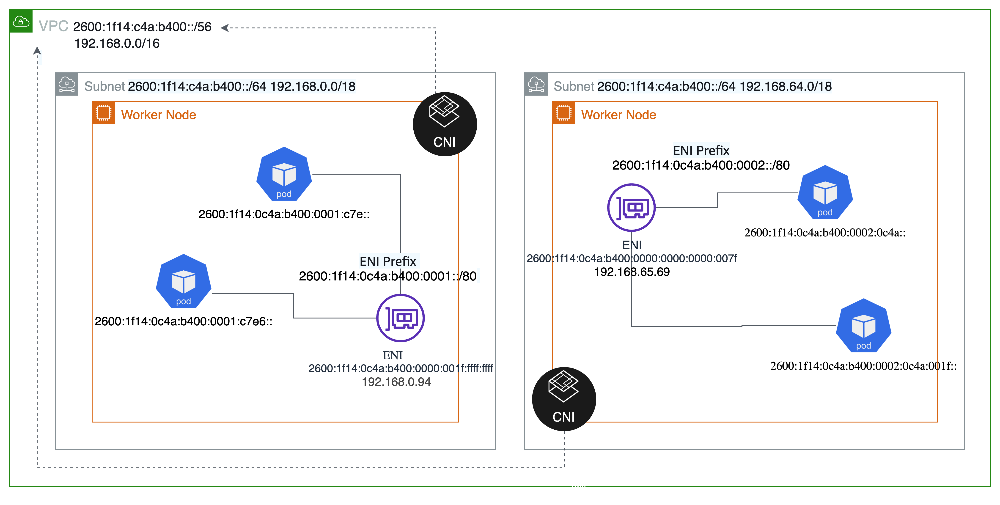
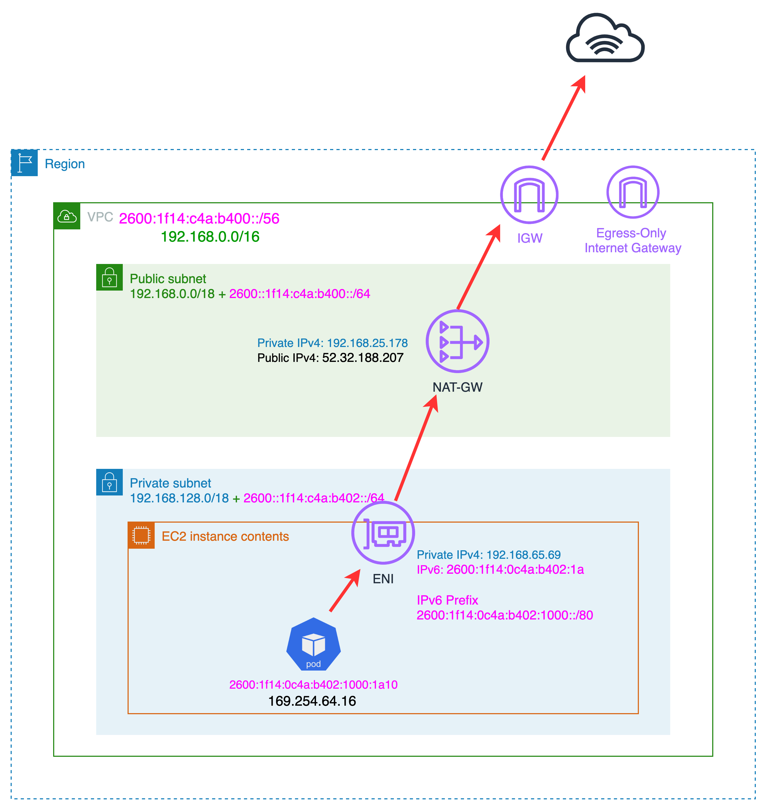
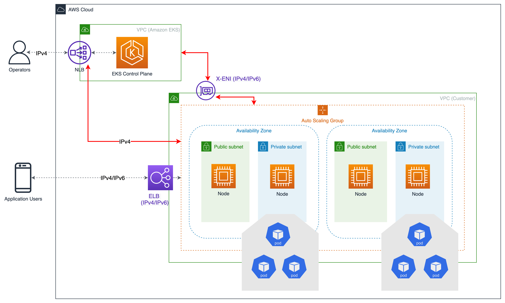

# Running for IPv6 EKS Clusters

With the launch of IPv6 support in EKS, you can now create IPv6 Kubernetes clusters. In an IPv6 EKS cluster, pods and services will receive IPv6 addresses while maintaining the ability for legacy IPv4 endpoints to connect to services running on IPv6 clusters, as well as pods to connect to legacy IPv4 endpoints outside the cluster. All the pod-to-pod communication within a cluster is always IPV6. Within a VPC (/56), the IPv6 CIDR block size for IPv6 subnets is fixed at /64. This provides 264 (approximately 18 quintillion) IPv6 addresses, allowing you to scale your deployments on EKS. EKS’s support for IPv6 is focused on resolving the IP exhaustion problem, which is constrained by the limited size of the IPv4 address space. This is a significant concern raised by a number of our customers and is distinct from Kubernetes’ "IPv4/IPv6 dual-stack" feature.

At cluster creation, you will have the option to specify IPv6 as the IP address family for the cluster. When you set up your cluster to run in IPv6 mode, pods and services in Kubernetes get IPv6 addresses.

Amazon EKS IPv6 support leverages native VPC IPv6 capabilities. IPv6 support works for new and existing VPCs; you can opt in on a VPC-by-VPC basis. Each VPC is given an IPv4 address prefix (CIDR block size can be from /16 to /28) and a unique /56 IPv6 address prefix (fixed) from within Amazon’s GUA (Global Unicast Address); you can assign a /64 address prefix to each subnet in your VPC. All IPv4 features, like Security Groups, Route Tables, Network Access Control Lists, Peering, and DNS resolution, work the same way in a VPC.

In the IPv6 world, every address is internet routable. The IPv6 addresses associated with the nodes and pods are public. Private subnets are supported by implementing an egress-only internet gateway (EIGW) in a VPC, allowing outbound traffic while blocking all incoming traffic. Best practices for implementing IPv6 subnets can be found in the VPC user guide.

## How it works?

IPv6 is supported in prefix assignment mode. Amazon VPC Container Network Interface (CNI) plugin is configured to assign an address from the prefix attached to the primary ENI. IPv6 prefix assignment now occurs only at the node startup and hence increasing the performance significantly by removing AWS api throttle for large clusters. You will not be required to update any of the WARM* settings as a single IPv6 Prefix-Delegation prefix has many addresses (/80 => ~10^14 addresses per ENI) and is big enough to support large clusters with millions of pods. The VPC CNI currently supports only prefix assignment mode for IPv6 clusters and only works with AWS Nitro-based EC2 instances.

Every instance gets both IPv4 and IPv6 addresses, along with corresponding DNS entries. For a given instance, only a single IPv4 address from the VPC address range is consumed. EKS support for IPv6 enables you to communicate with IPv4 endpoints (AWS, on-premise, internet) trhough a highly oinionated egress-only IPv4 model. EKS implements a host-local CNI plugin chained along with VPC CNI to allocate and configure an IPv4 address for a pod. The CNI plugin configures a host-specific non-routable IPv4 address for a pod from the 169.254.172.0/22 range. The IPv4 address assigned to the pod is unique to the node and is not advertised to the Kubernetes control plane. 169.254.172.0/22 provides 1024 unique IPv4 addresses and can support large instance types.



Pods will perform a DNS lookup for an endpoint and, upon receiving an IPv4 “A” response, will establish a connection with the IPv4 endpoint using the IPv4 address from the host-local 169.254.172.0/22 IP range. Pod’s node-only unique IPv4 address is translated through network address translation (NAT) to the IPv4 (VPC) address of the primary network interface attached to the node. The private IPv4 address of a node is translated by a NAT gateway to the public IPv4 address of the gateway and routed to and from the internet by an internet gateway, as shown in the following picture.



Any pod-to-pod communication across the nodes always uses an IPv6 address. VPC CNI configures iptables to handle IPv6 while blocking any IPv4 connections.

Amazon EKS recommends running worker nodes and hence pods in private subnets. You can create public load balancers in the public subnets that load balance traffic to pods running on nodes that are in private subnets. Private subnets in IPv6 VPCs are configured with an egress-only internet gateway. Any pod communication from within private subnets to IPv6 endpoints outside the cluster will be routed via an egress-only internet gateway by default.

EKS IPv6 cluster communication will continue to follow EKS the IPv4 model but will continue to provision X-ENIs in dual stack mode (IPv4/IPv6). Kubernetes node components such as kubelet and kube-proxy are configured to support dual stacks. Kubelet and kube-proxy bind to both IPv4 and IPv6 addresses attached to the primary network interface of a node. Kubernetes apiserver communicates to pods and node components via the EKS managed ENI(IPv6). Pods communicate with the apiserver via the same EKS managed ENIs, and pod to apiserver communication always uses IPv6 mode.



## Recommendations

### APIs

EKS in IPv6 mode continues to support existing methods of access control to the cluster endpoint: public, private, and both public and private. However, the cluster endpoint (NLB) is configured in IPv4 mode when you provision an IPv6 cluster. Also, EKS apis are IPv4 only. You will not be able to access cluster endpoints and apis from an IPv6 only network. It is required that your network supports an IPv6 transition mechanism that facilitates communication between IPv6 and IPv4 hosts and a DNS service that supports translations of IPv4 endpoints.

### Max Pods

A single IPv6 prefix is sufficient to run many pods on a single node. This also effectively removes the max-pods limitations tied to ENI and IP limitations. Although IPv6 removes direct dependency on max-pods, when using prefix attachments with smaller instance types like the m5.large, you’re likely to exhaust the instance’s CPU and memory resources long before you exhaust its IP addresses. You must set the EKS recommended maximum pod value by hand if you are using self-managed node groups or a managed node group with a custom AMI ID. 

You can use the following formula to determine the maximum number of pods you can deploy on a node for a IPv6 EKS cluster.

```console
((Number of network interfaces for instance type (number of prefixes per network interface-1)* 16) + 2
```

```console
((3 ENIs)* ((10 secondary IPs per ENI-1)* 16)) + 2 = 460 (real)
```

Managed node groups automatically calculate the maximum number of pods for you. Avoid changing EKS's recommended value for the maximum number of pods. to avoid Pod scheduling failures due to resource limitations.

### Security Groups Per Pod

If you have a significant need for pod security groups, Amazon EKS suggests running your cluster in IPv4 mode. Support for security groups per pod requires non-prefix mode branch ENI management. Consequently, you cannot use security groups for pods during the present phase of IPv6 support. Please ensure that your subnet has sufficient spare IP addresses to accommodate the growth for your cluster.

### Custom Networking

If custom networking is enabled, Amazon EKS recommends evaluating your need for it. If your major reason for using custom networking is to solve the IPv4 exhaustion issue, you are no longer needed to use custom networking with IPv6 if IP exhaustion is the issue. If you are utilizing custom networking to satisfy a security requirement, such as a separate network for nodes and pods, you are encouraged to submit an EKS roadmap request.

### Fargate

EKS supports IPv6 for pods running on Fargate. Pods running on Fargate do receive both IPv6 and IPv4 addresses from the VPC CIDR range. Fargate pods do not leverage egress-only IPv4 implementation. You will be limited by IPv4 limits if you are deploying Fargate pods. It is recommended to size your subnets for growth. You will not be able to create new Fargate Pods if the subnets don’t have available IPv4 addresses, irrespective of IPv6 availability.

### Unique Local Addresses

By default, VPC allocates IPv6 CIDR from the public GUA range. VPCs do not support assigning private IPv6 addresses from the Unique Local Address (ULA) range as defined by RFC 4193 (fd00::/8 or fc00::/8). This is true even when you would like to assign an IPv6 CIDR owned by you. In an IPv6 EKS cluster, nodes and pods receive public IPv6 addresses. EKS assigns IPv6 addresses to services based on Unique Local IPv6 Unicast Addresses (ULA). The ULA Service CIDR for an IPv6 cluster is automatically assigned during the cluster creation stage and cannot be modified, unlike IPv4.

### Loadbalancer Controller

IPv6 is not supported with the in tree loadbalancer controller (upstream). You are required to use the latest version of the AWS Elastic Load Balancer Controller (ELB). The AWS load balancer controller manages Elastic Load Balancers for EKS. Application Load Balancer (ALB) and Network Load Balancer (NLB) in dual stack IP mode when you add an annotation service. To your service or ingress manifests, add `beta.kubernetes.io/aws-load-balancer-ip-address-type: dualstack`.

***Note***
ELB provisions ALB when you deploy ingress. You will not be able to configure ingress with the instance type. ALB currently supports `ip` mode only. Please make sure you change the `instance` type for any ingress in the scope before migrating to IPv6. You will lose the source ip when you use nlb in an `instance` mode. You will not be able to use nlb instance target type mode if you have a strict requirement to capture incoming source IP for any audit or security reasons.

### IMDSv2

EKS in IPv6 mode does not support IMDSv2 endpoints yet. Please open a support ticket if IMDSv2 is a blocker for you to migrate to IPv6.
