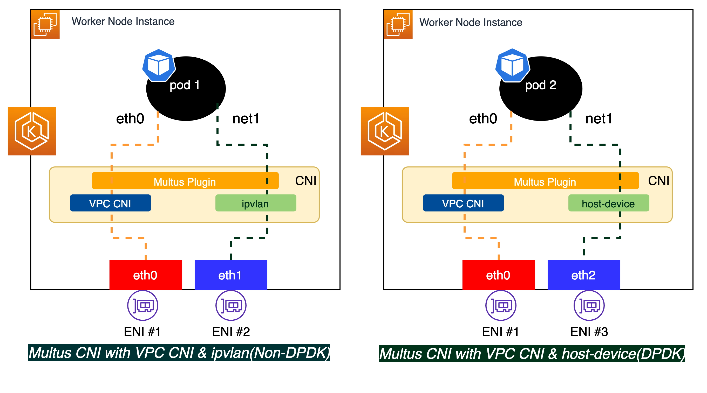

# Multus

A CNI is the container network interface that provides an application programming interface to configure network interfaces in containers. Multus CNI is a container network interface plugin for Kubernetes that enables attaching multiple network interfaces to pods. In Kubernetes, each pod has only one network interface by default, other than local loopback. With Multus, you can create multi-homed pods that have multiple interfaces. Multus acts as ‘meta’ plugin that can call other CNI plugins to configure additional interfaces.

Multiple network interfaces for pods are useful in various use cases; examples include:

- Traffic splitting: Running network functions (NF) that require separation of control/management, and data/user plane network traffic to meet low latency Quality of Service (QoS) requirements.
- Performance: Additional interfaces often leverage specialized hardware specifications such as Single Root I/O Virtualization (SR-IOV) and Data Plane Development Kit (DPDK), which bypass the operating system kernel for increased bandwidth and network performance.
- Security: Supporting multi-tenant networks with strict traffic isolation requirements. Connecting multiple subnets to pods to meet compliance requirements.

## What is a multi-homed pod?

The Multus CNI plugin allows pods to have multiple interfaces in Kubernetes. The current version of EKS support for Multus bundles Amazon VPC CNI as the default delegate plugin (which is the only supported and validated default  delegate plugin). The default delegate plugin configures the primary network interface (eth0) for pods to enable Kubernetes control plane traffic, including the IP Address Management (IPAM) for the primary network interface for the pods.

Here’s an example of how multi-homed pods can work on AWS. The image below shows two pods with two network interfaces, eth0 and net1. In both cases, the Amazon VPC CNI manages the pod eth0 (default Multus delegate). Interface net1 is managed by Multus via the ipvlan CNI plugin for pod1, which handles the user plane (eg: voice, video) traffic separated from the k8 control plane traffic. Where as pod2 net1 gets connected to the host elastic network interface through the host-device CNI plugin, and enables DPDK to accelerate the packet processing.



## Deploying Multus

EKS officially support Multus CNI. In Amazon EKS, each pod has one network interface assigned by the Amazon VPC CNI plugin. With Multus, you can create a multi-homed pod that has multiple interfaces with Multus acting as a "meta-plugin"; a CNI plugin that can call multiple other CNI plugins. AWS support for Multus comes configured with the Amazon VPC CNI plugin as the default delegate plugin.

!!!info

- Multus has been evaluated with IPVLAN CNI (both layer 2 and layer 3 modes) in region and and on local zones. AWS VPC does not support macvlan CNI; hence, macvlan cannot be used with Multus.
- AWS supports DPDK via a host-device CNI plugin. For configuration choices, please refer to the section supporting DPDK on AWS.

!!!warning

- AWS will not provide support for all compatible CNI plugins that can be chained, or for any issues that may emerge in these CNI plugins that are unrelated to the chaining setup.
- Multus is only supported when using the Amazon VPC CNI as the primary CNI. We do not support the Amazon VPC CNI when used for higher order interfaces, secondary or otherwise.

### Automation through CloudFormation, LifeCycle Hook, CloudWatch Event, and Lambda

Multus is supported on self-managed nodes. Multus requires additional ENIs to be available on the nodes. These ENIs will be mapped to additional subnets reserved for Multus use cases. You can use AWS Lambda function combined with Amazon CloudWatch event rule to attach ENIs from Multus subnets along with tag ```sh no_manage: true```. AWS VPC CNI will not manage ENI’s tagged no_manage: true. This is a must step for Multus to manage additional networks for pods.

For an implementation walk through, see the [Multus Setup Guide](https://github.com/aws-samples/eks-install-guide-for-multus/blob/main/README.md) on GitHub.

### Understanding IPAM for Multus interfaces

AWS's support for Multus comprises support and life cycle management for the Multus plugin, but it is not responsible for the IP address or management of additional network interfaces. IPAM requirements vary based on customer requirements. Some of our telecommunications carriers employ [whereabouts](https://github.com/k8snetworkplumbingwg/whereabouts), an IP Address Management (IPAM) CNI plugin that assigns cluster-wide IP addresses. If you do not have a requirement for cluster-wide IPAM, you may wish to consider host-local or static IPAM.

IPAM plugins such as static, whereabouts, and host-local supply IP addresses, but do not make these secondary interface IPs routable in the VPC network, hence preventing pods from being routed via Multus interfaces. In other words, AWS VPC is unaware of the IP addresses maintained by these third-party IPAMs; therefore, these IPs must be added manually as secondary IPs on an ENI managed by Multus. Each ENI linked to an EC2 Worker node must have the IP address(es) assigned. We advise utilizing an automated solution using either a sidecar or init-car strategy. You can find a sample implementation here: [https://github.com/aws-samples/eks-automated-ipmgmt-multus-pods](https://github.com/aws-samples/eks-automated-ipmgmt-multus-pods).

## Recommendations

### Multus with DPDK interface (host-device CNI)

We recommend using host-device CNI intead of using ipvlan CNI in the case where pod requires to have secondary interface as DPDK ENA interface. For DPDK interface, it is highly recommended to use Nitro instances (C5/M5) with ENA driver for workernode group. You will still use automation through CloudFormation, LifeCycle Hook, CloudWatch Event, and Lambda to configure multiple ENIs on a worker node.

**Note**

The version of /opt/cni/bin/host-device should be higher than [0.8.6 in the workernode] (https://github.com/awslabs/amazon-eks-ami/pull/496), in order to use the pciBudID parameter. Please check the CNI plugin version in advance. The current EKS optimized AMI (1.18) already has an updated version of host-device CNI (0.8.6).

We have tested the host device to work with pciBusID. The pciBusIds are sequential on an EC2 instance type and are static. On a worker node, the pciBusId from the example network attachment definition is mapped to eth1.

```sh
apiVersion: "k8s.cni.cncf.io/v1"
kind: NetworkAttachmentDefinition
metadata:
  name: hostcni-conf
spec:
  config: '{
      "cniVersion": "0.3.1",
      "type": "host-device",
      "pciBusID": "0000:00:06.0"
}'
```

You can use the above network attachment definition in your pod definition and with the below configurations.

- 'privileged' mode is enabled to access to host device space.
- /sys should be mounted to the container so that DPDK can access to files under that directory. (Ref: https://github.com/jeremyeder/docker-dpdk/blob/master/Dockerfile)

```sh
apiVersion: v1
kind: Pod
metadata:
  name: samplepod
  annotations:
    k8s.v1.cni.cncf.io/networks: hostcni-conf
spec:
  containers:
  - name: samplepod
    command: ["/bin/bash", "-c", "trap : TERM INT; sleep infinity & wait"]
    #image: centos:7
    image: amazonlinux:latest
    volumeMounts:
    - mountPath: /sys
      name: sys
    - mountPath: /dev
      name: dev
    securityContext:
       privileged: true
       capabilities:
        add:
          - NET_ADMIN
          - SYS_ADMIN
  volumes:
  - name: sys
    hostPath:
      path: /sys
- name: dev
```

You can configure DPDK libraries on the container as below:

```bash
kubectl exec -it samplepod /bin/bash --
```

```bash
yum install net-tools pciutils -y
yum install git gcc make -y
yum install numactl-devel -y
yum install which -y
yum install -y sudo libhugetlbfs-utils libpcap-devel \
    kernel kernel-devel kernel-headers
Download DPDK from GitHub.
 
git clone http://dpdk.org/git/dpdk
cd dpdk
git checkout v17.11
make config T=x86_64-native-linuxapp-gcc
cd usertools/
./dpdk-setup.sh

ifconfig net1 down

./dpdk-devbind.py --status

./dpdk-devbind --bind=igb_uio 0000:00:06.0

./dpdk-devbind.py --status
```

If you are using latest version of DPDK, follow these steps to build.

```bash
 
git clone http://dpdk.org/git/dpdk
cd dpdk
git checkout v20.02
make config T=x86_64-native-linuxapp-gcc
vi config/defconfig_x86_64-native-linuxapp-gcc # add at the end
CONFIG_RTE_EAL_IGB_UIO=y
cd usertools/ ./dpdk-setup.sh 

```

### Using SRIOV Device Plugin

Another recommended way to use DPDK is via the SRIOV device plugin. You can also use the [SRIOV Device Plugin](https://github.com/k8snetworkplumbingwg/sriov-network-device-plugin) to use an ENI resource as a SRIOV resource pool. You can follow the steps mentioned below to install the SR-IOV Device Plugin (sriov-dp) for the image used to run a daemonset.

```bash
sudo yum update -y
sudo amazon-linux-extras install docker
sudo service docker start
sudo groupadd docker
sudo usermod -aG docker ec2-user
```

You can configure configmap for ENI resource pool as below.  

```bash
apiVersion: v1
kind: ConfigMap
metadata:
  name: sriovdp-config
  namespace: kube-system
data:
  config.json: |
    {
        "resourceList": [
            {
                "resourceName": "sriov_dpdk_1",
                "resourcePrefix": "amazon.com",
                "selectors":
                {
                    "vendors": ["1d0f"],
                    "devices": ["ec20"],
                    "drivers": ["ena"],
                    "pciAddresses": ["0000:00:06.0"]

                }
            }
        ]
    }
```

You can configure a pod to use the SRIOV resource pool as below.

```bash
apiVersion: v1
kind: Pod
metadata:
  name: samplepod
  annotations:
    k8s.v1.cni.cncf.io/networks: amazon.com/sriov_dpdk_1
 spec:
  containers:
  - name: samplepod
    command: ["/bin/bash", "-c", "trap : TERM INT; sleep infinity & wait"]
    image: centos:7
    resources:
          limits:
            amazon.com/sriov_dpdk_1: "1"
          requests:
            amazon.com/sriov_dpdk_1: "1"
    volumeMounts:
    - mountPath: /sys
      name: sys
    - mountPath: /dev
      name: dev
    securityContext:
       privileged: true
       capabilities:
```

### IPv6 Support

Amazon EKS supports Multus in IPv6 mode. You can use Multus on IPv6 clusters. You are required to configure IPv6 subnets to be used with ipvlan CNI. ENIs reserved for Multus interfaces do not support prefix delegation mode. You will continue to use either cluster-wide, such as whereabouts, or host-local IPAM in IPv6 mode. As was said above, you can use the sidecar automation to map secondary IPs to the nodes.

### Prefix Delegation

Prefix delegation is not supported for Multus interfaces to be used with ipvlan CNI. Prefix delegation is only supported for VPC CNI. Although you can enable prefix delegation for VPC CNI, you will be limited by the number of secondary IPs for multus interfaces and hence should carefully consider using prefix delegation when multus is in use.
