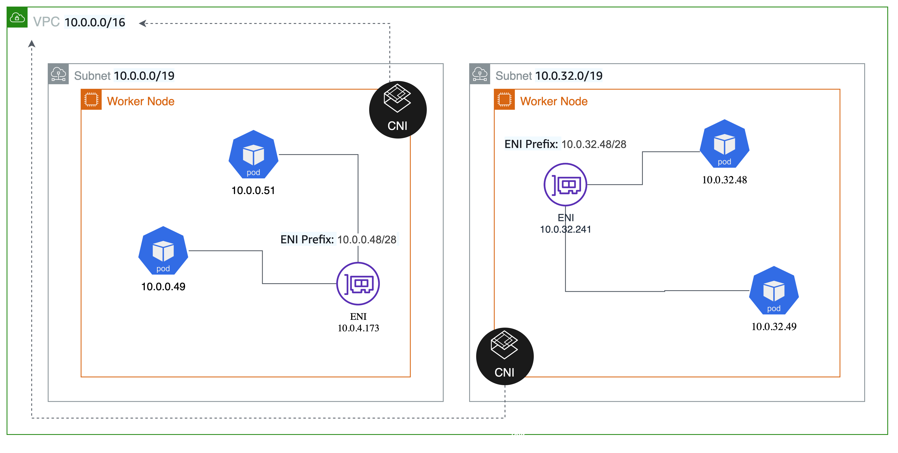

# Prefix Assignment Mode

As of August 2021, you can assign a private IPv4 or IPv6 CIDR range, either automatically or manually, to your network interfaces on EC2 instances. Amazon VPC CNI leverages assigning prefixes to [Amazon EC2 network interfaces](https://docs.aws.amazon.com/AWSEC2/latest/UserGuide/ec2-prefix-eni.html) to increase the number of IP addresses available to worker nodes. You can configure version 1.9.0 or later of the Amazon VPC CNI add-on to assign/28 (16 IP addresses) IPv4 address prefixes, instead of assigning individual IP addresses to network interfaces. This mode is used to maximize node use and improve pod density per node.

When `ENABLE_PREFIX_DELEGATION` is set to true, Amazon VPC CNI will allocate /28 IPv4 address prefixes to the ENIs. With prefix assignment mode, the maximum number of elastic network interfaces per instance type remains the same, but you can now configure Amazon VPC CNI to assign /28 (16 IP addresses) IPv4 address prefixes, instead of assigning individual IPv4 addresses to network interfaces. The pods are assigned an IPv4 address from the prefix assigned to the ENI. Please follow the instructions mentioned in the EKS user guide to enable Prefix IP mode.

Under the hood, CNI on worker node initialization, will assign a CIDR block prefix to the primary ENI. The CNI pre-allocates Prefix’s and IP addresses for faster pod startup by maintaining a warm pool. As IP needs increase (as more pods scheduled) additional prefixes will be requested for the existing ENI. When the number of prefixes exceeds the number of number can be assigned to a single network interface, the plugin begins allocating a new network interface, as long as the maximum number of network interfaces for the instance aren't already attached.



## Recommendations

### Calculate Maximum Pods

You can use the following formula to determine the maximum number of pods you can deploy on a node when Prefix IP mode is enabled.

```console
((Number of network interfaces for instance type (number of prefixes per network interface-1)* 16) + 2
```

For example, say you’re using an M5. For instance, the maximum number of pods you can run without prefix IP mode is 29.

```console
((3 ENIs)* (10 secondary IPs per ENI-1)) + 2 equals 29.
```

whereas with prefix attachments, it is 110 on smaller instance types and 440 on larger instance types.

```console
((3 ENIs)* ((10 secondary IPs per ENI-1)* 16)) + 2 = 460 (real)
```

Managed node groups automatically calculate the maximum number of pods for you. Avoid changing EKS's recommended value for the maximum number of pods. to avoid Pod scheduling failures due to resource limitations.

For self-managed nodes, we suggest setting the maximum pods per EKS user guide to avoid exhaustion of the instance’s CPU and memory resources. You may consider using a script called [max-pod-calculator.sh](https://github.com/awslabs/amazon-eks-ami/blob/master/files/max-pods-calculator.sh) ** to calculate EKS's recommended maximum pods for a given instance type. Also, the [Kubernetes community recommends](https://github.com/kubernetes/community/blob/master/sig-scalability/configs-and-limits/thresholds.md) that the maximum number of pods be no more than 110 or 10 * number of cores.

### Non-Nitro Instances

Prefix Assignment mode is supported on instances built on the [Nitro system](https://docs.aws.amazon.com/AWSEC2/latest/UserGuide/instance-types.html#ec2-nitro-instances). You may consider creating a different EKS cluster for workloads that are required to run on non-nitro instances.

### Similar Instance Types

Consider using similar instance types in a node group to maximize node use. Your node group may contain instances of many types. If an instance has a low maximum pod count, that value is applied to all nodes in the node group.

### Preserve IPv4 Addresses

The Amazon VPC CNI supports setting WARM_PREFIX_TARGET or either/both WARM_IP_TARGET and MINIMUM_IP_TARGET. Note, MINIMUM_IP_TARGET is not required to be set when using WARM_IP_TARGET, but is recommended if you have an expectation of the baseline pods per node to be scheduled in your cluster. 

The recommended and default value set in the [installation manifest](https://github.com/aws/amazon-vpc-cni-k8s/blob/master/config/v1.9/aws-k8s-cni.yaml#L158) configuration is to set WARM_PREFIX_TARGET to 1. In most cases, the recommended value of 1 for WARM_PREFIX_TARGET will provide a good mix of fast pod launch times while minimizing unused IP addresses assigned to the instance.

If you have a need to further conserve IPv4 addresses per node you can instead use WARM_IP_TARGET and MINIMUM_IP_TARGET settings, which override WARM_PREFIX_TARGET if set. By setting WARM_IP_TARGET to a value less than 16, you can prevent CNI from keeping one full free prefix attached. 

Allocating an additional prefix to an existing ENI is a faster EC2 API operation compared to creating and attaching a new ENI to the instance, which gives you the better performance characteristics while being frugal with IPv4 address allocation. Attaching a prefix typically completes in under a second, where attaching a new ENI can take up to 10 seconds. For most use cases, CNI will only need a single ENI per worker node when running in prefix assignment mode. If you can afford (in the worst case) up to 15 unused IPs per node, we strongly recommend using the newer prefix assignment networking mode, and realizing the performance and efficiency gains that come with it. 

### Subnet Fragmentation (IPv4)

When EC2 allocates a /28 IPv4 prefix to an ENI, it has to be a contiguous block of IP addresses from your subnet. If the subnet that the prefix is generated from is fragmented (a highly used subnet with scattered secondary IP addresses), the prefix attachment may fail, and you will see the following error message in the VPC CNI logs:

failed to allocate a private IP/Prefix address: InsufficientCidrBlocks: There are not enough free cidr blocks in the specified subnet to satisfy the request.

To avoid fragmentation and have sufficient contiguous space for creating prefixes, you may use VPC Subnet CIDR reservations to reserve IP space within a subnet for exclusive use by prefixes. Once you create a reservation, the VPC CNI plugin will call EC2 APIs to assign prefixes that are automatically allocated from the reserved space.

It is recommended to create a new subnet, reserve space for prefixes, and enable prefix assignment with VPC CNI for worker nodes running in that subnet. If the new subnet is dedicated only to pods running in your EKS cluster with VPC CNI prefix assignment enabled, then you can skip the prefix reservation step.

### VPC CNI Upgrade/Downgrade Behavior

Prefix mode works with VPC CNI version 1.9.0 and later. Downgrading of the Amazon VPC CNI add-on to a version lower than 1.9.0 must be avoided once the prefix mode is enabled and prefixes are assigned to ENIs. You must delete and recreate nodes if you decide to downgrade the VPC CNI.

It is highly recommended that you create new nodes to increase the number of available IP addresses. And, cordon and drain all the existing nodes to safely evict all of your existing pods. Pods on new nodes will be assigned an IP from a prefix assigned to ENI. After you confirm the pods are running, you can delete the old nodes and node groups.

### Security Group per Pod

Prefix assignment is a good networking mode choice if your workload requirements can be met with a node-level security group configuration. With prefix assignment, multiple pods are shared across an ENI and the security groups associated with that ENI. If you need each pod to have its own security groups, you can use [security group per pod](https://docs.aws.amazon.com/eks/latest/userguide/security-groups-for-pods.html) feature.

## Prefix Assignment in IPv6 Clusters

Cluster networking on IPv6 clusters is supported only in prefix assignment mode by AWS VPC CNI and only works with AWS Nitro-based EC2 instances. Prefix assignment is enabled by default on IPv6 clusters (supported by VPC CNI supported v1.10.0+). In contrast to IPv4, VPC CNI assigns an 80/80 IPv6 prefix to ENI.

A single IPv6 Prefix-Delegation prefix has many addresses (/80 => 1014 addresses per ENI) and is big enough to support large clusters with millions of pods, also removing the need for warm prefixes and minimum IP configurations.

A single IPv6 prefix is sufficient to run many pods on a single node. This also effectively removes the max-pods limitations tied to ENI and IP limitations. Although IPv6 removes direct dependency on max-pods, when using prefix attachments with smaller instance types like the m5.large, you’re likely to exhaust the instance’s CPU and memory resources long before you exhaust its IP addresses. Please follow the recommendations for maximum pods as below.


