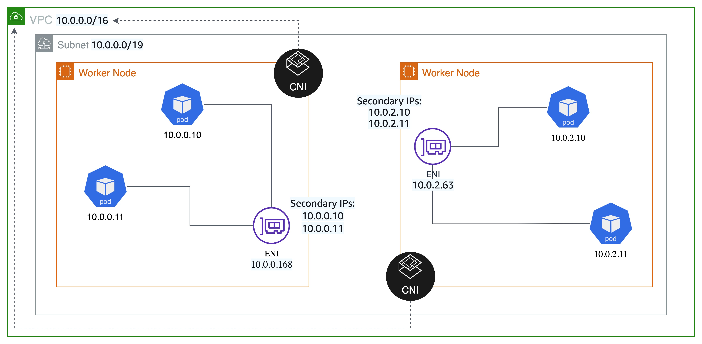

# Secondary IP Mode

The secondary IP mode was the original networking mode for Amazon VPC CNI. VPC CNI (secondary IP mode) was built from the ground up to allow EKS to fulfill all Kubernetes networking needs. As of today, EKS supports Secondary IP as the default mode for VPC CNI.

In secondary IP mode, the CNI plugin uses [Elastic Network Interface (ENI)](https://docs.aws.amazon.com/AWSEC2/latest/UserGuide/using-eni.html) for Pod networking. The CNI allocates ENIs to each worker node and uses the secondary IP range from each ENI for pods. The CNI pre-allocates ENIs and IP addresses for faster pod startup by maintaining a warm pool. When the number of pods running on the node exceeds the number of addresses that can be assigned to a single network interface, the plugin starts allocating a new network interface, as long as the maximum number of network interfaces for the instance aren't already attached.

In this mode, each pod you deploy is assigned one secondary private IP address from one of the network interfaces attached to the instance. Since each Pod uses an IP address, the number of Pods you can run on a particular [EC2 Instance](https://docs.aws.amazon.com/AWSEC2/latest/UserGuide/using-eni.html#AvailableIpPerENI) depends on how many ENIs can be attached to it and how many IP addresses it supports. You can use following formula to determine maximum no of pods you can deploy on a node. 

(Number of network interfaces for the instance type × (the number of IP addressess per network interface - 1)) + 2

For a list of the maximum number of pods supported by each instance type, see [eni-max-pods.txt](https://github.com/awslabs/amazon-eks-ami/blob/master/files/eni-max-pods.txt) on GitHub. Please be aware system pods also count towards the maximum pods.

## Recommendations

### Size your subnets for growth

Sizing your subnets for growth will prevent your subnets from running out of IP addresses as your Pods and nodes scale. You will not be able to create new Pods or nodes if the subnets don’t have available IP addresses.

If you need to constrain the IP addresses the CNI caches, then you can use warm pool CNI environment variables.

- `WARM_IP_TARGET` — Number of free IP addresses the CNI should keep available. 
- `MINIMUM_IP_TARGET` — Number of minimum IP addresses the CNI should allocate at node startup.
- `WAM_ENI_TARGET` - Number of minimum ENI the CNI should keep available (default is 1).

!!! info

- Configure the value of `MINIMUM_IP_TARGET` to closely match the number of Pods you expect to run on your nodes. Doing so will ensure that as Pods get created, the CNI can assign IP addresses from the warm pool without calling the EC2 API.
- It is recommended to use default value of 1 for `WARM_ENI_TARGET`. It's a good balance between having too many unused IPs attached, and the risk of being throttled by the EC2 API. Please note `WARM_ENI_TARGET` value will be ignored when you set `MINIMUM_IP_TARGET`.

!!! warning

- Avoid setting the value of `WARM_IP_TARGET` too low as it will cause additional calls to the EC2 API, and that might cause throttling of the requests.
- Avoid the WARM_IP_TARGET setting for large clusters or if the cluster has high pod churn. Setting it will cause additional calls to the EC2 API, and that might cause throttling of the requests. You should set `MINIMUM_IP_TARGET` along with `WARM_IP_TARGET` for large clusters with high Pod churn.
- Setting the `WARM_IP_TARGET` value too high on a highly constrained VPC might result in IP exhaustion issues and failure of workloads, hence must be avoided.

### Cluster Type

Consider using VPC CNI in secondary IP mode for running ephermal clusters that are used for testing. It is an ideal setting for greenfield use cases and for customers who have recently migrated to EKS. You can also use secondary IP mode when there are no IP or overlapping CIDR constraints. The Secondary IP mode is only available on IPv4 clusters. Consider prefix assignment mode (IPv4) if you are having problems with IP density and IPv6 if you are having problems with IP density and running out of IP space.
