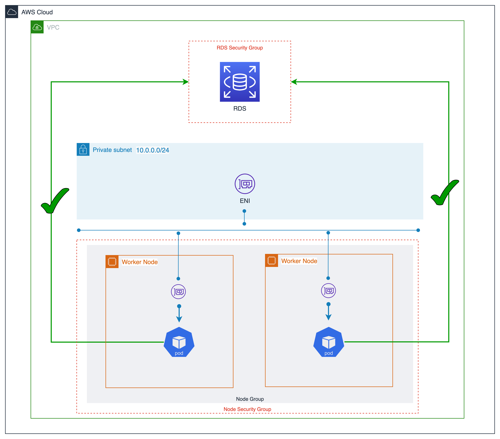
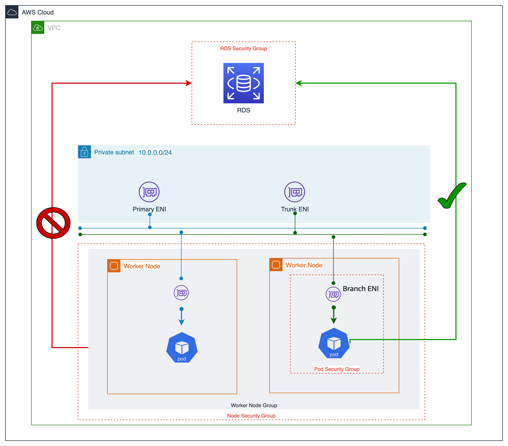

# Pod Per Branch Interface Mode (Security Group Per Pod)

A security group acts as a virtual firewall for instances to control inbound and outbound traffic. By default, the Amazon VPC CNI will use security groups at the node level, and every pod on a node shares the same security groups. Security groups at the node level can be customized by customers.

As seen in the image below, all application pods operating on worker nodes will have access to the RDS database service. Although you may workaround this limitation by setting up a new node group for each application and defining taint and affinity rules to assign pods to the appropriate nodes, this appears to be a laborious process. Security groups are too coarse grained because they apply to all Pods running on a node.



Security groups for pods provides workload network segmentation, part of a defense in depth strategy. This may help meet compliance requirements. 

Kubernetes network policies provide a mechanism for controlling ingress and egress traffic both within and outside the cluster. Network policies are not integrated with AWS security groups. This makes it difficult to restrict network access to VPC resources, such as RDS databases or EC2 instances, solely using Kubernetes network policies. With security groups for pods, you can reuse existing AWS security group resources rather than reimplementing network policies at the Kubernetes layer.

With security groups for pods, you can improve compute efficiency by running applications with varying network security requirements on shared compute resources. Multiple types of security rules, such as pod-to-pod and pod-to-internet, can be defined in a single place with EC2 security groups and applied to workloads with Kubernetes native APIs. The below image shows security groups applied at the pod level and how they simplify your application deployment and node architecture.



You can enable security groups for pods by setting `ENABLE_POD_ENI = true` for VPC CNI. Security groups for pods use a separate ENI called a branch interface, which is associated with the main trunk interface attached to the node.

## Recommendations

### Configure NAT for Outbound Traffic

Source NAT is disabled for outbound traffic from pods with assigned security groups so that outbound security group rules are applied.  To access the internet, launch worker nodes on private subnets configured with a NAT gateway or instance, and you will need to enable [external SNAT](https://docs.aws.amazon.com/eks/latest/userguide/external-snat.html) in the CNI.

```bash
kubectl set env daemonset -n kube-system aws-node AWS_VPC_K8S_CNI_EXTERNALSNAT=true
```

Pods with assigned security groups must be launched on nodes that are deployed in a private subnet.

### Deploy Pods with Security Groups to Private Subnets

Note that Pods with assigned security groups deployed to public subnets will not able to access the internet.

### Security Groups for a Pod override ENI Security Groups when using Custom Networking

When security groups for pods are used in combination with custom networking, the security group defined in security groups for pods is used rather than the security group specified in the ENIConfig for custom networking. As a result, when custom networking is enabled, carefully assess security group ordering while using security groups per pod.

### Verify *terminationGracePeriodSeconds* in Pod Specification File 

Ensure *terminationGracePeriodSeconds* in your pod specification file is defined. This is required for VPC CNI to delete the pod network from the underlying worker node. Without this setting, the CNI plugin doesn't remove the pod network on the host.

### Plan for inaccessibility of NodeLocal DNS Cache

You can’t use security groups per pod if your use case requires enabling NodeLocal DNSCache. Pods with security groups will not be able to reach the DNS caching agent running on the node.

### Restrict Access to Pod Mutation

If you want to restrict access to pod mutation while using security groups per pod, you will need to specify `eks-vpc-resource-controller` and `vpc-resource-controller` Kubernetes service accounts in the Kubernetes ClusterRoleBinding for the role that your pod security policy is assigned to. Please find the steps mentioned in the [EKS user guide](https://docs.aws.amazon.com/eks/latest/userguide/security-groups-for-pods.html).  

### Disable TCP Early Demux for Liveness Probes

If are you using liveness or readiness probes, you also need to disable TCP early demux, so that the kubelet can connect to pods on branch network interfaces via TCP. To do this run the following command:

```bash
kubectl edit daemonset aws-node -n kube-system
```

Under the `initContainer` section, change the value for `DISABLE_TCP_EARLY_DEMUX` to `true`, and save the file.
