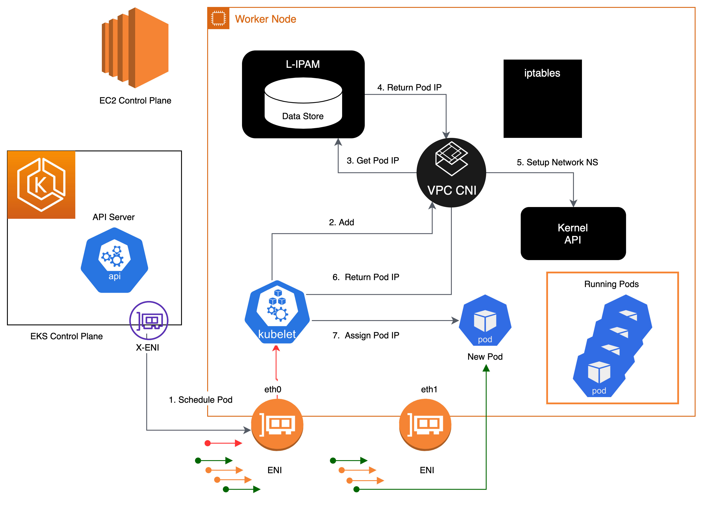

# Amazon VPC CNI

Amazon EKS implements cluster networking through the [Amazon VPC Container Network Interface (CNI)](https://github.com/aws/amazon-vpc-cni-k8s) plugin. The CNI plugin allows Kubernetes Pods to have the same IP address inside the Pod as they do on the VPC network. The CNI plugin uses [Elastic Network Interface (ENI)](https://docs.aws.amazon.com/AWSEC2/latest/UserGuide/using-eni.html) for Pod networking. 

The CNI allocates secondary ENIs to nodes for pods. Each Pod receives it's IP address from a secondary ENI. The also CNI pre-allocates "warm" ENIs and IP addresses for faster Pod startup.

The maximum number of network interfaces, and the maximum number of [private IPv4 addresses](https://docs.aws.amazon.com/AWSEC2/latest/UserGuide/using-eni.html#AvailableIpPerENI) that you can use varies by the type of EC2 Instance. Since each Pod uses an IP address, the number of Pods you can run on a particular EC2 Instance depends on how many ENIs can be attached to it and how many secondary IP addresses it supports. Pods using `hostNetwork` are excluded from this calculation. 

[This file](https://github.com/awslabs/amazon-eks-ami/blob/master/files/eni-max-pods.txt) contains the maximum number of Pods you can run on an EC2 Instance. The limits in the file are invalid if you use CNI custom networking. Review the section on [Custom Network](custom-nw.md) for more information.

The CNI plugin has two components:

* [CNI binary](https://kubernetes.io/docs/concepts/extend-kubernetes/compute-storage-net/network-plugins/#cni), which will wire up host’s and Pod’s network stack when called.
* L-IPAMD (aws-node DaemonSet) runs on every node is a long-running node-Local IP Address Management (IPAM) daemon and is responsible for:
  * maintaining a warm-pool of available IP addresses, and
  * assigning an IP address to a Pod.

## Walkthrough

The internals described here are intended to provide an overview of VPC CNI behavior in order to assist you in selecting the appropriate cluster networking configurations for your use case. The functionality of IPAMD may vary depending on the configuration settings for VPC CNI, such as prefix assignment, Pod per branch ENI, and custom networking.

VPC CNI is deployed as a Kubernetes Daemonset named aws-node on worker nodes. When you provision a worker node, a node is assigned a Primary ENI. The CNI allocates a pool of secondary IP addresses (called warm pool) from the subnet of the node’s primary ENI. As the pool gets depleted, the CNI attaches another ENI to assign more IP addresses. 


When Kubelet receives an add pod request, CNI queries ipamd for an available IP address, which ipamd then provides to the pod. Pods deployed on a node are, by default, allocated to the same security groups as the ENI to which they are tied. Alternatively, [Pods may be configured with security groups](sg-per-pod.md). Pods are assigned an IP address from the CIDR block of the subnet to which ENI belongs.



The ipamd plugin monitors available warm IP and ENI counts and attempts to reconcile them with the configured warm pool values. The ipamd plugin will allocate extra IPs and ENIs as more Pods are installed on the node. This process continues until the node can no longer support additional elastic network interfaces.


When a Pod is deleted, VPC CNI places the Pod's IP address in a 30-second cooling period. When the cooling period is over, VPC CNI moves Pod IP back to the warm-pool. The cooling period prevents pod IP addresses from being recycled prematurely and allows kube-proxy on all cluster nodes to finish updating. When the number of IPs or ENIs exceeds the number of warm pool settings, the ipamd plugin returns IP to the VPC.

## Recommendations

### Monitor IP Address Inventory

You can monitor the IP addresses inventory of subnets using [CNI Metrics Helper](https://docs.aws.amazon.com/eks/latest/userguide/cni-metrics-helper.html). 

* maximum number of ENIs the cluster can support
* number of ENIs already allocated
* number of IP addresses currently assigned to Pods
* total and maximum number of IP address available

You can also set [CloudWatch alarms](https://docs.aws.amazon.com/AmazonCloudWatch/latest/monitoring/AlarmThatSendsEmail.html) to get notified if a subnet is running out of IP addresses. Please visit EKS user guide for install instructions of [CNI metrics helper](https://docs.aws.amazon.com/eks/latest/userguide/cni-metrics-helper.html). Make sure DISABLE_METRICS variable for VPC CNI is set to false.

### Plan for Growth

Sizing your subnets for growth will prevent your subnets from running out of IP addresses as your Pods and nodes scale. You will not be able to create new Pods or nodes if the subnets don’t have available IP addresses.
If you need to constrain the IP addresses the CNI caches then you can use warm pool CNI environment variables.

* WARM_IP_TARGET — Number of free IP addresses the CNI should keep available. Use this if your subnet is small and you want to reduce IP address usage.
* MINIMUM_IP_TARGET — Number of minimum IP addresses the CNI should allocate at node startup.
* WAM_ENI_TARGET - Number of minimum ENI the CNI should keep available (default is 1). Use this if you have a very large cluster with heavy Pod churn and in-time Pod scalability needs.

To configure these options, you can download aws-k8s-cni.yaml compatible with your cluster and set environment variables. At the time of writing, the latest release is located [here](https://github.com/aws/amazon-vpc-cni-k8s/blob/master/config/v1.7/aws-k8s-cni.yaml).

*Info*
Configure the value of MINIMUM_IP_TARGET to closely match the number of Pods you expect to run on your nodes. Doing so will ensure that as Pods get created, the CNI can assign IP addresses from the warm pool without calling the EC2 API.
*Warning*
Avoid setting the value of WARM_IP_TARGET too low as it will cause additional calls to the EC2 API, and that might cause throttling of the requests. For large clusters use along with MINIMUM_IP_TARGET to avoid throttling of the requests. 

### Configure IPTables Forward Policy on non-EKS AMI Instances

If you are using custom AMI, make sure to set iptables forward policy to ACCEPT under [kubelet.service](https://github.com/awslabs/amazon-eks-ami/blob/master/files/kubelet.service#L8). By default on most of the systems iptables forward policy is set to DROP.

### Enable SNAT for private IP communication

If your Pods with private IP address need to communicate with other private IP address spaces (for example, Direct Connect, VPC Peering or Transit VPC), then you need to enable external SNAT in the CNI:

```bash
kubectl set env daemonset -n kube-system aws-node AWS_VPC_K8S_CNI_EXTERNALSNAT=true
```
