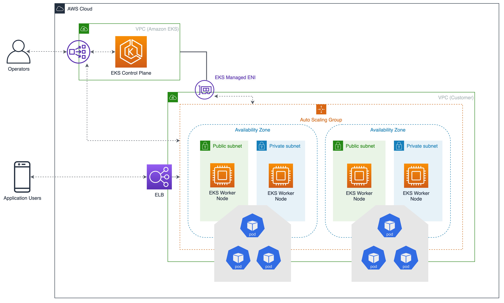

# VPC Considerations

We recommend you understand the EKS control plane communication mechanisms before you start to plan your VPC or use existing VPCs to create clusters.

Refer to [Cluster VPC considerations](https://docs.aws.amazon.com/eks/latest/userguide/network_reqs.html) and [Amazon EKS security group considerations] when architecting a VPC and subnets to be used with EKS.

## EKS Control Plane Communication

EKS uses Amazon VPCs to provide networking capabilities to worker nodes and Kubernetes Pods. An EKS cluster consists of two VPCs: an AWS-managed VPC that hosts the Kubernetes control plane and a second customer-managed VPC that hosts the Kubernetes worker nodes where containers run, as well as other AWS infrastructure (like load balancers) used by the cluster. All worker nodes need the ability to connect to the managed API server endpoint. This connection allows the worker node to register itself with the Kubernetes control plane and to receive requests to run application pods.

Worker nodes connect to the EKS control plane through the EKS public endpoint or EKS-managed elastic network interfaces (ENIs). The subnets that you pass when you create the cluster influence where EKS places these ENIs. You need to provide a minimum of two subnets in at least two Availability Zones. The route that worker nodes take to connect is determined by whether you have enabled or disabled the private endpoint for your cluster. EKS uses the EKS-managed ENI to communicate with worker nodes.



## Recommendations

### Maintain DNS Hostname and Resolution Support

Your VPC must have DNS hostname and DNS resolution support, or your nodes can't register with your cluster

If you deploy worker nodes in private subnets then these subnets should have a default route to a [NAT Gateway](https://docs.aws.amazon.com/vpc/latest/userguide/vpc-nat-gateway.html).

### Deploy NAT Gateways in each Availability Zone

If you deploy worker nodes in private subnets, consider creating a NAT Gateway in each Availability Zone to ensure zone-independent architecture. Each NAT gateway in an AZ is implemented with redundancy.

### Plan for growth

Size the subnets you will use for Pod networking for growth. If you have insufficient IP addresses available in the subnet that the CNI uses, your pods will not get an IP address. And the pods will remain pending until an IP address becomes available. This may impact application autoscaling and compromise its availability.

### Enable Automatic IP Assignment for Nodes in Public Subnets

If you use public subnets, then they must have the automatic public IP address assignment setting enabled; otherwise, worker nodes will not be able to communicate with the cluster.

### Enable SNAT for Private IP communication

If your Pods with private IP address need to communicate with other private IP address spaces (for example, Direct Connect, VPC Peering or Transit VPC), then you need to [enable external SNAT](https://docs.aws.amazon.com/eks/latest/userguide/external-snat.html) in the CNI:

```bash
kubectl set env daemonset -n kube-system aws-node AWS_VPC_K8S_CNI_EXTERNALSNAT=true
```
