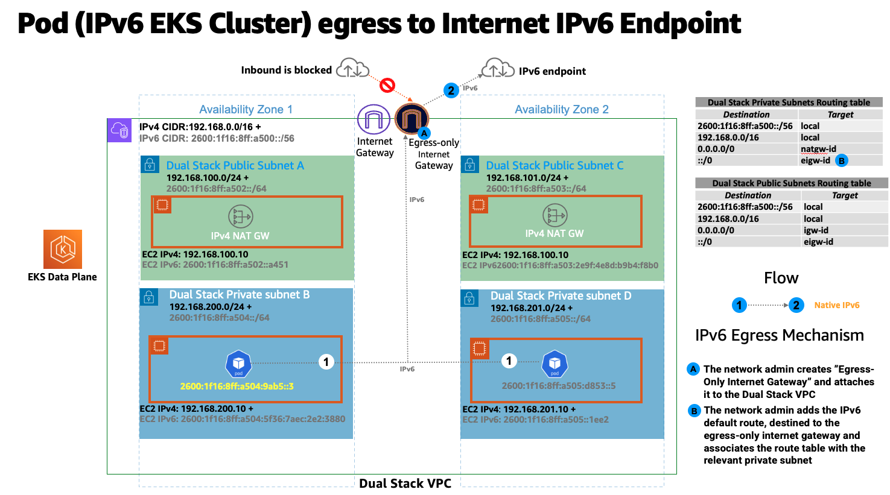
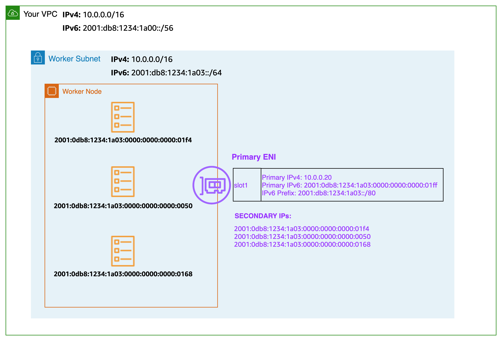
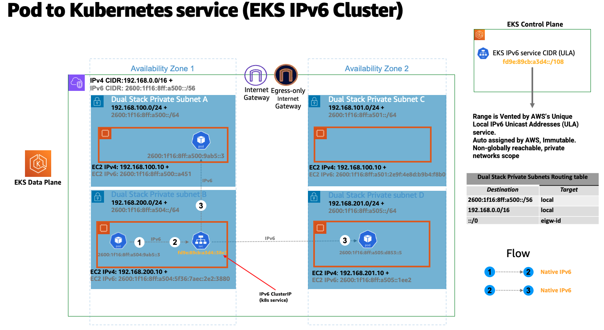
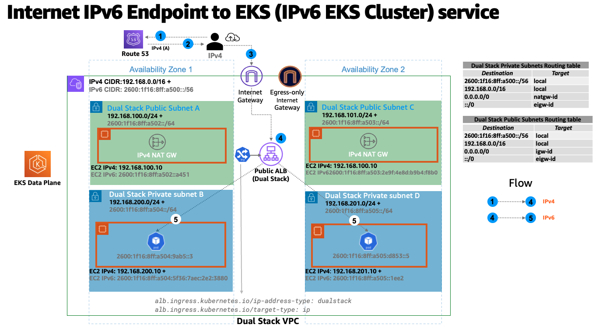

# Running IPv6 EKS Clusters

<iframe width="560" height="315" src="https://www.youtube.com/embed/zdXpTT0bZXo" title="YouTube video player" frameborder="0" allow="accelerometer; autoplay; clipboard-write; encrypted-media; gyroscope; picture-in-picture; web-share" allowfullscreen></iframe>

EKS in IPv6 mode solves the IPv4 exhaustion challenge often manifested in large scale EKS clusters. EKS’s support for IPv6 is focused on resolving the IPv4 exhaustion problem, which stems from the limited size of the IPv4 address space. This is a significant concern raised by a number of our customers and is distinct from Kubernetes’ “[IPv4/IPv6 dual-stack](https://kubernetes.io/docs/concepts/services-networking/dual-stack/)” feature.
EKS/IPv6 will also provide the flexability to inter-connect network boundaries with with non-overlapping network IPv6 CIDRs, therefor solving a 2-Fold problem (In-Cluster, Cross-Cluster).

In an IPv6 EKS cluster, Pods and Services will receive IPv6 addresses while maintaining compatibility with legacy IPv4 Endpoints. This includes the ability for external IPv4 endpoints to access in-cluster services, and Pods to access external IPv4 endpoints.

Amazon EKS IPv6 support leverages the native VPC IPv6 capabilities. Each VPC is allocated with an IPv4 address prefix (CIDR block size can be from /16 to /28) and a unique /56 IPv6 address prefix (fixed) from within Amazon’s GUA (Global Unicast Address); you can assign a /64 address prefix to each subnet in your VPC. IPv4 features, like Route Tables, Network Access Control Lists, Peering, and DNS resolution, work the same way in an IPv6 enabled VPC. The VPC is then referred as dual-stack VPC, following dual-stack subnets, the following diagram depicts the IPV4&IPv6 VPC foundation that support EKS/IPv6 based clusters:

In the IPv6 world, every address is internet routable. By default, VPC allocates IPv6 CIDR from the public GUA range. VPCs do not support assigning private IPv6 addresses from the [Unique Local Address (ULA)](https://en.wikipedia.org/wiki/Unique_local_address) range as defined by RFC 4193 (fd00::/8 or fc00::/8). This is true even when you would like to assign an IPv6 CIDR owned by you. Egressing to the internet from Private Subnets is supported by implementing an egress-only internet gateway (EIGW) in a VPC, allowing outbound traffic while blocking all incoming traffic. 
the following diagram depicts a Pod IPv6 Internet egress flow inside an EKS/IPv6 cluster:

Best practices for implementing IPv6 subnets can be found in the [VPC user guide](https://docs.aws.amazon.com/whitepapers/latest/ipv6-on-aws/IPv6-on-AWS.html).

In an IPv6 EKS cluster, nodes and Pods receive public IPv6 addresses. EKS assigns IPv6 addresses to services based on Unique Local IPv6 Unicast Addresses (ULA). The ULA Service CIDR for an IPv6 cluster is automatically assigned during the cluster creation stage and cannot be specified, unlike IPv4. The following diagram depicts an EKS/IPv6 based cluster control-plane & data-plan foundation design pattern:

## Overview

EKS/IPv6 is only supported in prefix mode (VPC-CNI Plug-in ENI IP assign mode). Review [the documentation](https://docs.aws.amazon.com/eks/latest/userguide/cni-ipv6.html) for other requirements.

Prefix assignment only works on AWS Nitro-based EC2 instances, hence EKS/IPv6 is only supported when the cluster data-plane uses nitro based instances. Amazon VPC Container Network Interface (CNI) plugin is configured to assign an address from the prefix attached to the primary ENI. 
IPv6 prefix assignment occurs at the worker-node EKS bootstrap time.
This behaviour is known to mitigate scenarios where high Pod churn EKS/IPv4 clusters are often delayed in Pod scheduling due to throttled API calls generated by the VPC CNI plug-in (ipamd) aimed to allocate Private IPv4 addresses in a timely fashion. It is also known to make the VPC-CNI plug-in advanced knobs tunning [WARM_IP/ENI*, MINIMUM_IP*](https://github.com/aws/amazon-vpc-cni-k8s#warm_ip_target) unnecessarily. In simple words an IPv6 prefix of /80 (Per worker-node) will yield ~10^14 IPv6 addresses, the limiting factor will no longer be IPs but Pod density (Resources wise).
The following diagram zooms into an IPv6 worker-node Elastic Network Interface (ENI):

Every EKS worker-node is assigned with IPv4 and IPv6 addresses, along with corresponding DNS entries. For a given worker-node, only a single IPv4 address from the dual-stack subnet is consumed. EKS support for IPv6 enables you to communicate with IPv4 endpoints (AWS, on-premise, internet) through a highly opinionated egress-only IPv4 model. EKS implements a host-local CNI plugin, secondary to the VPC CNI plugin, which allocates and configures an IPv4 address for a Pod. The CNI plugin configures a host-specific non-routable IPv4 address for a Pod from the 169.254.172.0/22 range. The IPv4 address assigned to the Pod is *unique to the worker-node* and is *not advertised beyond the worker-node*. 169.254.172.0/22 provides up to 1024 unique IPv4 addresses which can support large instance types.
The following diagram depictes the flow of an IPv6 Pod connecting to an IPv4 endpoint outside the cluster boundary:

In the above diagram Pods will perform a DNS lookup for an endpoint and, upon receiving an IPv4 “A” response, will establish a connection with the IPv4 endpoint using the IPv4 address from the host-local 169.254.172.0/22 IP range. Pod’s node-only unique IPv4 address is translated through network address translation (NAT) to the IPv4 (VPC) address of the primary network interface attached to the node. 

When the IPv6 based Pod requires to connect to an internet IPv4 endpoint, an additional Source Network Addresses Translation (SNAT) is applied on the IPv4 Based NAT Gateway (Standard practice VPC architecture), the entire flow is depicted in the following diagram: 

Any Pod-to-Pod communication across the nodes always uses an IPv6 address. VPC CNI configures iptables to handle IPv6 while blocking any IPv4 connections.

Kubernetes services will receive only IPv6 addresses (ClusterIP) from Unique [Local IPv6 Unicast Addresses (ULA)](https://datatracker.ietf.org/doc/html/rfc4193). The ULA Service CIDR for an IPv6 cluster is automatically assigned during EKS cluster creation stage and cannot be modified. The following digram depicts the Pod to Kubernetes Service flow:

Services are exposed to the internet using an AWS load balancer. The load balancer receives public IPv4 and IPv6 addresses, a.k.a dual-stack loadd balancer. For IPv4 clients accessing IPv6 cluster services, the load balancer does IPv4 to IPv6 translation.

Amazon EKS recommends running worker nodes and Pods in private subnets. You can create public load balancers in the public subnets that load balance traffic to Pods running on nodes that are in private subnets.
The following diagram depicts an internet IPv4 user accessing an EKS/IPv6 Ingress based service:

### EKS Control Plane <-> Data Plane communication

EKS will provision Cross-Account ENIs (X-ENIs) in dual stack mode (IPv4/IPv6). Kubernetes node components such as kubelet and kube-proxy are configured to support dual stack. Kubelet and kube-proxy run in a hostNetwork mode and bind to both IPv4 and IPv6 addresses attached to the primary network interface of a node. The Kubernetes api-server communicates to Pods and node components via the X-ENIs is IPv6 based. Pods communicate with the api-servers via the X-ENIs, and Pod to api-server communication always uses IPv6 mode.

## Recommendations

### Maintain Access to IPv4 EKS APIs

EKS APIs are accessible by IPv4 only. This also includes the Cluster API Endpoint. You will not be able to access cluster endpoints and APIs from an IPv6 only network. It is required that your network supports (1) an IPv6 transition mechanism such as NAT64/DNS64 that facilitates communication between IPv6 and IPv4 hosts and (2) a DNS service that supports translations of IPv4 endpoints.

### Schedule Based on Compute Resources

A single IPv6 prefix is sufficient to run many Pods on a single node. This also effectively removes ENI and IP limitations on the maximum number of Pods on a node. Although IPv6 removes direct dependency on max-Pods, when using prefix attachments with smaller instance types like the m5.large, you’re likely to exhaust the instance’s CPU and memory resources long before you exhaust its IP addresses. You must set the EKS recommended maximum Pod value by hand if you are using self-managed node groups or a managed node group with a custom AMI ID.

You can use the following formula to determine the maximum number of Pods you can deploy on a node for a IPv6 EKS cluster.

* ((Number of network interfaces for instance type (number of prefixes per network interface-1)* 16) + 2

* ((3 ENIs)*((10 secondary IPs per ENI-1)* 16)) + 2 = 460 (real)

Managed node groups automatically calculate the maximum number of Pods for you. Avoid changing EKS’s recommended value for the maximum number of Pods to avoid Pod scheduling failures due to resource limitations.

### Evaluate Purpose of Existing Custom Networking

If custom networking is currently enabled, Amazon EKS recommends re-evaluating your need for it with IPv6. If you chose to use custom networking to address the IPv4 exhaustion issue, it is no longer necessary with IPv6. If you are utilizing custom networking to satisfy a security requirement, such as a separate network for nodes and Pods, you are encouraged to submit an [EKS roadmap request](https://github.com/aws/containers-roadmap/issues).

### Plan for IPv4 addresses for Fargate Pods

EKS supports IPv6 for Pods running on Fargate. Pods running on Fargate do receive both IPv6 and IPv4 addresses from the VPC CIDR range. You will be limited by IPv4 limits if you are deploying Fargate Pods. It is recommended to size your subnets for growth. You will not be able to create new Fargate Pods if the subnets don’t have available IPv4 addresses, irrespective of IPv6 availability.

### Use AWS Load Balancer Controller

The upstream in-tree Kubernetes service controller does not support IPv6. We recommend using the most recent version of the AWS Load Balancer Controller add-on with IPv6 clusters. The [AWS load balancer controller](https://kubernetes-sigs.github.io/aws-load-balancer-controller/v2.2/) manages Elastic Load Balancers for EKS and supports Application Load Balancer (ALB) and Network Load Balancer (NLB) in dual stack IP mode when you add an annotation to your service or ingress. To your service or ingress manifests, add `beta.kubernetes.io/aws-load-balancer-ip-address-type: dualstack`.

AWS Network Load Balancer does not support dual-stack UDP protocol address types. If you have strong requirements for low-latency, real-time streaming, online gaming, and IoT, we recommend running IPv4 clusters. To learn more about managing health checks for UDP services, please refer to [“How to route UDP traffic into Kubernetes”](https://aws.amazon.com/blogs/containers/how-to-route-udp-traffic-into-kubernetes/).

### Identify Dependencies on IMDSv2

EKS in IPv6 mode does not support IMDSv2 endpoints yet. Please open a support ticket if IMDSv2 is a blocker for you to migrate to IPv6.
