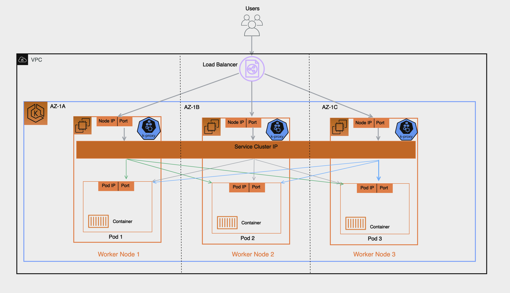

# Load Balancing

Load Balancers receive incoming traffic and distribute it across targets of the 
intended application hosted in an EKS Cluster. This improves the resilience of the 
application. 
When deployed in an EKS Cluster the [AWS Load Balancer controller](https://docs.aws.amazon.com/eks/latest/userguide/aws-load-balancer-controller.html) will 
create and manage AWS Elastic Load Balancers for that cluster. 
When a Kubernetes Service of type `LoadBalancer` is created, the AWS Load Balancer controller creates a [Network Load Balancer (NLB)](https://https://docs.aws.amazon.com/eks/latest/userguide/network-load-balancing.html) which load balances received traffic
 at Layer 4 of the [OSI model](https://en.wikipedia.org/wiki/OSI_model). While when a Kubernetes `Ingress` object is created, the 
AWS Load Balancer Controller creates an [Application Load Balancer (NLB)](https://docs.aws.amazon.com/eks/latest/userguide/alb-ingress.html)which load 
balances traffic at Layer 7 of the OSI model.

   
# Recommendations

## Choosing Load Balancer Type 

The AWS Elastic Load Balancing portfolio supports the following load balancers: Application Load Balancers (ALB), Network Load Balancers (NLB), Gateway Load Balancers (GWLB), and Classic Load Balancers (CLB). This best practices section will focus on the ALB and NLB which are the two which are most relevant for EKS Clusters. 

The main consideration in choosing the type of load balancer is the workload requirements.

For more detailed information and as a reference for all AWS Load balancers, see [Product Comparisons](https://aws.amazon.com/elasticloadbalancing/features/#Product_comparisons) 

### Choose the Application Load Balancer (ALB) if your workload is  HTTP/HTTPS

If a workloads requires load balancing at Layer 7 of the OSI Model, the AWS Load 
Balancer Controller can be used to provision an ALB; we cover the provisioning in 
the following section. The ALB is controlled and configured by the Ingress resource 
mentioned earlier and routes HTTP or HTTPS traffic to different Pods within the cluster. 
The ALB provides customers with the flexibility to change the application traffic 
routing algorithm; the default routing algorithm is round robin with the least outstanding requests routing algorithm also an alternative.

### Choose the Network Load Balancer (NLB) if your workload is TCP, or if your workload requires Source IP Preservation of Clients

A Network Load Balancer functions at the fourth layer (Transport) of the Open Systems Interconnection (OSI) model. It is suited for TCP & UDP based workloads. Network Load Balancer also by default preserves the Source IP of address of the clients when presenting the traffic to the pod.

### Choose the Network Load Balancer (NLB) if your workload cannot utilize DNS

Another key reason to use the NLB is if your clients cannot utilize DNS. In this case, the NLB may be a better fit for your workload as the IPs on a Network Load Balancer are static. While clients are recommended to use DNS when resolving Domain Names to IP Addresses when connecting to Load Balancers, if a client's application doesn't support DNS resolution and only accepts hard-coded IPs then an NLB is a better fit as the IPs are static and remain same for the life of the NLB.

## Provisioning Load Balancers

After determining the Load Balancer best suited for your workloads, customers have a 
number of options for provisioning a load balancer.

### Provision Load Balancers by deploying the AWS Load Balancer Controller

There are two key methods of provisioning load balancers within an EKS Cluster. 

* Leveraging the AWS Cloud Provider Load balancer Controller (legacy)
* Leveraging the AWS Load Balancer Controller (recommended)

By default, Kubernetes Service resources of type LoadBalancer get reconciled by the Kubernetes Service Controller that is built into the CloudProvider component of the kube-controller-manager or the cloud-controller-manager (also known as the in-tree controller).

The configuration of the provisioned load balancer is controlled by annotations that are added to the manifest for the Service or Ingress object and are different when using the AWS Load Balancer Controller than they are when using the AWS cloud provider load balancer controller. 

The AWS Cloud Provider Load balancer Controller is legacy and is currently only receiving critical bug fixes. When you create a Kubernetes Service of type LoadBalancer, the AWS cloud provider load balancer controller creates AWS Classic Load Balancers by default, but can also create AWS Network Load Balancers with the correct annotation. 

The AWS Load Balancer Controller (LBC) has to be installed in the EKS clusters and provisions AWS load balancers that point to cluster Service or Ingress resources. 

In order for the LBC to manage the reconciliation of Kubernetes Service resources of type LoadBalancer, you need to offload the reconciliation from the in-tree controller to the LBC, explicitly.
With LoadBalancerClassWith `service.beta.kubernetes.io/aws-load-balancer-type` annotation

## Choosing Load Balancer Target-Type

### Register Pods as targets using IP Target-Type

An AWS Elastic Load Balancer: Network & Application, sends received traffic to registered targets in a target group. For an EKS Cluster there are 2 types of targets you can register in the target group: Instance & IP, which target type is used has implications on what gets registered and how traffic is routed from the Load Balancer to the pod. 
By default the AWS Load Balancer controller will register targets using ‘Instance’ type and this target will be the Worker Node’s IP and NodePort, implication of this includes:

* Traffic from the Load Balancer will be forwarded to the Worker Node on the NodePort, this gets processed by iptable rules (configured by kube-proxy running on the node) gets forwarded to the Service on its ClusterIP (still on the node), finally the Service randomly selects a pod registered to it and forwards the traffic to it. This flow involves multiple hops and extra latency can be incurred especially because the Service will sometimes select a pod running on another worker node which might also be in another AZ.
* Because the Load Balancer registers the Worker Node as its target this means its health check which gets sent to the target will not be directly received by the pod but by the Worker Node on its NodePort and health check traffic will follow the same path described above.
* Monitoring and Troubleshooting is more complex since traffic forwarded by the Load Balancer isn’t directly sent to the pods and you’d have to carefully correlate the packet received on the Worker Node to to the Service ClusterIP and eventually the pod to have full end-to-end visibility into the packet’s path for proper troubleshooting.

By contrast if you configure the target type as ‘IP’ as we recommend the implication will be the following: 

* Traffic from the Load Balancer will be forwarded directly to the pod, this simplifies the network path as it bypasses the previous extra hops of Worker Nodes and Service Cluster IP, it reduces latency that would otherwise have been incurred if the Service forwarded traffic to a pod in another AZ and lastly it removes the iptable rules overhead processing on the Worker Nodes. 
* The Load Balancer’s health check is directly received and responded to by the pod, this means the target status ‘healthy’ or ‘unhealthy’ are a direct representation of the pod’s health status. 
* Monitoring and Troubleshooting is easier and any tool used that captures packet IP address will directly reveal the bi-directional traffic between the Load Balancer and the pod in its source and destination fields.

To create an AWS Elastic Load Balancing that uses IP Targets you add:

* `alb.ingress.kubernetes.io/target-type: ip` annotation to your Ingress’ manifest when configuring your Kubernetes Ingress (Application Load Balancer)
* `service.beta.kubernetes.io/aws-load-balancer-nlb-target-type: ip` annotation to your Service’s Manifest when configuring your Kubernetes Service of type LoadBalancer (Network Load Balancer).

## Availability and Pod Lifecycle

During an application upgrade you must make sure that your application is always available to process requests so that the users do not experience any downtime. One common challenge in this scenario is syncing the availability status of your workloads between the Kubernetes layer and the infrastructure, for instance external load balancers.  The next few sections highlight the best practices to address such scenarios.

Note : The explanations below are based on the [EndpointSlices](https://kubernetes.io/docs/concepts/services-networking/service/#endpointslices) as it is the recommended replacement for the [Endpoints](https://kubernetes.io/docs/concepts/services-networking/service/#endpoints) in Kubernetes. The differences between the two are negligible in the context of the scenarios covered below. AWS Load Balancer Controller by default consumes Endpoints, you can enable EndpointSlices by enabling the [enable-endpoint-sliceflag](https://github.com/kubernetes-sigs/aws-load-balancer-controller/blob/main/docs/deploy/configurations.md#controller-command-line-flags) on the controller. 

### Use health checks

Kubernetes by default runs the [process health check](https://kubernetes.io/docs/concepts/workloads/pods/pod-lifecycle/#container-states) where the kubelet process on the node verifies whether or not the main process of the container is running. If not then by default it restarts that container. However you can also configure [Kubernetes probes](https://kubernetes.io/docs/concepts/workloads/pods/pod-lifecycle/#types-of-probe) to identify when a container process is running but in a deadlock state, or whether an application has started successfully or not. Probes can be based on exec, grpc, httpGet and tcpSocket [mechanisms](https://kubernetes.io/docs/concepts/workloads/pods/pod-lifecycle/#probe-check-methods). Based on the type and result of the probe the container can be restarted. 

---

  
 <b> Pod Creation (Expand to revisit the sequence of events) </b> 

It is imperative to understand what is the sequence of events in a scenario where a Pod is deployed and then it becomes healthy/ready to receive and process client requests.  Let’s talk about the sequence of events.

1. A Pod is created on the Kubernetes control plane (i.e. by a kubectl command, or Deployment update, or scaling action).
2. `kube-scheduler` assigns the Pod to a node in the cluster.
3. The kubelet process running on the assigned node receives the update (via `watch`) and communicates with the container runtime to start the containers defined in the Pod spec.
4. When the containers start running, the kubelet updates the [Pod condition](https://kubernetes.io/docs/concepts/workloads/pods/pod-lifecycle/#pod-conditions) as `Ready` in the Pod object in the Kubernetes API.
5. The [EndpointSlice Controller](https://kubernetes.io/docs/concepts/overview/components/#kube-controller-manager) receives the Pod condition update (via `watch`) and adds the Pod IP/Port as a new endpoint to the [EndpointSlice](https://kubernetes.io/docs/concepts/services-networking/endpoint-slices/) object (list of Pod IPs) of the respective Kubernetes Service. 
6. [kube-proxy](https://kubernetes.io/docs/concepts/overview/components/#kube-proxy) process on each node receives the update (via `watch`) on the EndpointSlice object and then updates the [iptables](https://en.wikipedia.org/wiki/Iptables) rules on each node, with the new Pod IP/port.

---

### Use readiness probes

By default when [all the containers within a Pod are running](https://kubernetes.io/docs/concepts/workloads/pods/pod-lifecycle/#pod-readiness-status) the [Pod condition](https://kubernetes.io/docs/concepts/workloads/pods/pod-lifecycle/#pod-conditions) is considered to be “Ready”. However the application may still not be able to process client requests. For example the application may need to pull some data or configuration from an external resource to be able to process requests. In such a state you would neither want to kill the application nor forward any requests to it yet. [Readiness probe](https://kubernetes.io/docs/tasks/configure-pod-container/configure-liveness-readiness-startup-probes/#define-readiness-probes) enables you to make sure that the Pod is not considered to be “Ready” meaning that it will not be added to the EndpointSlice object, until the [probe result](https://kubernetes.io/docs/concepts/workloads/pods/pod-lifecycle/#probe-outcome) is `success`. On the other hand if the probe fails further down the line then the Pod is removed from the EndpointSlice object. You can configure a readiness probe in the Pod manifest for each container. `kubelet` process on each node runs the readiness probe against the containers on that node. 

### Utilize Pod readiness gates

One aspect of the readiness probe is the fact that there is no external feedback/influence mechanism in it,  kubelet process on the node executes the probe and defines the state of the probe. This does not have any impact on the requests between microservices themselves in the Kubernetes layer (east west traffic) since the EndpointSlice Controller keeps the list of endpoints (Pods) always up to date. Why and when would you need an external mechanism then ? 

When you expose your applications using Kubernetes Service type of Load Balancer or Kubernetes Ingress (for north - south traffic) then the list of Pod IPs for the respective Kubernetes Service must be propagated to the external infrastructure load balancer so that the load balancer also has an up to date list targets. [AWS Load Balancer Controller](https://docs.aws.amazon.com/eks/latest/userguide/aws-load-balancer-controller.html) bridges the gap here. When you use AWS Load Balancer Controller and leverage  `target group: IP` , just like `kube-proxy` the AWS Load Balancer Controller also receives an update (via `watch`) and then it communicates with the [ELB API](https://docs.aws.amazon.com/elasticloadbalancing/latest/APIReference/Welcome.html) to configure and start registering the Pod IP as a target on the ELB. 

Whenever you update a Deployment new Pods get created and as soon as a new Pod’ s condition is “Ready” an old/existing Pod gets terminated. During this process, the Kubernetes EndpointSlice object is updated much earlier/quicker than the time it takes for the [ELB to register the new Pods as targets (target registration process)](https://docs.aws.amazon.com/elasticloadbalancing/latest/application/target-group-register-targets.html). For a certain period of time you would have a state mismatch between the Kubernetes layer and the infrastructure layer and client requests will be dropped. Because in the Kubernetes layer the Deployment update progresses further and cycles through all the Pods in the Deployment; but in the infrastructure layer the ELB still needs time to complete the registration and health check of the new Pods so that the status of the ELB target becomes “Healthy”.  During this period within the Kubernetes layer new Pods would be ready to process requests but from ELB point of view they are not. 

[Pod Readiness Gates](https://kubernetes.io/docs/concepts/workloads/pods/pod-lifecycle/#pod-readiness-gate) enables you to define additional requirements that must be met before the Pod condition is considered to be “Ready”. In the case of AWS ELB, the AWS Load Balancer Controller monitors the status of the target (the Pod) on the AWS ELB and once the target registration completes and its status turns “Healthy” then [the controller updates the Pod’ s condition to “Ready”](https://kubernetes-sigs.github.io/aws-load-balancer-controller/v2.4/deploy/pod_readiness_gate/). With this approach you influence the Pod condition based on the state of the external network, which is the target status on the AWS ELB. Pod Readiness Gates is crucial in rolling update scenarios as it enables you to prevent the rolling update of a deployment from terminating old pods until the newly created Pods target status turn “Healthy” on the AWS ELB. 

---

  
 <b> Pod Deletion (Expand to revisit the sequence of events) </b> 

Just like Pod creation, it is imperative to understand what is the sequence of events during Pod deletion. Let’ s talk about the sequence of events. 

1. A Pod deletion request is sent to the Kubernetes API server (i.e. by a `kubectl` command, or Deployment update, or scaling action). 
2. Kubernetes API server [starts a grace period](https://kubernetes.io/docs/concepts/workloads/pods/pod-lifecycle/#pod-termination), which is 30 seconds by default, by setting the [deletionTimestamp](https://kubernetes.io/docs/concepts/architecture/garbage-collection/#foreground-deletion) field in the Pod object. (Grace period can be configured in Pod spec through `terminationGracePeriodSeconds`)
3. The `kubelet` process running on the node receives the update (via watch) on the Pod object and sends a [SIGTERM](https://en.wikipedia.org/wiki/Signal_(IPC)#SIGTERM) signal to process identifier 1 (PID 1) inside each container in that Pod. It then watches the `terminationGracePeriodSeconds`.
4. The [EndpointSlice Controller](https://kubernetes.io/docs/concepts/overview/components/#kube-controller-manager) also receives the update (via `watch`) from Step 2 and sets the endpoint condition to “terminating”  in the [EndpointSlice](https://kubernetes.io/docs/concepts/services-networking/endpoint-slices/#conditions) object (list of Pod IPs) of the respective Kubernetes Service. 
5. [kube-proxy](https://kubernetes.io/docs/concepts/overview/components/#kube-proxy) process on each node receives the update (via `watch`) on the EndpointSlice object then [iptables](https://en.wikipedia.org/wiki/Iptables) rules on each node get updated by the kube-proxy to stop forwarding clients requests to the Pod.
6. When the `terminationGracePeriodSeconds` expires then the `kubelet` sends  [SIGKILL](https://en.wikipedia.org/wiki/Signal_(IPC)#SIGKILL)  signal to the parent process of each container in the Pod and forcibly terminates them. 
7. [TheEndpointSlice Controller](https://kubernetes.io/docs/concepts/overview/components/#kube-controller-manager) removes the endpoint from the [EndpointSlice](https://kubernetes.io/docs/concepts/services-networking/endpoint-slices/#conditions) object.
8. API server deletes the Pod object. 

---

### Gracefully shutdown applications

Your application should respond to a SIGTERM signal by starting its graceful shutdown so that clients do not experience any downtime. What this means is your application should run cleanup procedures such as saving data, closing file descriptors, closing database connections, completing in-flight requests gracefully and exit in a timely manner to fulfill the Pod termination request. You should set the grace period to long enough so that cleanup can finish. To learn how to respond to the SIGTERM signal you can refer to the resources of the respective programming language that you use for your application. 

If your application is unable to shutdown gracefully upon receipt of a SIGTERM signal or if it [ignores/does not receive the signal](https://petermalmgren.com/signal-handling-docker/), then you can instead leverage [PreStop hook](https://kubernetes.io/docs/concepts/containers/container-lifecycle-hooks/#container-hooks) to initiate a graceful shutdown of the application. Prestop hook is executed immediately before the SIGTERM signal is sent and it can perform arbitrary operations without having to implement those operations in the application code itself. 

The overall sequence of events is shown in the diagram below. Note that regardless of the result of graceful shutdown procedure of the application, or the result of the PreStop hook, the application containers are eventually terminated at the end of the grace period via SIGKILL.

### Gracefully handle the  client requests

The sequence of events in Pod deletion is different than Pod creation. When a Pod is created `kubelet`  updates the Pod IP in Kubernetes API and only then the EndpointSlice object is updated. On the other hand when a Pod is being terminated Kubernetes API notifies both the kubelet and EndpointSlice controller at the same time. Carefully inspect the following diagram which shows the sequence of events.

The way the state propagates all the way from API server down to the iptables rules on the nodes explained above creates an interesting race condition. Because there is a high chance that the container receives the SIGKILL signal much earlier than the kube-proxy on each node updates the local iptables rules. In such an event two scenarios worth mentioning are : 

* If your application immediately and bluntly drops the in-flight requests and connections upon receipt of SIGTERM which means the clients would see 50x errors all over the place.
* Even if your application ensures that all in-flight requests and connections are processed completely upon receipt of SIGTERM, during the grace period, new client requests would still be sent to the application container because iptables rules may still not be updated yet. Until the cleanup procedure closes the server socket on the container those new requests will result in new connections. When the grace period ends those connections, which are established after the SIGTERM, at that time are dropped unconditionally since SIGKILL is sent. 

Setting the grace period in Pod spec long enough may address this challenge but depending on the propagation delay and the number of actual client requests it is hard to anticipate the time it takes for the application to close out the connections gracefully. Hence the not so perfect but most feasible approach here is to use a PreStop hook to delay the SIGTERM signal until the iptables rules are updated to make sure that no new client requests are sent to the application rather, only existing connections carry on.  PreStop hook can be a simple Exec handler such as `sleep 10`. 

The behaviour and the recommendation mentioned above would be equally applicable when you expose your applications using Kubernetes Service type of Load Balancer or Kubernetes Ingress (for north - south traffic) using AWS Load Balancer Controller and leverage  `target group: IP` . Because just like `kube-proxy` the AWS Load Balancer Controller also receives an update (via watch) on the EndpointSlice object and then it communicates with the [ELB API](https://docs.aws.amazon.com/elasticloadbalancing/latest/APIReference/Welcome.html) to start deregistering the Pod IP from the ELB. However depending on the load on Kubernetes API or the ELB API this can also take time and the SIGTERM may have already been sent to the application long ago. Once the ELB starts deregistering the target it stops sending requests to that target so the application will not receive any new requests and the ELB also starts a [Deregistration delay](https://docs.aws.amazon.com/elasticloadbalancing/latest/application/load-balancer-target-groups.html#deregistration-delay) which is 300 seconds by default. During the deregistration process the target is `draining`  where basically the ELB waits for the in-flight requests/existing connections to that target to drain. Once the deregistration delay expires then the target is unused and any in-flight requests to that target is forcibly dropped. 

### Use Pod disruption budget

Configure a [Pod Disruption Budget (PDB)](https://kubernetes.io/docs/concepts/workloads/pods/disruptions/#pod-disruption-budgets) for your applications. PDBlimits the number of Pods of a replicated application that are down simultaneously from [voluntary disruptions](https://kubernetes.io/docs/concepts/workloads/pods/disruptions/#voluntary-and-involuntary-disruptions). It ensures that a minimum number or percentage of pods remain available in a StatefulSet or Deployment. For example, a quorum-based application needs to ensure that the number of replicas running is never brought below the number needed for a quorum. Or a web front end might ensure that the number of replicas serving load never falls below a certain percentage of the total. PDB will protect the application against actions such as nodes being drained, or new versions of Deployments being rolled out. Keep in mind that PDB’s will not protect the application against involuntary disruptions such as a failure of the node operating system or loss of network connectivity. For more information please refer to the [Specifying a Disruption Budget for your Application](https://kubernetes.io/docs/tasks/run-application/configure-pdb/) in Kubernetes documentation.

## References

* KubeCon Europe 2019 Session - [Ready? A Deep Dive into Pod Readiness Gates for Service Health](https://www.youtube.com/watch?v=Vw9GmSeomFg) 
* Book - [Kubernetes in Action](https://www.manning.com/books/kubernetes-in-action) 
* AWS Blog - [How to rapidly scale your application with ALB on EKS (without losing traffic)](https://aws.amazon.com/blogs/containers/how-to-rapidly-scale-your-application-with-alb-on-eks-without-losing-traffic/)
