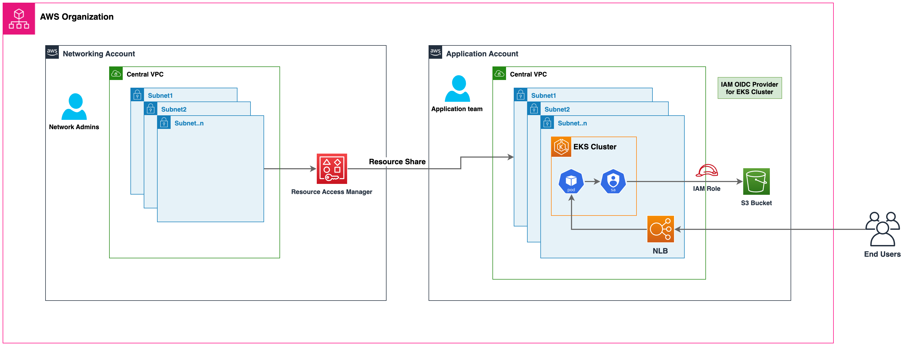

---
search:
  exclude: true
---

# VPC 및 서브넷 고려 사항

EKS 클러스터를 운영하려면 쿠버네티스 네트워킹 외에도 AWS VPC 네트워킹에 대한 지식이 필요합니다.

VPC를 설계하거나 기존 VPC에 클러스터를 배포하기 전에 EKS 컨트롤 플레인 통신 메커니즘을 이해할 것을 권장합니다.

EKS에서 사용할 VPC와 서브넷을 설계할 때는 [클러스터 VPC 고려 사항](https://docs.aws.amazon.com/eks/latest/userguide/network_reqs.html) 및 [Amazon EKS 보안 그룹 고려 사항](https://docs.aws.amazon.com/eks/latest/userguide/sec-group-reqs.html)을 참조합니다.

## 개요

### EKS 클러스터 아키텍처

EKS 클러스터는 두 개의 VPC로 구성됩니다. 

* 쿠버네티스 컨트롤 플레인을 호스팅하는 AWS 관리형 VPC. 이 VPC는 고객 계정에 표시되지 않습니다. 
* 쿠버네티스 노드를 호스팅하는 고객 관리형 VPC. 여기에서 컨테이너는 물론 클러스터에서 사용하는 로드 밸런서와 같은 기타 고객 관리형 AWS 인프라가 실행됩니다. 이 VPC는 고객 계정에 표시됩니다. 클러스터를 생성하기 전, 고객 관리형 VPC를 생성해야 합니다. 사용자가 VPC를 제공하지 않을 경우 eksctl이 VPC를 생성합니다.

고객 VPC의 노드는 AWS VPC의 관리형 API 서버 엔드포인트에 연결할 수 있어야 합니다. 이를 통해 노드가 쿠버네티스 컨트롤 플레인에 등록되고 애플리케이션 파드를 실행하라는 요청을 수신할 수 있습니다.

노드는 (a) EKS 퍼블릭 엔드포인트 또는 (b) EKS에서 관리하는 교차 계정 [Elastic Network Interface](https://docs.aws.amazon.com/AWSEC2/latest/UserGuide/using-eni.html)(X-ENI)를 통해 EKS 컨트롤 플레인에 연결됩니다. 클러스터를 생성할 때는 최소 두 개의 VPC 서브넷을 지정해야 합니다. EKS는 클러스터 생성 시 지정된 각 서브넷(클러스터 서브넷이라고도 함)에 X-ENI를 배치합니다. 쿠버네티스 API 서버는 이러한 교차 계정 ENI를 사용하여 고객 관리형 클러스터 VPC 서브넷에 배포된 노드와 통신합니다. 

노드를 시작하면 EKS 부트스트랩 스크립트가 실행되고 쿠버네티스 노드 구성 파일이 설치됩니다. 각 인스턴스의 부팅 프로세스의 일부로써 컨테이너 런타임 에이전트, kubelet 및 쿠버네티스 노드 에이전트가 시작됩니다.

노드를 등록하기 위해 kubelet은 쿠버네티스 클러스터 엔드포인트에 접속합니다. VPC 외부의 퍼블릭 엔드포인트 또는 VPC 내의 프라이빗 엔드포인트와의 연결을 설정합니다. Kubelet은 API 명령을 수신하고 엔드포인트에 상태 업데이트 및 하트비트를 정기적으로 제공합니다.

### EKS 컨트롤 플레인 통신

EKS에는 [클러스터 엔드포인트](https://docs.aws.amazon.com/eks/latest/userguide/cluster-endpoint.html)에 대한 접근을 제어하는 두 가지 방법이 있습니다. 엔드포인트 접근 제어를 통해 엔드포인트가 퍼블릭 인터넷을 통해 접근할 수 있는지 아니면 VPC를 통해서만 접근할 수 있는지 여부를 선택할 수 있습니다. 퍼블릭 엔드포인트(기본값), 프라이빗 엔드포인트 또는 둘 다를 한 번에 활성화 할 수 있습니다. 

클러스터 API 엔드포인트의 구성은 노드가 컨트롤 플레인과 통신하기 위한 경로를 결정합니다. 참고로 이러한 엔드포인트 설정은 EKS 콘솔 또는 API를 통해 언제든지 변경할 수 있습니다.

#### 퍼블릭 엔드포인트

해당 구성은 신규 Amazon EKS 클러스터의 기본 동작입니다. 클러스터의 퍼블릭 엔드포인트만 활성화된 경우 클러스터의 VPC 내에서 시작된 쿠버네티스 API 요청(예: 워커노드에서 컨트롤 플레인으로의 통신)은 VPC 외부로 가지만 Amazon 네트워크 외부로는 가지 않습니다. 노드가 컨트롤 플레인에 연결되려면 퍼블릭 IP 주소 및 인터넷 게이트웨이에 대한 경로 또는 NAT 게이트웨이의 퍼블릭 IP 주소를 사용할 수 있는 NAT 게이트웨이에 대한 경로가 있어야 합니다.

#### 퍼블릭 및 프라이빗 엔드포인트

퍼블릭 엔드포인트와 프라이빗 엔드포인트가 모두 활성화되면 VPC 내의 쿠버네티스 API 요청이 VPC 내의 X-ENI를 통해 컨트롤 플레인과 통신합니다. 클러스터 API 서버는 인터넷에서 액세스할 수 있습니다.

#### 프라이빗 엔드포인트

프라이빗 엔드포인트만 활성화된 경우 인터넷에서 API 서버에 공개적으로 액세스할 수 없습니다. 클러스터 API 서버로 향하는 모든 트래픽은 클러스터의 VPC 또는 연결된 네트워크 안에서 들어와야 합니다. 노드는 VPC 내의 X-ENI를 통해 API 서버와 통신합니다. 단, 클러스터 관리 도구는 프라이빗 엔드포인트에 액세스할 수 있어야 합니다. [Amazon VPC 외부에서 프라이빗 Amazon EKS 클러스터 엔드포인트에 연결하는 방법](https://aws.amazon.com/premiumsupport/knowledge-center/eks-private-cluster-endpoint-vpc/)에 대해 자세히 알아봅니다.

참고로 클러스터의 API 서버 엔드포인트는 퍼블릭 DNS 서버에서 VPC의 프라이빗 IP 주소로 리졸브됩니다. 과거에는 VPC 내에서만 엔드포인트를 리졸브할 수 있었습니다.

### VPC 구성

Amazon VPC는 IPv4 및 IPv6 주소를 지원합니다. Amazon EKS는 기본적으로 IPv4를 지원합니다. VPC에는 IPv4 CIDR 블록이 연결되어 있어야 합니다. 선택적으로 여러 IPv4 [Classless Inter-Domain Routing](http://en.wikipedia.org/wiki/CIDR_notation)(CIDR) 블록과 여러 IPv6 CIDR 블록을 VPC에 연결할 수 있습니다. VPC를 생성할 경우 [RFC 1918](http://www.faqs.org/rfcs/rfc1918.html)에 지정된 프라이빗 IPv4 주소 범위에서 VPC에 대한 IPv4 CIDR 블록을 지정해야 합니다. 허용되는 블록 크기는 `/16` Prefix(65,536개의 IP 주소)와 `/28` Prefix(16개의 IP 주소) 사이입니다. 

신규 VPC를 만들 때는 하나의 IPv6 CIDR 블록을 연결할 수 있으며, 기존 VPC를 변경할 때는 최대 5개까지 연결할 수 있습니다. IPv6 VPC의 CIDR 블록의 Prefix 길이는 [1조 개 이상의 IP 주소](https://www.ripe.net/about-us/press-centre/understanding-ip-addressing#:~:text=IPv6%20Relative%20Network%20Sizes%20%20%20%2F128%20,Minimum%20IPv6%20allocation%20%201%20more%20rows%20)를 가진 /64로 고정됩니다. Amazon에서 관리하는 IPv6 주소 풀에서 IPv6 CIDR 블록을 요청할 수 있습니다.

Amazon EKS 클러스터는 IPv4와 IPv6를 모두 지원합니다. 기본적으로 EKS 클러스터는 IPv4 IP를 사용합니다. 클러스터 생성 시 IPv6을 지정하면 IPv6 클러스터를 사용할 수 있습니다. IPv6 클러스터에는 듀얼 스택 VPC와 서브넷이 필요합니다.

Amazon EKS는 클러스터를 생성하는 동안 서로 다른 가용 영역에 있는 서브넷을 두 개 이상 사용할 것을 권장합니다. 클러스터를 생성할 때 전달하는 서브넷을 클러스터 서브넷이라고 합니다. 클러스터를 생성할 때 Amazon EKS는 지정한 서브넷에 최대 4개의 교차 계정(x-account 또는 x-ENIs) ENI를 생성합니다.x-ENI는 항상 배포되며 로그 전송, 실행 및 프록시와 같은 클러스터 관리 트래픽에 사용됩니다. 전체 [VPC 및 서브넷 요구 사항](https://docs.aws.amazon.com/eks/latest/userguide/network_reqs.html#network-requirements-subnets) 세부 정보는 EKS 사용자 가이드를 참조합니다. 

쿠버네티스 워커 노드는 클러스터 서브넷에서 실행할 수 있지만 권장되지는 않습니다. [클러스터 업그레이드](https://aws.github.io/aws-eks-best-practices/upgrades/#verify-available-ip-addresses) 중에 Amazon EKS는 클러스터 서브넷에 추가 ENI를 프로비저닝합니다. 클러스터가 확장되면 워커 노드와 파드가 클러스터 서브넷에서 가용 IP를 사용할 수 있습니다. 따라서 사용 가능한 IP를 충분히 확보하려면 /28 넷마스크가 있는 전용 클러스터 서브넷 사용을 고려할 수 있습니다.

쿠버네티스 워커 노드는 퍼블릭 또는 프라이빗 서브넷에서 실행할 수 있습니다. 서브넷이 퍼블릭인지 프라이빗인지는 서브넷 내의 트래픽이 [인터넷 게이트웨이](https://docs.aws.amazon.com/vpc/latest/userguide/VPC_Internet_Gateway.html)를 통해 라우팅되는지 여부를 뜻합니다. 퍼블릭 서브넷에는 인터넷 게이트웨이를 통해 인터넷으로 라우팅되는 라우트 테이블 항목이 있지만 프라이빗 서브넷에는 없습니다.

다른 곳에서 시작하여 노드에 도착하는 트래픽을 *인그레스(ingress)*라고 합니다. 노드에서 시작하여 네트워크 외부로 가는 트래픽을 *이그레스(egress)*라고 합니다. 인터넷 게이트웨이로 구성된 서브넷 내에 퍼블릭 또는 Elastic IP Address(EIP)를 가진 노드는 VPC 외부로부터의 인그레스를 허용합니다. 프라이빗 서브넷에는 일반적으로 [NAT 게이트웨이](https://docs.aws.amazon.com/vpc/latest/userguide/vpc-nat-gateway.html)가 포함되어 있는데, 이 게이트웨이는 노드로부터의 트래픽이 VPC를 나가는 것(*이그레스*)은 허용하면서 VPC 내에서 노드로의 인그레스 트래픽만 허용합니다.

IPv6 환경에서는 모든 주소를 인터넷으로 라우팅할 수 있습니다. 노드 및 파드와 연결된 IPv6 주소는 퍼블릭입니다. 프라이빗 서브넷은 VPC에 [egress-only internet gateways (EIGW)](https://docs.aws.amazon.com/vpc/latest/userguide/egress-only-internet-gateway.html)를 구성하여 아웃바운드 트래픽을 허용하는 동시에 들어오는 트래픽은 모두 차단하는 방식으로 지원됩니다. IPv6 서브넷 구현의 모범 사례는 [VPC 사용자 가이드](https://docs.aws.amazon.com/vpc/latest/userguide/VPC_Scenario2.html)에서 확인할 수 있습니다.

### 다음과 같은 세 가지 방법으로 VPC와 서브넷을 구성할 수 있습니다.

#### 퍼블릭 서브넷만 사용

동일한 퍼블릭 서브넷에서 노드와 인그레스 리소스(예: 로드 밸런서)가 모두 생성됩니다. 퍼블릭 서브넷에 [`kubernetes.io/role/elb`](http://kubernetes.io/role/elb) 태그를 지정하여 인터넷에 연결된 로드 밸런서를 구성합니다. 해당 구성에서는 클러스터 엔드포인트를 퍼블릭, 프라이빗 또는 둘 다 (퍼블릭 및 프라이빗)로 구성할 수 있습니다.

#### 프라이빗 및 퍼블릭 서브넷 사용

노드는 프라이빗 서브넷에서 생성되는 반면, 인그레스 리소스는 퍼블릭 서브넷에서 인스턴스화됩니다. 클러스터 엔드포인트에 대한 퍼블릭, 프라이빗 또는 둘 다(퍼블릭 및 프라이빗) 액세스를 사용하도록 설정할 수 있습니다. 클러스터 엔드포인트의 구성에 따라 노드 트래픽은 NAT 게이트웨이 또는 ENI를 통해 들어옵니다.

#### 프라이빗 서브넷만 사용

노드와 인그레스 모두 프라이빗 서브넷에서 생성됩니다. [`kubernetes.io/role/internal-elb`](http://kubernetes.io/role/internal-elb:1) 서브넷 태그를 사용하여 내부용 로드 밸런서를 구성합니다. 클러스터의 엔드포인트에 접근하려면 VPN 연결이 필요합니다. EC2와 모든 Amazon ECR 및 S3 리포지토리에 대해 [AWS PrivateLink](https://docs.aws.amazon.com/vpc/latest/userguide/endpoint-service.html)를 활성화해야 합니다. 클러스터의 프라이빗 엔드포인트만 활성화해야 합니다. 프라이빗 클러스터를 프로비저닝하기 전 [EKS 프라이빗 클러스터 요구 사항](https://docs.aws.amazon.com/eks/latest/userguide/private-clusters.html)을 읽어볼 것을 권장합니다.

### VPC간 통신

여러 개의 VPC와 이러한 VPC에 배포된 별도의 EKS 클러스터들이 필요한 경우가 많이 있습니다. 

[Amazon VPC Lattice](https://aws.amazon.com/vpc/lattice/)를 사용하면 여러 VPC와 계정에서 서비스를 일관되고 안전하게 연결할 수 있습니다(VPC 피어링, AWS PrivateLink 또는 AWS Transit Gateway와 같은 서비스에서 추가 연결을 제공할 필요 없음). [여기](https://aws.amazon.com/blogs/networking-and-content-delivery/build-secure-multi-account-multi-vpc-connectivity-for-your-applications-with-amazon-vpc-lattice/)에서 자세한 내용을 확인할 수 있습니다.

Amazon VPC Lattice는 IPv4 및 IPv6의 링크 로컬 주소 공간에서 작동하며, IPv4 주소가 겹칠 수 있는 서비스 간의 연결을 제공합니다. 운영 효율성을 위해 EKS 클러스터와 노드를 겹치지 않는 IP 범위에 배포할 것을 권장합니다. 인프라에 IP 범위가 겹치는 VPC가 포함된 경우에는 그에 맞게 네트워크를 설계해야 합니다. 라우팅 가능한 RFC1918 IP 주소를 유지하면서 중복되는 CIDR 문제를 해결하기 위해 [프라이빗 NAT 게이트웨이](https://docs.aws.amazon.com/vpc/latest/userguide/vpc-nat-gateway.html#nat-gateway-basics) 또는 [사용자 지정 네트워킹](../custom-networking/index.md) 모드에서 [transit gateway](https://docs.aws.amazon.com/whitepapers/latest/aws-vpc-connectivity-options/aws-transit-gateway.html)와 함께 VPC CNI를 사용하여 EKS의 워크로드를 통합하는 것을 권장합니다.

서비스 제공자이고 별도의 계정으로 고객 VPC와 쿠버네티스 서비스 및 인그레스(ALB 또는 NLB)를 공유하려는 경우, 엔드포인트 서비스라고도 불리는 [AWS PrivateLink](https://docs.aws.amazon.com/vpc/latest/privatelink/privatelink-share-your-services.html) 활용을 고려합니다.

### 여러 계정에서의 VPC 공유

많은 기업에서 AWS 조직 내 여러 AWS 계정의 네트워크 관리를 간소화하고, 비용을 절감하고, 보안을 개선하기 위한 수단으로 공유 Amazon VPC를 도입합니다. 이들은 AWS Resource Access Manager(RAM)를 활용하여 지원되는 [AWS 리소스](https://docs.aws.amazon.com/ram/latest/userguide/shareable.html)를 개별 AWS 계정, 조직 단위(OU) 또는 전체 AWS 조직과 안전하게 공유합니다.

AWS RAM을 사용하여 다른 AWS 계정의 공유용 VPC 서브넷에 Amazon EKS 클러스터, 관리형 노드 그룹 및 기타 지원 AWS 리소스(예: 로드밸런서, 보안 그룹, 엔드포인트 등)를 배포할 수 있습니다. 아래 그림은 상위 수준 아키텍처의 예를 보여줍니다. 이를 통해 중앙 네트워크 팀은 VPC, 서브넷 등과 같은 네트워킹 구조를 제어하고, 동시에 애플리케이션 또는 플랫폼 팀은 각자의 AWS 계정에 Amazon EKS 클러스터를 배포할 수 있습니다. 이 시나리오에 대한 전체 설명은 이 [github 저장소](https://github.com/aws-samples/eks-shared-subnets)에서 확인할 수 있습니다.

#### 공유 서브넷 사용 시 고려 사항

* Amazon EKS 클러스터와 워커 노드는 모두 동일한 VPC의 공유 서브넷 내에서 생성할 수 있습니다. Amazon EKS는 여러 VPC에서의 클러스터 생성을 지원하지 않습니다. 

* Amazon EKS는 AWS VPC 보안 그룹(SG)을 사용하여 쿠버네티스 컨트롤 플레인과 클러스터의 워커 노드 사이의 트래픽을 제어합니다. 또한 보안 그룹은 워커 노드, 기타 VPC 리소스 및 외부 IP 주소 간의 트래픽을 제어하는 데에도 사용됩니다. 애플리케이션/참여자(participant) 계정에서 이러한 보안 그룹을 생성해야 합니다. 파드에 사용할 보안 그룹도 참여자 계정에 있는지 확인합니다. 보안 그룹 내에서 인바운드 및 아웃바운드 규칙을 구성하여 중앙 VPC 계정에 있는 보안 그룹에서 송수신되는 필요한 트래픽을 허용할 수 있습니다.

* Amazon EKS 클러스터가 있는 참여자 계정 내에 IAM 역할 및 관련 정책을 생성합니다. 이러한 IAM 역할 및 정책은 Amazon EKS에서 관리하는 쿠버네티스 클러스터와 Fargate에서 실행되는 노드 및 파드에 필요한 권한을 부여하기 위해 반드시 필요합니다. 이 권한을 통해 Amazon EKS는 사용자를 대신하여 다른 AWS 서비스를 호출할 수 있습니다.

* 다음 접근 방식에 따라 쿠버네티스 파드에서 Amazon S3 버킷, Dynamodb 테이블 등과 같은 AWS 리소스의 계정 간 액세스를 허용할 수 있습니다.
    * **리소스 기반 정책 접근 방식**: AWS 서비스가 리소스 정책을 지원하는 경우 적절한 리소스 기반 정책을 추가하여 쿠버네티스 파드에 할당된 IAM 역할에 대한 계정 간 액세스를 허용할 수 있습니다. 이 시나리오에서는 OIDC 공급자, IAM 역할 및 권한 정책이 애플리케이션 계정에 존재하게 됩니다. 리소스 기반 정책을 지원하는 AWS 서비스를 찾으려면 [IAM과 함께 작동하는 AWS 서비스](https://docs.aws.amazon.com/IAM/latest/UserGuide/reference_aws-services-that-work-with-iam.html)를 참조하고 리소스 기반 열에서 '예'라고 표시된 서비스를 찾아보십시오.

    * **OIDC 공급자 접근 방식**: OIDC 공급자, IAM 역할, 권한 및 신뢰 정책과 같은 IAM 리소스는 리소스가 있는 다른 참여자 AWS 계정에서 생성됩니다. 이러한 역할은 애플리케이션 계정의 쿠버네티스 파드에 할당되어 계정 간 리소스에 액세스할 수 있도록 합니다. 이 접근 방식에 대한 자세한 내용은 [쿠버네티스 서비스 어카운트를 위한 교차 계정 간 IAM 역할](https://aws.amazon.com/blogs/containers/cross-account-iam-roles-for-kubernetes-service-accounts/) 블로그를 참조합니다.

* Amazon Elastic Loadbalancer(ELB) 리소스(ALB 또는 NLB)를 배포하여 애플리케이션 또는 중앙 네트워킹 계정의 쿠버네티스 파드로 트래픽을 라우팅할 수 있습니다. 중앙 네트워킹 계정에 ELB 리소스를 배포하는 방법에 대한 자세한 안내는 [교차 계정 로드 밸런서를 통해 Amazon EKS 파드 노출](https://aws.amazon.com/blogs/containers/expose-amazon-eks-pods-through-cross-account-load-balancer/)안내를 참조합니다. 이 옵션은 로드 밸런서 리소스의 보안 구성에 대한 모든 권한을 중앙 네트워킹 계정에 부여하므로 유연성이 향상됩니다.

* Amazon VPC CNI의 `사용자 지정 네트워킹 기능(custom networking feature)`을 사용하는 경우 중앙 네트워킹 계정에 나열된 가용 영역(AZ) ID 매핑을 사용하여 각각의 `ENIConfig`를 생성해야 합니다. 이는 물리적 AZ를 각 AWS 계정의 AZ 이름에 무작위로 매핑하기 때문입니다.

### 보안 그룹

[*보안 그룹*](https://docs.aws.amazon.com/vpc/latest/userguide/VPC_SecurityGroups.html)은 연결된 리소스에 들어오거나 나가는 것이 허용되는 트래픽을 제어합니다. Amazon EKS는 보안 그룹을 사용하여 [컨트롤 플레인과 노드](https://docs.aws.amazon.com/eks/latest/userguide/sec-group-reqs.html)간의 통신을 관리합니다. 클러스터를 생성하면 Amazon EKS는 `eks-cluster-sg-my-cluster-uniqueID`라는 보안 그룹을 생성합니다. EKS는 이러한 보안 그룹을 관리형 ENI 및 노드에 연결합니다. 기본 규칙을 사용하면 클러스터와 노드 간에 모든 트래픽이 자유롭게 전달되고, 모든 아웃바운드 트래픽이 모든 목적지로 전달되도록 허용합니다. 

클러스터를 생성할 때 자체 보안 그룹을 지정할 수 있습니다. 자체 보안 그룹을 지정하는 경우 [보안 그룹 권장 사항](https://docs.aws.amazon.com/eks/latest/userguide/sec-group-reqs.html)을 참조합니다. 

## 권장 사항

### 다중 AZ 배포 고려

AWS 리전은 물리적으로 분리되고 격리된 여러 가용 영역(AZ)을 제공하며, 이러한 가용 영역은 지연 시간이 짧고 처리량이 높으며 중복성이 높은 네트워킹으로 연결됩니다. 가용 영역을 활용하여 가용 영역 간에 중단 없이 자동으로 장애 조치되는 애플리케이션을 설계하고 운영할 수 있습니다. Amazon EKS는 EKS 클러스터를 여러 가용 영역에 배포할 것을 강력히 권장합니다. 클러스터를 생성할 때 최소 두 개의 가용 영역에 서브넷을 지정하는 것을 고려합니다.

노드에서 실행되는 Kubelet은 [`topology.kubernetes.io/region=us-west-2`, `topology.kubernetes.io/zone=us-west-2d`](http://topology.kubernetes.io/region=us-west-2,topology.kubernetes.io/zone=us-west-2d)와 같은 레이블을 노드 오브젝트에 자동으로 추가합니다. 노드 레이블을 [Pod topology spread constraints](https://kubernetes.io/docs/concepts/scheduling-eviction/topology-spread-constraints/)와 함께 사용하여 파드가 여러 영역에 분산되는 방식을 제어할 것을 권장합니다. 이러한 힌트를 통해 쿠버네티스 [스케줄러](https://kubernetes.io/docs/reference/command-line-tools-reference/kube-scheduler/)가 예상 가용성을 높이기 위해 파드를 배치하여 상관 관계가 있는 장애가 전체 워크로드에 영향을 미칠 위험을 줄일 수 있습니다. 노드 셀렉터 및 AZ 분산 제약 조건의 예를 보려면 [파드에 노드 할당](https://kubernetes.io/docs/concepts/scheduling-eviction/assign-pod-node/#nodeselector)을 참조합니다.

노드를 생성할 때 서브넷 또는 가용 영역을 정의할 수 있습니다. 서브넷이 구성되지 않은 경우 노드는 클러스터 서브넷에 배치됩니다. 관리형 노드 그룹에 대한 EKS 지원은 가용 용량을 기준으로 여러 가용 영역에 노드를 자동으로 분산합니다. 워크로드가 topology spread constraints를 정의하는 경우 [Karpenter](https://karpenter.sh/)는 노드를 지정된 AZ로 확장하여 AZ 분산 배치를 준수합니다.

AWS Elastic Loadbalancer는 쿠버네티스 클러스터의 AWS 로드 밸런서 컨트롤러에 의해 관리됩니다. 쿠버네티스 인그레스 리소스를 위한 애플리케이션 로드 밸런서(ALB)와 로드밸런서 유형의 쿠버네티스 서비스를 위한 네트워크 로드 밸런서(NLB)를 프로비저닝합니다. Elastic Loadbalancer 컨트롤러는 [태그](https://aws.amazon.com/premiumsupport/knowledge-center/eks-vpc-subnet-discovery/)를 사용하여 서브넷을 검색합니다. ELB 컨트롤러가 인그레스 리소스를 성공적으로 프로비저닝하려면 최소 두 개의 가용 영역 (AZ)이 필요합니다. 지리적 이중화의 안전성과 안정성을 활용하기 위해 최소 두 개의 AZ에 서브넷을 설정할 것을 권장합니다. 

### 프라이빗 서브넷에 노드 배포

프라이빗 서브넷과 퍼블릭 서브넷을 모두 포함하는 VPC는 쿠버네티스 워크로드를 EKS에 배포하는 데 가장 적합한 방법입니다. 서로 다른 두 가용 영역에 최소 두 개의 퍼블릭 서브넷과 두 개의 프라이빗 서브넷을 설정할 것을 고려합니다. 퍼블릭 서브넷의 라우팅 테이블에는 인터넷 게이트웨이에 대한 경로가 포함되어 있습니다. 파드는 NAT 게이트웨이를 통해 인터넷과 상호작용할 수 있습니다. IPv6 환경(EIGW)에서의 프라이빗 서브넷은 [외부 전용 인터넷 게이트웨이](https://docs.aws.amazon.com/vpc/latest/userguide/egress-only-internet-gateway.html)를 통해 지원됩니다.

프라이빗 서브넷에서 노드를 인스턴스화하면 노드에 대한 트래픽 제어를 최대화 할 수 있으며 대부분의 쿠버네티스 애플리케이션에 적합합니다. 인그레스 리소스(예: 로드 밸런서)는 퍼블릭 서브넷에서 인스턴스화되고 프라이빗 서브넷에서 작동하는 파드로 트래픽을 라우팅합니다.

엄격한 보안 및 네트워크 격리가 필요한 경우 프라이빗 전용 모드를 고려합니다. 이 구성에서는 세 개의 프라이빗 서브넷이 AWS 리전 내 VPC의 서로 다른 가용 영역에 배포됩니다. 서브넷에 배포된 리소스는 인터넷에 액세스할 수 없으며 인터넷에서 서브넷의 리소스로도 액세스할 수 없습니다. 쿠버네티스 애플리케이션이 다른 AWS 서비스에 액세스할 수 있으려면 PrivateLink 인터페이스 및/또는 게이트웨이 엔드포인트를 구성해야 합니다. AWS 로드 밸런서 컨트롤러를 사용하여 내부 로드 밸런서가 트래픽을 파드로 리디렉션하도록 설정할 수 있습니다. 컨트롤러가 로드 밸런서를 프로비저닝하려면 프라이빗 서브넷에 ([``kubernetes.io/role/internal-elb: 1`](http://kubernetes.io/role/internal-elb)) 태그를 지정해야 합니다. 노드를 클러스터에 등록하려면 클러스터 엔드포인트를 프라이빗 모드로 설정해야 합니다. 전체 요구 사항 및 고려 사항은 [프라이빗 클러스터 가이드](https://docs.aws.amazon.com/eks/latest/userguide/private-clusters.html)를 참조합니다.

### 클러스터 엔드포인트의 퍼블릭 및 프라이빗 모드 고려

Amazon EKS는 퍼블릭 전용, 퍼블릭 및 프라이빗, 프라이빗 전용 클러스터 엔드포인트 모드를 제공합니다. 기본 모드는 퍼블릭 전용이지만 클러스터 엔드포인트를 퍼블릭 및 프라이빗 모드로 구성하는 것을 권장합니다. 이 옵션을 사용하면 클러스터 VPC 내에서의 쿠버네티스 API 호출(예: 노드와 컨트롤 플레인 간 통신)에 프라이빗 VPC 엔드포인트를 활용하고 트래픽이 클러스터의 VPC 내에 유지되도록 할 수 있습니다. 반면 클러스터 API 서버는 인터넷을 통해 연결할 수 있습니다. 하지만 퍼블릭 엔드포인트를 사용할 수 있는 CIDR 블록은 제한하는 것이 좋습니다. [CIDR 블록 제한을 포함하여 퍼블릭 및 프라이빗 엔드포인트 액세스를 구성하는 방법을 알아봅니다.](https://docs.aws.amazon.com/eks/latest/userguide/cluster-endpoint.html#modify-endpoint-access)

보안 및 네트워크 격리가 필요한 경우 프라이빗 전용 엔드포인트를 사용하는 것을 권장합니다. [EKS 사용자 가이드](https://docs.aws.amazon.com/eks/latest/userguide/cluster-endpoint.html#private-access)에 제시된 옵션 중 하나를 사용하여 API 서버에 프라이빗하게 연결할 것을 권장합니다.

### 보안 그룹을 신중하게 구성

Amazon EKS는 사용자 지정 보안 그룹 사용을 지원합니다. 모든 사용자 지정 보안 그룹은 노드와 쿠버네티스 컨트롤 플레인 간의 통신을 허용해야 합니다. 조직 내에서 개방형 통신을 허용하지 않는 경우 [포트 요구 사항](https://docs.aws.amazon.com/eks/latest/userguide/sec-group-reqs.html)을 확인하고 규칙을 수동으로 구성합니다. 

EKS는 클러스터 생성 중에 제공하는 사용자 지정 보안 그룹을 관리형 인터페이스(X-ENI)에 적용합니다. 하지만 사용자 지정 보안그룹이 노드와 즉시 연결되지는 않습니다. 노드 그룹을 생성할 때는 수동으로 [사용자 지정 보안 그룹을 연결](https://eksctl.io/usage/schema/#nodeGroups-securityGroups)할 것을 권장합니다. 노드 오토스케일링 중 사용자 지정 보안 그룹의 Karpenter 노드 템플릿 검색을 활성화하려면 [SecurityGroupSelector](https://karpenter.sh/docs/concepts/node-templates/#specsecuritygroupselector)를 활성화할 것을 고려합니다.

모든 노드 간 통신 트래픽을 허용하는 보안 그룹을 생성하는 것을 강력히 권장합니다. 부트스트랩 프로세스 중에 노드가 클러스터 엔드포인트에 액세스하려면 아웃바운드 인터넷 연결이 필요합니다. 온프레미스 연결 및 컨테이너 레지스트리 액세스와 같은 외부 액세스 요구 사항을 평가하고 규칙을 적절하게 설정합니다. 변경 사항을 프로덕션에 적용하기 전에 개발 환경에서 네트워크 연결을 주의 깊게 확인할 것을 권장합니다.

### 각 가용 영역에 NAT 게이트웨이 배포

프라이빗 서브넷(IPv4 및 IPv6)에 노드를 배포하는 경우 각 가용 영역(AZ)에 NAT 게이트웨이를 생성하여 가용 영역에 독립적인 아키텍처를 보장하고 AZ 간 비용을 절감하는 것을 고려합니다. AZ의 각 NAT 게이트웨이는 이중화로 구현됩니다.

### Cloud9을 사용하여 프라이빗 클러스터에 액세스

AWS Cloud9는 AWS Systems Manager를 사용하여 인그레스 액세스 없이 프라이빗 서브넷에서 안전하게 실행할 수 있는 웹 기반 IDE입니다. Cloud9 인스턴스에서 이그레스를 비활성화할 수도 있습니다. [Cloud9를 사용하여 프라이빗 클러스터와 서브넷에 액세스하는 방법에 대해 자세히 알아보십시오.](https://aws.amazon.com/blogs/security/isolating-network-access-to-your-aws-cloud9-environments/)

