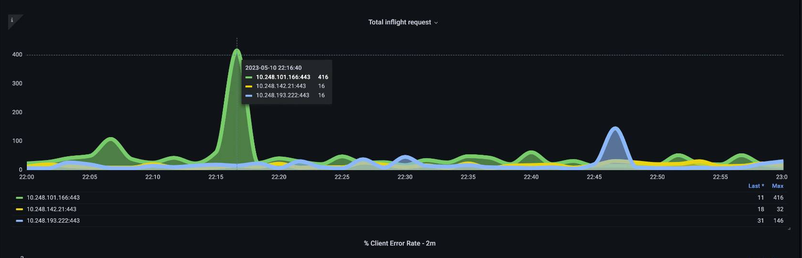
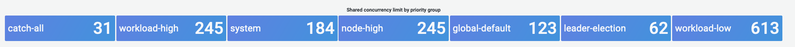
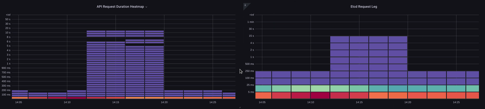
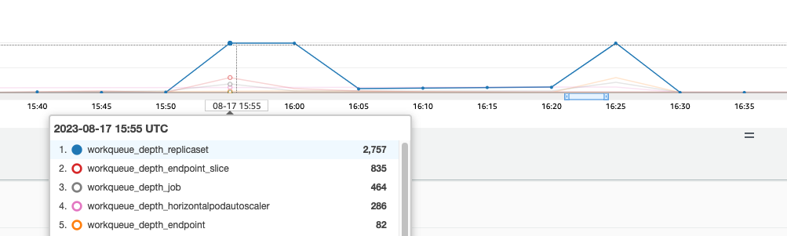

!!! info "We've Moved to the AWS Docs! 🚀"
    This content has been updated and relocated to improve your experience. 
    Please visit our new site for the latest version:
    [AWS EKS Best Practices Guide](https://docs.aws.amazon.com/eks/latest/best-practices/control_plane_monitoring.html) on the AWS Docs

    Bookmarks and links will continue to work, but we recommend updating them for faster access in the future.

---

---
date: 2023-09-22
authors: 
  - Shane Corbett
---
# Control Plane Monitoring

## API Server
When looking at our API server it’s important to remember that one of its functions is to throttle inbound requests to prevent overloading the control plane. What can seem like a bottleneck at the API server level might actually be protecting it from more serious issues. We need to factor in the pros and cons of increasing the volume of requests moving through the system. To make a determination if the API server values should be increased, here is small sampling of the things we need to be mindful of:

1. What is the latency of requests moving through the system?
2. Is that latency the API server itself, or something “downstream” like etcd?
3. Is the API server queue depth a factor in this latency?
4. Are the API Priority and Fairness (APF) queues setup correctly for the API call patterns we want?

## Where is the issue?
To start, we can use the metric for API latency to give us insight into how long it’s taking the API server to service requests. Let’s use the below PromQL and Grafana heatmap to display this data.

```
max(increase(apiserver_request_duration_seconds_bucket{subresource!="status",subresource!="token",subresource!="scale",subresource!="/healthz",subresource!="binding",subresource!="proxy",verb!="WATCH"}[$__rate_interval])) by (le)
```

!!! tip
    For an in depth write up on how to monitor the API server with the API dashboard used in this article, please see the following [blog](https://aws.amazon.com/blogs/containers/troubleshooting-amazon-eks-api-servers-with-prometheus/)


These requests are all under the one second mark, which is a good indication that the control plane is handling requests in a timely fashion.  But what if that was not the case?

The format we are using in the above API Request Duration is a heatmap. What’s nice about the heatmap format, is that it tells us the timeout value for the API by default (60 sec). However, what we really need to know is at what threshold should this value be of concern before we reach the timeout threshold. For a rough guideline of what acceptable thresholds are we can use the upstream Kubernetes SLO, which can be found [here](https://github.com/kubernetes/community/blob/master/sig-scalability/slos/slos.md#steady-state-slisslos)

!!! tip
    Notice the max function on this statement? When using metrics that are aggregating multiple servers (by default two API servers on EKS) it’s important not to average those servers together.

### Asymmetrical traffic patterns
What if one API server [pod] was lightly loaded, and the other heavily loaded? If we averaged those two numbers together we might misinterpret what was happening. For example, here we have three API servers but all of the load is on one of these API servers. As a rule anything that has multiple servers such as etcd and API servers should be broken out when investing scale and performance issues.



With the move to API Priority and Fairness the total number of requests on the system is only one factor to check to see if the API server is oversubscribed. Since the system now works off a series of queues, we must look to see if any of these queues are full and if the traffic for that queue is getting dropped. 

Let’s look at these queues with the following query:

```
max without(instance)(apiserver_flowcontrol_request_concurrency_limit{})
```

!!! note
    For more information on how API A&F works please see the following [best practices guide](https://aws.github.io/aws-eks-best-practices/scalability/docs/control-plane/#api-priority-and-fairness)

Here we see the seven different priority groups that come by default on the cluster



Next we want to see what percentage of that priority group is being used, so that we can understand if a certain priority level is being saturated. Throttling requests in the workload-low level might be desirable, however drops in a leader election level would not be. 

The API Priority and Fairness (APF) system has a number of complex options, some of those options can have unintended consequences. A common issue we see in the field is increasing the queue depth to the point it starts adding unnecessary latency. We can monitor this problem by using the `apiserver_flowcontrol_current_inqueue_request` metric. We can check for drops using the `apiserver_flowcontrol_rejected_requests_total`. These metrics will be a non-zero value if any bucket exceeds its concurrency. 


Increasing the queue depth can make the API Server a significant source of latency and should be done with care. We recommend being judicious with the number of queues created. For example, the number of shares on a EKS system is 600, if we create too many queues, this can reduce the shares in important queues that need the throughput such as the leader-election queue or system queue. Creating too many extra queues can make it more difficult to size theses queues correctly. 

To focus on a simple impactful change you can make in APF we simply take shares from underutilized buckets and increase the size of buckets that are at their max usage. By intelligently redistributing the shares among these buckets, you can make drops less likely. 

For more information, visit [API Priority and Fairness settings](https://aws.github.io/aws-eks-best-practices/scalability/docs/control-plane/#api-priority-and-fairness) in the EKS Best Practices Guide.

### API vs. etcd latency
How can we use the metrics/logs of the API server to determine whether there’s a problem with API server, or a problem that’s upstream/downstream of the API server, or a combination of both. To understand this better, lets look at how API Server and etcd can be related, and how easy it can be to troubleshoot the wrong system.

In the below chart we see API server latency, but we also see much of this latency is correlated to the etcd server due to the bars in the graph showing most of the latency at the etcd level. If there is 15 secs of etcd latency at the same time there is 20 seconds of API server latency, then the majority of the latency is actually at the etcd level.

By looking at the whole flow, we see that it’s wise to not focus solely on the API Server, but also look for signals that indicate that etcd is under duress (i.e. slow apply counters increasing). Being able to quickly move to the right problem area with just a glance is what makes a dashboard powerful. 

!!! tip
    The dashboard in section can be found at https://github.com/RiskyAdventure/Troubleshooting-Dashboards/blob/main/api-troubleshooter.json



### Control plane vs. Client side issues
In this chart we are looking for the API calls that took the most time to complete for that period. In this case we see a custom resource (CRD) is calling a APPLY function that is the most latent call during the 05:40 time frame. 


Armed with this data we can use an Ad-Hoc PromQL or a CloudWatch Insights query to pull LIST requests from the audit log during that time frame to see which application this might be.

### Finding the Source with CloudWatch
Metrics are best used to find the problem area we want to look at and narrow both the timeframe and the search parameters of the problem. Once we have this data we want to transition to logs for more detailed times and errors. To do this we will turn our logs into metrics using [CloudWatch Logs Insights](https://docs.aws.amazon.com/AmazonCloudWatch/latest/logs/AnalyzingLogData.html). 

For example, to investigate the issue above, we will use the following CloudWatch Logs Insights query to pull the userAgent and requestURI so that we can pin down which application is causing this latency. 

!!! tip
    An appropriate Count needs to be used as to not pull normal List/Resync behavior on a Watch.

```
fields *@timestamp*, *@message*
| filter *@logStream* like "kube-apiserver-audit"
| filter ispresent(requestURI)
| filter verb = "list"
| parse requestReceivedTimestamp /\d+-\d+-(?<StartDay>\d+)T(?<StartHour>\d+):(?<StartMinute>\d+):(?<StartSec>\d+).(?<StartMsec>\d+)Z/
| parse stageTimestamp /\d+-\d+-(?<EndDay>\d+)T(?<EndHour>\d+):(?<EndMinute>\d+):(?<EndSec>\d+).(?<EndMsec>\d+)Z/
| fields (StartHour * 3600 + StartMinute * 60 + StartSec + StartMsec / 1000000) as StartTime, (EndHour * 3600 + EndMinute * 60 + EndSec + EndMsec / 1000000) as EndTime, (EndTime - StartTime) as DeltaTime
| stats avg(DeltaTime) as AverageDeltaTime, count(*) as CountTime by requestURI, userAgent
| filter CountTime >=50
| sort AverageDeltaTime desc
```

Using this query we found two different agents running a large number of high latency list operations. Splunk and CloudWatch agent. Armed with the data, we can make a decision to remove, update, or replace this controller with another project. 


!!! tip
    For more details on this subject please see the following [blog](https://aws.amazon.com/blogs/containers/troubleshooting-amazon-eks-api-servers-with-prometheus/)

## Scheduler
Since the EKS control plane instances are run in separate AWS account we will not be able to scrape those components for metrics (The API server being the exception). However, since we have access to the audit logs for these components, we can turn those logs into metrics to see if any of the sub-systems are causing a scaling bottleneck. Let’s use CloudWatch Logs Insights to see how many unscheduled pods are in the scheduler queue.

### Unscheduled pods in the scheduler log
If we had access to scrape the scheduler metrics directly on a self managed Kubernetes (such as Kops) we would use the following PromQL to understand the scheduler backlog.

```
max without(instance)(scheduler_pending_pods)
```

Since we do not have access to the above metric in EKS, we will use the below CloudWatch Logs Insights query to see the backlog by checking for how many pods were unable to unscheduled during a particular time frame. Then we could dive further into into the messages at the peak time frame to understand the nature of the bottleneck. For example, nodes not spinning up fast enough, or the rate limiter in the scheduler itself. 

```
fields timestamp, pod, err, *@message*
| filter *@logStream* like "scheduler"
| filter *@message* like "Unable to schedule pod"
| parse *@message*  /^.(?<date>\d{4})\s+(?<timestamp>\d+:\d+:\d+\.\d+)\s+\S*\s+\S+\]\s\"(.*?)\"\s+pod=(?<pod>\"(.*?)\")\s+err=(?<err>\"(.*?)\")/
| count(*) as count by pod, err
| sort count desc
```

Here we see the errors from the scheduler saying the pod did not deploy because the storage PVC was unavailable. 


!!! note
    Audit logging must be turned on the control plane to enable this function. It is also a best practice to limit the log retention as to not drive up cost over time unnecessarily. An example for turning on all logging functions using the EKSCTL tool below.  

```yaml
cloudWatch:
  clusterLogging:
    enableTypes: ["*"]
    logRetentionInDays: 10
```

## Kube Controller Manager
Kube Controller Manager, like all other controllers, has limits on how many operations it can do at once. Let’s review what some of those flags are by looking at a KOPS configuration where we can set these parameters.

```yaml
  kubeControllerManager:
    concurrentEndpointSyncs: 5
    concurrentReplicasetSyncs: 5
    concurrentNamespaceSyncs: 10
    concurrentServiceaccountTokenSyncs: 5
    concurrentServiceSyncs: 5
    concurrentResourceQuotaSyncs: 5
    concurrentGcSyncs: 20
    kubeAPIBurst: 20
    kubeAPIQPS: "30"
```

These controllers have queues that fill up during times of high churn on a cluster. In this case we see the replicaset set controller has a large backlog in its queue. 



We have two different ways of addressing such a situation. If running self managed we could simply increase the concurrent goroutines, however this would have an impact on etcd by processing more data in the KCM. The other option would be to reduce the number of replicaset objects using `.spec.revisionHistoryLimit` on the deployment to reduce the number of replicaset objects we can rollback, thus reducing the pressure on this controller. 

```yaml
spec:
  revisionHistoryLimit: 2
```

Other Kubernetes features can be tuned or turned off to reduce pressure in high churn rate systems. For example, if the application in our pods doesn’t need to speak to the k8s API directly then turning off the projected secret into those pods would decrease the load on ServiceaccountTokenSyncs. This is the more desirable way to address such issues if possible.

```yaml
kind: Pod
spec:
  automountServiceAccountToken: false
```

In systems where we can’t get access to the metrics, we can again look at the logs to detect contention. If we wanted to see the number of requests being being processed on a per controller or an aggregate level we would use the following CloudWatch Logs Insights Query. 

### Total Volume Processed by the KCM

```
# Query to count API qps coming from kube-controller-manager, split by controller type.
# If you're seeing values close to 20/sec for any particular controller, it's most likely seeing client-side API throttling.
fields @timestamp, @logStream, @message
| filter @logStream like /kube-apiserver-audit/
| filter userAgent like /kube-controller-manager/
# Exclude lease-related calls (not counted under kcm qps)
| filter requestURI not like "apis/coordination.k8s.io/v1/namespaces/kube-system/leases/kube-controller-manager"
# Exclude API discovery calls (not counted under kcm qps)
| filter requestURI not like "?timeout=32s"
# Exclude watch calls (not counted under kcm qps)
| filter verb != "watch"
# If you want to get counts of API calls coming from a specific controller, uncomment the appropriate line below:
# | filter user.username like "system:serviceaccount:kube-system:job-controller"
# | filter user.username like "system:serviceaccount:kube-system:cronjob-controller"
# | filter user.username like "system:serviceaccount:kube-system:deployment-controller"
# | filter user.username like "system:serviceaccount:kube-system:replicaset-controller"
# | filter user.username like "system:serviceaccount:kube-system:horizontal-pod-autoscaler"
# | filter user.username like "system:serviceaccount:kube-system:persistent-volume-binder"
# | filter user.username like "system:serviceaccount:kube-system:endpointslice-controller"
# | filter user.username like "system:serviceaccount:kube-system:endpoint-controller"
# | filter user.username like "system:serviceaccount:kube-system:generic-garbage-controller"
| stats count(*) as count by user.username
| sort count desc
```

The key takeaway here is when looking into scalability issues, to look at every step in the path (API, scheduler, KCM, etcd) before moving to the detailed troubleshooting phase. Often in production you will find that it takes adjustments to more than one part of Kubernetes to allow the system to work at its most performant. It’s easy to inadvertently troubleshoot what is just a symptom (such as a node timeout) of a much larger bottle neck. 

## ETCD 
etcd uses a memory mapped file to store key value pairs efficiently. There is a protection mechanism to set the size of this memory space available set commonly at the 2, 4, and 8GB limits. Fewer objects in the database means less clean up etcd needs to do when objects are updated and older versions needs to be cleaned out. This process of cleaning old versions of an object out is referred to as compaction. After a number of compaction operations, there is a subsequent process that recovers usable space space called defragging that happens above a certain threshold or on a fixed schedule of time. 

There are a couple user related items we can do to limit the number of objects in Kubernetes and thus reduce the impact of both the compaction and de-fragmentation process. For example, Helm keeps a high `revisionHistoryLimit`. This keeps older objects such as ReplicaSets on the system to be able to do rollbacks. By setting the history limits down to 2 we can reduce the number of objects (like ReplicaSets) from ten to two which in turn would put less load on the system. 

```yaml
apiVersion: apps/v1
kind: Deployment
spec:
  revisionHistoryLimit: 2
```

From a monitoring standpoint, if system latency spikes occur in a set pattern separated by hours, checking to see if this defragmentation process is the source can be helpful. We can see this by using CloudWatch Logs.

If you want to see start/end times of defrag use the following query:

```
fields *@timestamp*, *@message*
| filter *@logStream* like /etcd-manager/
| filter *@message* like /defraging|defraged/
| sort *@timestamp* asc
```


