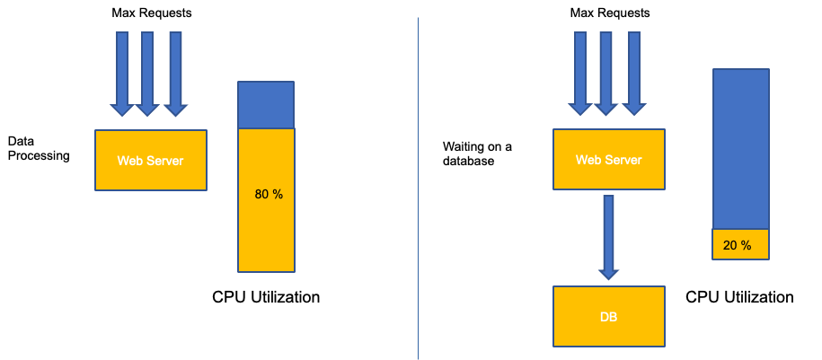
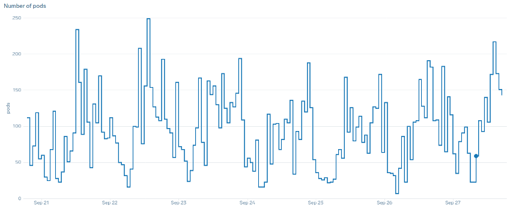

#  노드 및 워크로드 효율성
워크로드와 노드를 효율적으로 사용하면 복잡성과 비용을 줄이는 동시에 성능과 규모를 높일 수 있습니다. 이런 효율성을 계획할 때는 여러 가지 요소를 고려해야 하며, 각 기능에 대한 하나의 모범 사례 설정과 절충점을 기준으로 생각하는 것이 가장 쉽습니다. 다음 섹션에서 이런 장단점을 자세히 살펴보겠습니다.       

## 노드 선택
약간 큰 노드 크기(4-12xlarge) 를 사용하면 시스템 구성 요소의 [데몬셋(DaemonSets)](https://kubernetes.io/docs/concepts/workloads/controllers/daemonset/) 및 [Reserves](https://kubernetes.io/docs/tasks/administer-cluster/reserve-compute-resources/)와 같은 "오버헤드"에 사용되는 노드의 비율이 줄어들기 때문에 파드를 실행하는 데 사용할 수 있는 공간이 늘어납니다. 아래 다이어그램에서 2xlarge 시스템의 사용 가능한 공간과 적당한 수의 데몬셋을 포함하는 8xlarge 시스템의 사용 가능한 공간 차이를 확인할 수 있습니다. 

!!! note
    K8s는 일반적으로 수평으로 확장되므로 대부분의 애플리케이션에서 NUMA 크기 노드의 성능 영향을 고려하는 것이 합리적이지 않으므로 해당 노드 크기보다 낮은 범위를 권장합니다.


노드 크기가 크면 노드당 사용 가능한 공간 비율을 높일 수 있습니다. 하지만 이 모델은 노드를 너무 많이 파드로 가득 채워 오류를 일으키거나 노드를 포화 상태로 만들면 극단적인 상황까지 갈 수 있습니다. 더 큰 노드 크기를 성공적으로 사용하려면 노드 포화 상태를 모니터링하는 것이 중요합니다. 

노드 선택은 모든 경우에 적용되는 것은 아닙니다. 이탈률이 극적으로 다른 워크로드를 서로 다른 노드 그룹으로 분할하는 것이 가장 좋은 경우가 많습니다. 이탈률이 높은 소규모 배치 워크로드에는 4xlarge 인스턴스 패밀리가 가장 적합하고, 8vCPU를 사용하고 이탈률이 낮은 Kafka와 같은 대규모 애플리케이션은 12xlarge 제품군이 더 적합합니다.


!!! tip
    노드 크기가 매우 클 경우 고려해야 할 또 다른 요소는 CGROUPS가 컨테이너화된 애플리케이션에서 vCPU의 총 수를 숨기지 않기 때문입니다. 동적 런타임으로 인해 의도하지 않은 수의 OS 스레드가 생성되어 지연 시간이 발생하여 문제를 해결하기 어려운 경우가 많습니다. 이런 애플리케이션의 경우 [CPU 피닝(pinning)](https://kubernetes.io/docs/tasks/administer-cluster/cpu-management-policies/#static-policy)을 사용하는 것이 좋습니다. 주제에 대해 더 자세히 알아보려면 다음 비디오를 참고하세요. https://www.youtube.com/watch?v=NqtfDy_KAqg

## 노드 빈패킹(Bin-packing)
### 쿠버네티스 vs. 리눅스 규칙
쿠버네티스에서 워크로드를 다룰 때 염두에 두어야 할 두 가지 규칙 세트가 있습니다. 요청 값을 사용하여 노드에서 파드를 스케줄링하는 쿠버네티스 스케줄러의 규칙과 파드가 스케줄링된 후 일어나는 일은 쿠버네티스가 아닌 리눅스의 영역입니다.

쿠버네티스 스케줄러가 완료된 후에는 새로운 규칙 집합이 인계되는데, 이는 리눅스 Completely Fair Scheduler (CFS)입니다. 주요 포인트는 리눅스 CFS가 코어라는 개념을 가지고 있지 않다는 것입니다. 우리는 코어로 생각하는 것이 스케일에 최적화된 작업 부하를 주요 문제로 이어질 수 있는 이유에 대해 논의할 것입니다.

### 코어로 생각하기
쿠버네티스 스케줄러가 코어라는 개념을 가지고 있기 때문에 혼란이 시작됩니다. Kubernetes 스케줄러 관점에서 코어 요청이 1로 설정된 4개의 NGINX 파드가 있는 노드를 살펴보면, 노드는 다음과 같이 보일 것입니다.


그러나, 리눅스 CFS 관점에서 이것이 얼마나 다르게 보이는지에 대한 생각 실험을 해보겠습니다. 리눅스 CFS 시스템을 사용할 때 기억해야 할 가장 중요한 것은 바쁜 컨테이너들(CGROUPS)만이 공유 시스템에 포함되는 유일한 컨테이너들이라는 것입니다. 이 경우, 첫 번째 컨테이너만이 바쁘므로 노드의 모든 4개의 코어를 사용할 수 있습니다.


이것이 왜 중요한가요? 개발 클러스터에서 성능 테스팅을 실행하였고, NGINX 애플리케이션이 해당 노드에서 유일하게 바쁜 컨테이너였다고 가정해봅시다. 우리가 앱을 프로덕션으로 옮기면 다음과 같은 일이 발생할 것입니다. NGINX 애플리케이션은 4 vCPU의 자원을 원하지만, 노드의 다른 모든 파드가 바쁜 상태이기 때문에 앱의 성능이 제한됩니다.


이런 상황은 우리 애플리케이션의 "스위트 스팟(sweet spot)"까지 스케일을 허용하지 않기 때문에 불필요하게 더 많은 컨테이너를 추가하게 될 것입니다. 이 "스위트 스팟"이라는 중요한 개념을 좀 더 자세히 살펴보겠습니다.

### 애플리케이션 적정 크기
각 응용 프로그램에는 더 이상 트래픽을 처리할 수 없는 특정 지점이 있습니다. 이 지점을 초과하면 처리 시간이 늘어나고 이 시점을 훨씬 넘으면 트래픽이 감소할 수도 있습니다. 이를 애플리케이션의 포화 지점이라고 합니다. 크기 조정 문제를 방지하려면 응용 프로그램이 포화 지점에 도달하기 **이전**에 응용 프로그램 크기를 조정해야 합니다. 이 지점을 스위트 스팟이라고 부르겠습니다. 


스위트 스팟을 이해하려면 각 애플리케이션을 테스트해야 합니다.애플리케이션마다 다르기 때문에 여기서는 보편적인 지침을 제공할 수 없습니다. 이 테스트에서는 애플리케이션 포화점을 보여주는 최상의 지표를 파악하기 위해 노력하고 있습니다. 사용률 지표는 애플리케이션이 포화 상태임을 나타내는 데 사용되는 경우가 많지만, 이로 인해 규모 조정 문제가 빠르게 발생할 수 있습니다(이 주제에 대해서는 이후 섹션에서 자세히 설명하겠습니다). 이 "스위트 스팟"을 확보하면 이를 사용하여 워크로드를 효율적으로 확장할 수 있습니다.

반대로, 스위트 스팟보다 훨씬 먼저 규모를 확장하여 불필요한 파드를 만들면 어떻게 될까요?다음 섹션에서 살펴보도록 하겠습니다.

### Pod 확산 
불필요한 파드를 만들면 어떻게 빠르게 제어가 힘들어질 수 있는지 보기 위해, 왼쪽의 첫 번째 예제를 살펴보겠습니다. 이 컨테이너의 올바른 수직 스케일은 초당 100개의 요청을 처리할 때 약 2개의 vCPU 사용량을 차지합니다. 하지만 요청을 하프 코어로 설정하여 요청 값을 과소 프로비저닝하려면 이제 실제로 필요한 파드 하나당 파드 4개가 필요합니다. 이 문제를 더욱 악화시키는 것은 [HPA](https://kubernetes.io/docs/tasks/run-application/horizontal-pod-autoscale/)를 기본값인 50% CPU로 설정하면 해당 파드가 절반만 비어 있는 상태로 확장되어 8:1 비율이 된다는 점입니다. 


이 문제를 확대해보면 이 문제가 어떻게 해결될 수 있는지 금방 알 수 있습니다. 스위트 스팟이 잘못 설정된 10개의 파드를 배포하면 빠르게 80개의 파드로 늘어나고 이를 실행하는 데 필요한 추가 인프라가 생길 수 있습니다. 


애플리케이션이 최적의 위치에서 작동하지 않도록 하는 것이 미치는 영향을 이해했으니 이제 노드 수준으로 돌아가서 Kubernetes 스케줄러와 리눅스 CFS 간의 이런 차이가 왜 그렇게 중요한지 물어보도록 하겠습니다.

HPA로 스케일링을 확장하고 축소할 때, 더 많은 파드를 할당할 많은 공간이 있는 시나리오가 있을 수 있습니다. 이것은 좋지 않은 결정일 것입니다. 왼쪽에 그려진 노드는 이미 100% CPU 사용률에 있기 때문입니다. 현실적이지는 않지만 이론적으로 가능한 시나리오에서는 우리 노드가 완전히 가득 차 있지만, CPU 사용률은 0%일 수 있습니다.


### Requests 설정
request 값을 해당 애플리케이션의 "스위트 스팟" 값으로 설정하고 싶을 수도 있지만, 이렇게 하면 아래 다이어그램과 같이 비효율성이 발생할 수 있습니다. 여기서는 요청 값을 2vCPU로 설정했지만 이 파드들의 평균 사용률은 대부분의 시간 동안 1 CPU만 실행됩니다. 이 설정은 CPU 주기의 50%를 낭비하게 되어, 이는 허용할 수 없습니다.


  
이것은 문제에 대한 복잡한 답변을 가져옵니다. 컨테이너 활용은 진공 상태에서는 생각할 수 없습니다. 노드에서 실행되는 다른 애플리케이션을 고려해야 합니다. 음 예에서는 성질상 버스티한 컨테이너들이 메모리에 제약이 있을 수 있는 두 개의 낮은 CPU 사용 컨테이너와 섞여 있습니다. 이렇게 하면 노드에 부담을 주지 않고도 컨테이너가 스위트 스팟에 도달할 수 있습니다. 


이 모든 것에서 얻을 수 있는 중요한 개념은, 리눅스 컨테이너 성능을 이해하기 위해 쿠버네티스 스케줄러의 코어 개념을 사용하는 것이 그들 사이에 관련이 없기 때문에 잘못된 결정을 내릴 수 있다는 것입니다.

!!! tip
    리눅스 CFS는 그 자체로 강점이 있습니다. 이는 I/O 기반 작업 부하에 대해 특히 그렇습니다. 그러나 애플리케이션이 사이드카 없이 전체 코어를 사용하고 I/O 요구사항이 없다면, CPU 피닝은 이 과정에서 많은 복잡성을 제거할 수 있으며, 그런 사항들로 인해 권장됩니다.

## 이용률(Utilization) vs. 포화도(Saturation)  
애플리케이션 스케일링에서 흔히 발생하는 실수는 스케일링 지표에 CPU 사용률만 사용하는 것입니다. 복잡한 애플리케이션에서 이는 애플리케이션이 실제로 요청으로 가득 차 있다는 잘못된 지표인 경우가 거의 대부분입니다. 왼쪽 예에서는 모든 요청이 실제로 웹 서버에 도달하고 있는 것을 볼 수 있으므로 CPU 사용률이 포화 상태에서도 잘 추적되고 있습니다. 

실제 응용 프로그램에서는 이런 요청 중 일부가 데이터베이스 계층이나 인증 계층 등에서 처리될 가능성이 높지만, 이 보다 일반적인 경우에는 다른 엔티티에서 요청을 처리하고 있기 때문에 CPU가 포화 상태로 추적되지 않습니다. 이 경우 CPU는 포화도를 제대로 나타내지 못합니다.



Kubernetes에서 불필요하고 예측할 수 없는 스케일링이 발생하는 가장 큰 이유는 애플리케이션 성능에서 잘못된 지표를 사용하는 것입니다.사용 중인 애플리케이션 유형에 맞는 올바른 채도 지표를 선택할 때는 각별한 주의를 기울여야 합니다.한 가지 주의할 점은 모든 사람에게 맞는 한 가지 권장 사항이 없다는 것입니다.사용되는 언어와 해당 애플리케이션 유형에 따라 채도에 대한 다양한 지표가 있습니다.

이 문제는 CPU 사용률에만 국한된 것으로 생각할 수도 있지만, 초당 요청 수와 같은 다른 일반적인 지표도 위에서 설명한 것과 똑같은 문제에 빠질 수 있습니다. 참고로 요청은 웹 서버에서 직접 처리되지 않는 DB 계층, 인증 계층에도 전달될 수 있으므로 웹 서버 자체의 실제 채도를 평가하는 지표로는 부족합니다.


안타깝게도 올바른 채도 측정법을 선택하는 데 있어 쉬운 해답은 없습니다. 고려해야 할 몇 가지 지침은 다음과 같습니다. 

* 언어 런타임을 이해하세요. 여러 OS 스레드가 있는 언어는 단일 스레드 응용 프로그램과 다르게 반응하므로 노드에 미치는 영향이 다릅니다.
* 올바른 수직 스케일을 이해하세요. 새 파드를 스케일링하기 전에 애플리케이션의 수직 스케일에 얼마나 많은 버퍼를 적용하길 원하시나요? 
* 애플리케이션의 채도를 실제로 반영하는 지표는 무엇인가요? - Kafka Producer의 포화 지표는 복잡한 웹 애플리케이션과는 상당히 다릅니다. 
* 노드의 다른 모든 애플리케이션은 서로 어떤 영향을 미치나요? - 애플리케이션 성능은 진공 상태에서 이루어지지 않으므로 노드의 다른 워크로드가 큰 영향을 미칩니다.

이 섹션을 마무리하며, 위의 내용을 과도하게 복잡하고 불필요하다고 생각하기 쉽습니다. 종종 우리는 문제를 겪고 있지만, 잘못된 지표를 보고 있기 때문에 문제의 진정한 성격을 모르고 있을 수 있습니다. 다음 섹션에서는 어떻게 이런 일이 일어날 수 있는지 살펴보겠습니다. 

### 노드 포화도 
이제 애플리케이션 포화에 대해 살펴보았으니 노드 관점에서 이와 동일한 개념을 살펴보겠습니다. 사용률이 100% 인 두 개의 CPU를 예로 들어 사용률과 포화도 간의 차이를 확인해 보겠습니다. 

왼쪽의 vCPU는 100% 사용되지만 이 vCPU에서 실행되기를 기다리는 다른 작업은 없습니다. 따라서 순전히 이론적인 의미에서는 상당히 효율적입니다. 한편, 두 번째 예에서는 20개의 단일 스레드 애플리케이션이 vCPU에서 처리되기를 기다리고 있습니다. 이제 20개 애플리케이션 모두 vCPU에서 순서가 처리되기를 기다리는 동안 어느 정도의 지연 시간이 발생합니다. 즉, 오른쪽에 있는 vCPU가 포화 상태입니다. 

사용률만 보면 이 문제가 발생하지 않을 뿐만 아니라 네트워킹과 같이 관련이 없는 문제가 지연되어 잘못된 길로 가게 될 수도 있습니다. 


특정 시점에 노드에서 실행되는 총 파드 수를 늘릴 때는 사용률 지표뿐만 아니라 포화 지표를 보는 것이 중요합니다. 노드가 과포화 상태라는 사실을 쉽게 놓칠 수 있기 때문입니다. 이 작업에는 아래 차트에서 볼 수 있는 것처럼 압력 포화 정보 지표를 사용할 수 있습니다.

PromQL - Stalled I/O

```
topk(3, ((irate(node_pressure_io_stalled_seconds_total[1m])) * 100))
```


!!! note
    압력 정체 지표에 대한 자세한 내용은 https://facebookmicrosites.github.io/psi/docs/overview *을 참조하십시오.

이 측정치를 통해 스레드가 CPU에서 대기 중인지, 아니면 모든 스레드가 메모리 또는 I/O와 같은 리소스를 기다리는 동안 중단되었는지를 알 수 있습니다. 예를 들어 인스턴스의 모든 스레드가 1분 동안 I/O를 기다리는 동안 중단된 비율을 확인할 수 있습니다.  

```
topk(3, ((irate(node_pressure_io_stalled_seconds_total[1m])) * 100))
```

이 지표를 사용하면 위의 차트에서 박스상의 모든 스레드가 하이 워터마크에서 I/O를 기다릴 때 45% 의 시간 동안 중단된 것을 확인할 수 있습니다. 즉, 1분 동안 CPU 사이클을 모두 낭비하고 있다는 뜻입니다. 이런 일이 일어나고 있다는 것을 이해하면 상당한 양의 vCPU 시간을 회수하여 스케일링의 효율성을 높일 수 있습니다. 

### HPA V2
HPA API의 autoscaling/v2 버전을 사용하는 것이 좋습니다. 이전 버전의 HPA API는 특정 엣지 케이스에서 크기 조정이 중단될 수 있습니다. 또한 각 확장 단계에서 파드가 두 배만 증가하는 것으로 제한되었으므로 소규모 배포에서는 빠르게 확장해야 하는 문제가 발생했습니다. 

autoscaling/v2를 사용하면 규모를 확대하기 위한 여러 기준을 더 유연하게 포함할 수 있으며, 사용자 지정 및 외부 지표 (K8s 지표가 아님) 을 사용할 때 유연성이 크게 향상되었습니다.

예를 들어 세 가지 값 중 가장 높은 값을 기준으로 확장할 수 있습니다(아래 참조). 모든 파드의 평균 사용률이 50% 를 넘거나, 커스텀 지표인 경우 인그레스 초당 패킷이 평균 1,000개를 초과하거나, 인그레스 오브젝트가 초당 요청 10,000건을 초과할 경우 규모를 조정합니다.

!!! note
    이는 Auto Scaling API의 유연성을 보여주기 위한 것이므로 프로덕션 환경에서 문제를 해결하기 어려울 수 있는 지나치게 복잡한 규칙은 피하는 것이 좋습니다. 

```yaml
apiVersion: autoscaling/v2
kind: HorizontalPodAutoscaler
metadata:
  name: php-apache
spec:
  scaleTargetRef:
    apiVersion: apps/v1
    kind: Deployment
    name: php-apache
  minReplicas: 1
  maxReplicas: 10
  metrics:
  - type: Resource
    resource:
      name: cpu
      target:
        type: Utilization
        averageUtilization: 50
  - type: Pods
    pods:
      metric:
        name: packets-per-second
      target:
        type: AverageValue
        averageValue: 1k
  - type: Object
    object:
      metric:
        name: requests-per-second
      describedObject:
        apiVersion: networking.k8s.io/v1
        kind: Ingress
        name: main-route
      target:
        type: Value
        value: 10k
```

하지만 복잡한 웹 애플리케이션에 이런 지표를 사용하는 것이 위험하다는 것을 알게 되었습니다. 이 경우 애플리케이션의 포화도와 사용률을 정확하게 반영하는 사용자 지정 또는 외부 지표를 사용하는 것이 더 나은 서비스를 제공할 수 있습니다. HPAV2는 모든 지표에 따라 확장할 수 있어 이를 가능하게 하지만, 사용하려면 해당 지표를 찾아서 쿠버네티스로 익스포트해야 합니다.

예를 들어, Apache에서 활성 스레드 대기열 수를 살펴볼 수 있습니다. 이렇게 하면 스케일링 프로파일이 "더 매끄럽게" 만들어지는 경우가 많습니다(이 용어에 대해서는 곧 설명하겠습니다). 스레드가 활성 상태이면 해당 스레드가 데이터베이스 계층에서 대기 중이든 로컬에서 요청을 처리하든 상관 없습니다. 모든 애플리케이션 스레드가 사용되고 있다면 애플리케이션이 포화 상태임을 나타내는 좋은 지표입니다. 

이 스레드 고갈을 신호로 사용하여 완전히 사용 가능한 스레드 풀을 갖춘 새 파드를 만들 수 있습니다. 또한 트래픽이 많은 시기에 애플리케이션에서 흡수하려는 버퍼 크기를 제어할 수 있습니다. 예를 들어 총 스레드 풀이 10개인 경우 사용된 스레드 4개와 사용된 스레드 8개로 확장하면 애플리케이션을 확장할 때 사용할 수 있는 버퍼에 큰 영향을 미칠 수 있습니다. 부하가 심한 상태에서 빠르게 확장해야 하는 애플리케이션에는 4로 설정하는 것이 좋습니다. 시간이 지남에 따라 요청 수가 느리게 증가하는 대신 급격히 증가하므로 확장할 시간이 충분하다면 8로 설정하는 것이 리소스 활용에 더 효율적입니다. 


스케일링과 관련하여 "매끄럽다"라는 용어는 무엇을 의미할까요? 아래 차트를 보면 CPU를 지표로 사용하고 있습니다 .이 디플로이먼트의 파드 수가 50개에서 최대 250개까지 짧은 기간에 급증하다가 다시 즉시 축소됩니다.이는 매우 비효율적인 스케일링이 클러스터 이탈의 주요 원인이라는 점입니다.



애플리케이션의 올바른 스위트 스팟(차트 중간 부분)을 반영하는 지표로 변경한 후 원활하게 확장할 수 있다는 점에 주목하세요. 이제 스케일링이 효율적이었으며 요청 설정을 조정하여 제공된 여유 공간에 맞게 파드를 완전히 확장할 수 있습니다. 이전에는 수백 개의 파드가 하던 작업을 이제는 소규모 파드 그룹이 수행하고 있습니다. 실제 데이터에 따르면 이것이 쿠버네티스 클러스터의 확장성을 결정하는 가장 중요한 요소입니다. 


중요한 점은 CPU 사용률이 애플리케이션과 노드 성능의 한 차원에 불과하다는 것입니다. CPU 사용률을 노드와 애플리케이션의 유일한 상태 지표로 사용하면 확장성, 성능 및 비용 측면에서 문제가 발생하는데, 이는 모두 긴밀하게 연결된 개념입니다. 애플리케이션과 노드의 성능이 높을수록 확장해야 하는 양이 줄어들어 비용이 절감됩니다. 

또한 특정 애플리케이션을 확장하기 위한 올바른 포화도 지표를 찾아 사용하면 해당 애플리케이션의 실제 병목 현상을 모니터링하고 경보를 설정할 수 있습니다. 이 중요한 단계를 건너뛰면 성능 문제에 대한 보고서를 이해하기가 불가능하지는 않더라도 이해하기 어려울 것입니다.   

## CPU 제한 설정
잘못 이해되고 있는 주제에 대해 이 섹션을 마무리하기 위해 CPU 제한에 대해 설명하겠습니다. 간단히 말해 한도는 100ms마다 재설정하는 카운터가 있는 컨테이너와 관련된 메타데이터입니다. 이를 통해 Linux는 100ms 기간 동안 특정 컨테이너가 노드 전체에서 사용한 CPU 리소스 수를 추적할 수 있습니다. 


제한을 설정할 때 흔한 오류는 애플리케이션이 단일 스레드이며 할당된 vCPU에서만 실행된다고 가정하는 것입니다. 위 섹션에서 CFS는 코어를 할당하지 않으며, 실제로 대규모 스레드 풀을 실행하는 컨테이너는 기본적으로 사용 가능한 모든 vCPU를 스케줄링한다는 것을 배웠습니다. 

64개의 OS 스레드가 64개의 사용 가능한 코어(리눅스 노드 관점에서)에서 실행되고 있다면, 그 64개의 코어에서 모두 실행된 시간을 합한 후 100ms 기간 동안 사용된 CPU 시간의 총계는 상당히 크게 될 것입니다. 이것은 가비지 수집 프로세스 중에만 발생할 수 있기 때문에 이런 것을 놓치기가 상당히 쉽습니다. 이것이 제한을 설정하기 전에 시간 동안 올바른 사용량을 보장하기 위해 지표를 사용해야 하는 이유입니다.

다행히도, 애플리케이션의 모든 스레드에서 얼마나 많은 vCPU가 사용되고 있는지 정확히 알 수 있는 방법이 있습니다. 이 목적으로 `container_cpu_usage_seconds_total` 지표를 사용할 것입니다.

스로틀링 로직이 매 100ms마다 발생하고 이 지표가 초당 지표이므로, 이 100ms 기간에 맞게 PromQL을 사용할 것입니다. 이 PromQL 명령문 작업에 대해 자세히 알아보려면 다음 [블로그](https://aws.amazon.com/blogs/containers/using-prometheus-to-avoid-disasters-with-kubernetes-cpu-limits/)를 참조하십시오.

PromQL 쿼리: 

```
topk(3, max by (pod, container)(rate(container_cpu_usage_seconds_total{image!="", instance="$instance"}[$__rate_interval]))) / 10
```


일단 우리가 올바른 가치를 가지고 있다고 생각되면, 프로덕션에서 제한을 설정할 수 있습니다. 그런 다음 예상치 못한 문제로 인해 애플리케이션이 병목 현상을 겪고 있는지 확인해야 합니다 `container_cpu_throttled_seconds_total`을 살펴보면 이 작업을 수행할 수 있습니다.

```
topk(3, max by (pod, container)(rate(container_cpu_cfs_throttled_seconds_total{image!=``""``, instance=``"$instance"``}[$__rate_interval]))) / 10
```


### 메모리 
메모리 할당은 쿠버네티스 스케줄링 동작과 리눅스 CGroup 동작을 혼동하기 쉬운 또 다른 예입니다. CGroup v2가 리눅스에서 메모리를 처리하는 방식이 크게 변경되었고 Kubernetes가 이를 반영하여 구문을 변경했기 때문에 이 주제는 좀 더 미묘한 주제입니다. 자세한 내용은 이 [블로그](https://kubernetes.io/blog/2021/11/26/qos-memory-resources/)를 참조하십시오.

CPU 요청과 달리 메모리 요청은 스케줄링 프로세스가 완료된 후 사용되지 않습니다. 이는 CGroup v1에서 CPU와 같은 방식으로 메모리를 압축할 수 없기 때문입니다. 그 결과 우리는 메모리 제한만을 가지게 되며, 이는 메모리 누수에 대한 실패로부터 파드를 완전히 종료시키는 것으로 설계되었습니다. 이는 전부 또는 아무것도 없는 스타일의 제안이지만, 이 문제를 해결하기 위한 새로운 방법이 제시되었습니다.

첫째, 컨테이너에 올바른 양의 메모리를 설정하는 것은 보이는 것만큼 간단하지 않다는 것을 이해하는 것이 중요합니다. 리눅스의 파일 시스템은 성능 향상을 위해 메모리를 캐시로 사용합니다. 이 캐시는 시간이 지남에 따라 성장하며, 얼마나 많은 메모리가 캐시에 좋지만 응용 프로그램 성능에 큰 영향을 미치지 않고 되찾을 수 있는지 알기 어렵습니다. 이는 종종 메모리 사용량을 잘못 해석하는 결과를 가져옵니다.

메모리를 "압축"하는 능력을 갖게 되었던 것은 CGroup v2의 주요 동기 중 하나였습니다. CGroup V2가 필요했던 이유에 대한 더 많은 역사를 알고 싶다면, LISA21에서 Chris Down의 [발표]((https://www.youtube.com/watch?v=kPMZYoRxtmg))를 참조하십시오. 그는 최소 메모리를 올바르게 설정할 수 없는 문제가 CGroup v2와 압력 정체 지표를 만드는 데에 이르게 한 원인 중 하나였다고 설명합니다.

다행히 쿠버네티스는 이제 `requests.memory`에서 `memory.min`과 `memory.high`라는 개념을 갖게 되었습니다. 이렇게 하면 캐시된 메모리를 적극적으로 해제하여 다른 컨테이너가 사용할 수 있도록 할 수 있습니다. 컨테이너가 메모리 상한에 도달하면 커널은 해당 컨테이너의 메모리를 `memory.min`으로 설정된 값까지 적극적으로 회수할 수 있습니다. 따라서 노드에 메모리 압력이 가해질 때 유연성이 향상됩니다.

핵심 질문은 `memory.min`을 어떤 값으로 설정해야 하는가입니다. 여기서 메모리 압력 정체 지표가 작용합니다. 이런 지표를 사용하여 컨테이너 수준에서 메모리 "스래싱"을 감지할 수 있습니다. 그러면 [fbtax](https://facebookmicrosites.github.io/cgroup2/docs/fbtax-results.html)와 같은 컨트롤러를 사용하여 이 메모리 스래싱을 찾아 `memory.min`의 올바른 값을 탐지하고, `memory.min` 값을 동적으로 이 설정으로 설정할 수 있습니다. 

### 정리하기
이 섹션을 요약하면, 다음과 같은 개념을 혼동하기 쉽습니다:

* 이용률(Utilization)와 포화도(Saturation)  
* Linux 성능 규칙과 Kubernetes 스케줄러 로직

이런 개념들을 구분하도록 많은 주의를 기울여야 합니다. 성능과 스케일은 깊은 수준에서 연결되어 있습니다. 불필요한 스케일링은 성능 문제를 일으키며, 그 결과 스케일링 문제를 초래합니다.