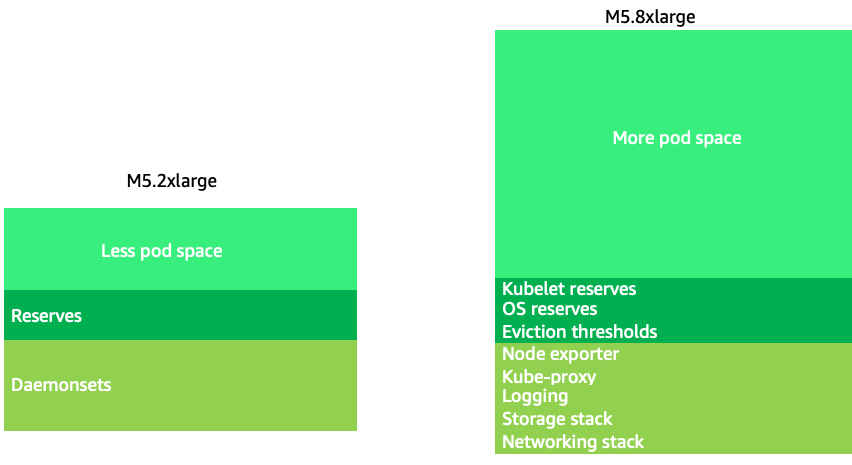
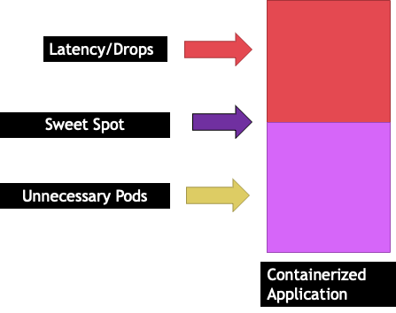
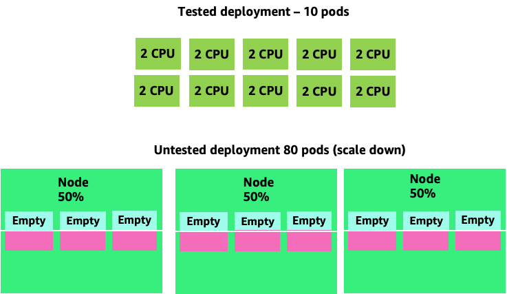
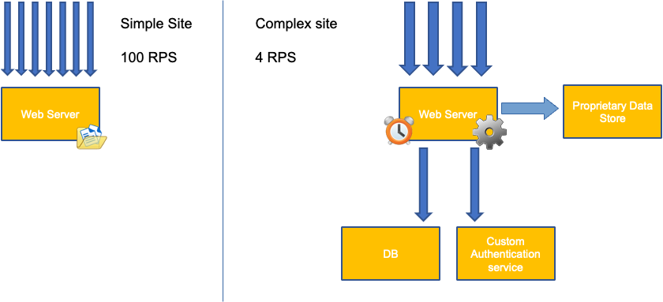
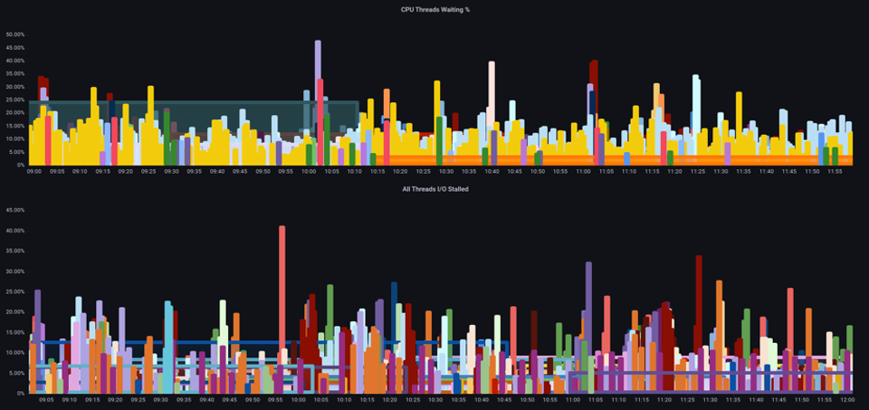
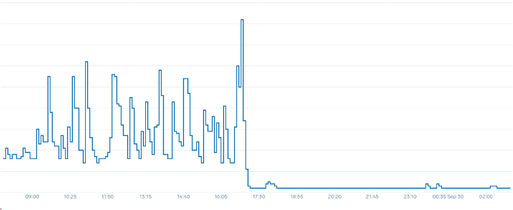
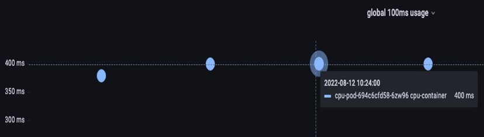

# Node and Workload Efficiency
Being efficient with our workloads and nodes reduces complexity/cost while increasing performance and scale. There are many factors to consider when planning this efficiency, and it’s easiest to think in terms of trade offs vs. one best practice setting for each feature. Let’s explore these tradeoffs in depth in the following section.     

## Node Selection
Using node sizes that are slightly larger (4-12xlarge) increases the available space that we have for running pods due to the fact it reduces the percentage of the node used for “overhead” such as [DaemonSets](https://kubernetes.io/docs/concepts/workloads/controllers/daemonset/) and [Reserves](https://kubernetes.io/docs/tasks/administer-cluster/reserve-compute-resources/) for system components. In the diagram below we see the difference between the usable space on a 2xlarge vs. a 8xlarge system with just a moderate number of DaemonSets. 

!!! note
    Since k8s scales horizontally as a general rule, for most applications it does not make sense to take the performance impact of NUMA sizes nodes, thus the recommendation of a range below that node size.



Large nodes sizes allow us to have a higher percentage of usable space per node. However, this model can be taken to to the extreme by packing the node with so many pods that it causes errors or saturates the node. Monitoring node saturation is key to successfully using larger node sizes. 

Node selection is rarely a one-size-fits-all proposition. Often it is best to split workloads with dramatically different churn rates into different node groups. Small batch workloads with a high churn rate would be best served by the 4xlarge family of instances, while a large scale application such as Kafka which takes 8 vCPU and has a low churn rate would be better served by the 12xlarge family.   


!!! tip
    Another factor to consider with very large node sizes is since CGROUPS do not hide the total number of vCPU from the containerized application. Dynamic runtimes can often spawn an unintentional number of OS threads, creating latency that is difficult to troubleshoot. For these application [CPU pinning](https://kubernetes.io/docs/tasks/administer-cluster/cpu-management-policies/#static-policy) is recommend. For a deeper exploration of topic please see the following video https://www.youtube.com/watch?v=NqtfDy_KAqg

## Node Bin-packing
### Kubernetes vs. Linux Rules
There are two sets of rules we need to be mindful of when dealing with workloads on Kubernetes. The rules of the Kubernetes Scheduler, which uses the request value to schedule pods on a node, and then what happens after the pod is scheduled, which is the realm of Linux, not Kubernetes.

After Kubernetes scheduler is finished, a new set of rules takes over, the Linux Completely Fair Scheduler (CFS). The key take away is that Linux CFS doesn’t have a the concept of a core. We will discuss why thinking in cores can lead to major problems with optimizing workloads for scale.  

### Thinking in Cores 
The confusion starts because the Kubernetes scheduler does have the concept of cores. From a Kubernetes scheduler perspective if we looked at a node with 4 NGINX pods, each with a request of one core set, the node would look like this.


However, let’s do a thought experiment on how different this looks from a Linux CFS perspective. The most important thing to remember when using the Linux CFS system is: busy containers (CGROUPS) are the only containers that count toward the share system. In this case, only the first container is busy so it is allowed to use all 4 cores on the node.


Why does this matter? Let’s say we ran our performance testing in a development cluster where an NGINX application was the only busy container on that node. When we move the app to production, the following would happen: the NGINX application wants 4 vCPU of resources however, because all the other pods on the node are busy, our app’s performance is constrained. 


This situation would lead us to add more containers unnecessarily because we were not allowing our applications scale to their “sweet spot“. Let's explore this important concept of a ”sweet spot“ in a bit more detail.

### Application right sizing
Each application has a certain point where it can not take anymore traffic. Going above this point can increase processing times and even drop traffic when pushed well beyond this point. This is known as the application’s saturation point. To avoid scaling issues, we should attempt to scale the application **before** it reaches its saturation point. Let’s call this point the sweet spot. 



We need to test each of our applications to understand its sweet spot. There will be no universal guidance here as each application is different. During this testing we are trying to understand the best metric that shows our applications saturation point. Oftentimes, utilization metrics are used to indicate an application is saturated but this can quickly lead to scaling issues (We will explore this topic in detail in a later section). Once we have this “sweet spot“ we can use it to efficiently scale our workloads.

Conversely, what would happen if we scale up well before the sweet spot and created unnecessary pods? Let’s explore that in the next section. 

### Pod sprawl 
To see how creating unnecessary pods could quickly get out of hand, let's look at the first example on the left. The correct vertical scale of this container takes up about two vCPUs worth of utilization when handling 100 requests a second. However, If we were to under-provision the requests value by setting requests to half a core, we would now need 4 pods for each one pods we actually needed. Exacerbating this problem further, if our [HPA](https://kubernetes.io/docs/tasks/run-application/horizontal-pod-autoscale/) was set at the default of 50% CPU, those pods would scale half empty, creating an 8:1 ratio. 


Scaling this problem up we can quickly see how this can get out of hand. A deployment of ten pods whose sweet spot was set incorrectly could quickly spiral to 80 pods and the additional infrastructure needed to run them. 



Now that we understand the impact of not allowing applications to operate in their sweet spot, let’s return to the node level and ask why this difference between the Kubernetes scheduler and Linux CFS so important?

When scaling up and down with HPA, we can have a scenario where we have a lot of space to allocate more pods. This would be a bad decision because the node depicted on the left is already at 100% CPU utilization. In a unrealistic but theoretically possible scenario, we could have the other extreme where our node is completely full, yet our CPU utilization is zero. 


### Setting Requests
It would tempting to set the request at the “sweet spot” value for that application, however this would cause inefficiencies as pictured in the diagram below.  Here we have set the request value to 2 vCPU, however the average utilization of these pods runs only 1 CPU most of the time. This setting would cause us to waste 50% of our CPU cycles, which would be unacceptable. 


This bring us to the complex answer to problem. Container utilization cannot be thought of in a vacuum; one must take into account the other applications running on the node. In the following example containers that are bursty in nature are mixed in with two low CPU utilization containers that might be memory constrained. In this way we allow the containers to hit their sweet spot without taxing the node.   


The important concept to take away from all this is that using Kubernetes scheduler concept of cores to understand Linux container performance can lead to poor decision making as they are not related. 

!!! tip
    Linux CFS has its strong points. This is especially true for I/O based workloads. However, if your application uses full cores without sidecars, and has no I/O requirements, CPU pinning can remove a great deal of complexity from this process and is encouraged with those caveats.

## Utilization vs. Saturation
A common mistake in application scaling is only using CPU utilization for your scaling metric. In complex applications this is almost always a poor indicator that an application is actually saturated with requests. In the example on the left, we see all of our requests are actually hitting the web server, so CPU utilization is tracking well with saturation. 

In real world applications, it’s likely that some of those requests will be getting serviced by a database layer or an authentication layer, etc. In this more common case, notice CPU is not tracking with saturation as the request is being serviced by other entities. In this case CPU is a very poor indicator for saturation.


Using the wrong metric in application performance is the number one reason for unnecessary and unpredictable scaling in Kubernetes. Great care must be taken in picking the correct saturation metric for the type of application that you're using. It is important to note that there is not a one size fits all recommendation that can be given. Depending on the language used and the type of application in question, there is a diverse set of metrics for saturation.

We might think this problem is only with CPU Utilization, however other common metrics such as request per second can also fall into the exact same problem as discussed above.  Notice the request can also go to DB layers, auth layers, not being directly serviced by our web server, thus it’s a poor metric for true saturation of the web server itself.




Unfortunately there are no easy answers when it comes to picking the right saturation metric. Here are some guidelines to take into consideration: 

* Understand your language runtime - languages with multiple OS threads will react differently than single threaded applications, thus impacting the node differently.
* Understand the correct vertical scale - how much buffer do you want in your applications vertical scale before scaling a new pod?  
* What metrics truly reflect the saturation of your application - The saturation metric for a Kafka Producer would be quite different than a complex web application. 
* How do all the other applications on the node effect each other - Application performance is not done in a vacuum the other workloads on the node have a major impact.

To close out this section, it would be easy to dismiss the above as overly complex and unnecessary. It can often be the case that we are experiencing an issue but we are unaware of the true nature of the problem because we are looking at the wrong metrics. In the next section we will look at how that could happen. 

### Node Saturation 
Now that we have explored application saturation, let’s look at this same concept from a node point of view. Let’s take two CPUs that are 100% utilized to see the difference between utilization vs. saturation. 

The vCPU on the left is 100% utilized, however no other tasks are waiting to run on this vCPU, so in a purely theoretical sense, this is quite efficient. Meanwhile, we have 20 single threaded applications waiting to get processed by a vCPU in the second example. All 20 applications now will experience some type of latency while they're waiting their turn to be processed by the vCPU. In other words, the vCPU on the right is saturated.  

Not only would we not see this problem if we where just looking at utilization, but we might attribute this latency to something unrelated such as networking which would lead us down the wrong path. 


It is important to view saturation metrics, not just utilization metrics when increasing the total number of pods running on a node at any given time as we can easily miss the fact we have over-saturated a node. For this task we can use pressure stall information metrics as seen in the below chart.

PromQL - Stalled I/O

```
topk(3, ((irate(node_pressure_io_stalled_seconds_total[1m])) * 100))
```



!!! note
    For more on Pressure stall metrics, see https://facebookmicrosites.github.io/psi/docs/overview*

With these metrics we can tell if threads are waiting on CPU, or even if every thread on the box is stalled waiting on resource like memory or I/O. For example, we could see what percentage every thread on the instance was stalled waiting on I/O over the period of 1 min.  

```
topk(3, ((irate(node_pressure_io_stalled_seconds_total[1m])) * 100))
```

Using this metric, we can see in the above chart every thread on the box was stalled 45% of the time waiting on I/O at the high water mark, meaning we were throwing away all of those CPU cycles in that minute. Understanding that this is happening can help us reclaim a significant amount of vCPU time, thus making scaling more efficient. 

### HPA V2
It is recommended to use the autoscaling/v2 version of the HPA API. The older versions of the HPA API could get stuck scaling in certain edge cases. It was also limited to pods only doubling during each scaling step, which created issues for small deployments that needed to scale rapidly.  

Autoscaling/v2 allows us more flexibility to include multiple criteria to scale on and allows us a great deal of flexibility when using custom and external metrics (non K8s metrics).

As an example, we can scaling on the highest of three values (see below). We scale if the average utilization of all the pods are over 50%, if custom metrics the packets per second of the ingress exceed an average of 1,000, or ingress object exceeds 10K request per second.

!!! note
    This is just to show the flexibility of the auto-scaling API, we recommend against overly complex rules that can be difficult to troubleshoot in production. 

```yaml
apiVersion: autoscaling/v2
kind: HorizontalPodAutoscaler
metadata:
  name: php-apache
spec:
  scaleTargetRef:
    apiVersion: apps/v1
    kind: Deployment
    name: php-apache
  minReplicas: 1
  maxReplicas: 10
  metrics:
  - type: Resource
    resource:
      name: cpu
      target:
        type: Utilization
        averageUtilization: 50
  - type: Pods
    pods:
      metric:
        name: packets-per-second
      target:
        type: AverageValue
        averageValue: 1k
  - type: Object
    object:
      metric:
        name: requests-per-second
      describedObject:
        apiVersion: networking.k8s.io/v1
        kind: Ingress
        name: main-route
      target:
        type: Value
        value: 10k
```

However, we learned the danger of using such metrics for complex web applications. In this case we would be better served by using custom or external metric that accurately reflects the saturation of our application vs. the utilization. HPAv2 allows for this by having the ability to scale according to any metric, however we still need to find and export that metric to Kubernetes for use.

For example, we can look at the active thread queue count in Apache. This often creates a “smoother” scaling profile (more on that term soon). If a thread is active, it doesn’t matter if that thread is waiting on a database layer or servicing a request locally, if all of the applications threads are being used, it’s a great indication that application is saturated. 

We can use this thread exhaustion as a signal to create a new pod with a fully available thread pool. This also gives us control over how big a buffer we want in the application to absorb during times of heavy traffic. For example, if we had a total thread pool of 10, scaling at 4 threads used vs. 8 threads used would have a major impact on the buffer we have available when scaling the application. A setting of 4 would make sense for an application that needs to rapidly scale under heavy load, where a setting of 8 would be more efficient with our resources if we had plenty of time to scale due to the number of requests increasing slowly vs. sharply over time. 


What do we mean by the term “smooth” when it comes to scaling? Notice the below chart where we are using CPU as a metric. The pods in this deployment are spiking in a short period for from 50 pods, all the way up to 250 pods only to immediately scale down again. This is highly inefficient scaling is the leading cause on churn on clusters.


Notice how after we change to a metric that reflects the correct sweet spot of our application (mid-part of chart), we are able to scale smoothly. Our scaling is now efficient, and our pods are allowed to fully scale with the headroom we provided by adjusting requests settings. Now a smaller group of pods are doing the work the hundreds of pods were doing before.  Real world data shows that this is the number one factor in scalability of Kubernetes clusters. 



The key takeaway is CPU utilization is only one dimension of both application and node performance. Using CPU utilization as a sole health indicator for our nodes and applications creates problems in scaling, performance and cost which are all tightly linked concepts. The more performant the application and nodes are, the less that you need to scale, which in turn lowers your costs. 

Finding and using the correct saturation metrics for scaling your particular application also allows you to monitor and alarm on the true bottlenecks for that application. If this critical step is skipped, reports of performance problems will be difficult, if not impossible, to understand.  

## Setting CPU Limits
To round out this section on misunderstood topics, we will cover CPU limits. In short, limits are metadata associated with the container that has a counter that resets every 100ms. This helps Linux keep track of how many CPU resources are used node-wide by a specific container in a 100ms period of time. 


A common error with setting limits is assuming that the application is single threaded and only running on it’s “assigned“ vCPU. In the above section we learned that CFS doesn’t assign cores, and in reality a container running large thread pools will schedule on all available vCPU’s on the box. 

If 64 OS threads are running across 64 available cores (from a Linux node perspective) we will make the total bill of used CPU time in a 100ms period quite large after the time running on all of those 64 cores are added up. Since this might only occur during a garbage collection process it can be quite easy to miss something like this. This is why it is necessary to use metrics to ensure we have the correct usage over time before attempting to set a limit. 

Fortunately, we have a way to see exactly how much vCPU is being used by all the threads in a application. We will use the metric `container_cpu_usage_seconds_total` for this purpose. 

Since throttling logic happens every 100ms and this metric is a per second metric, we will PromQL to match this 100ms period. If you would like to dive deep into this PromQL statement work please see the following [blog](https://aws.amazon.com/blogs/containers/using-prometheus-to-avoid-disasters-with-kubernetes-cpu-limits/).

PromQL query: 

```
topk(3, max by (pod, container)(rate(container_cpu_usage_seconds_total{image!="", instance="$instance"}[$__rate_interval]))) / 10
```



Once we feel we have the right value, we can put the limit in production. It then becomes necessary to see if our application is being throttled due to something unexpected. We can do this by looking at  `container_cpu_throttled_seconds_total`

```
topk(3, max by (pod, container)(rate(container_cpu_cfs_throttled_seconds_total{image!=``""``, instance=``"$instance"``}[$__rate_interval]))) / 10
```


### Memory 
The memory allocation is another example where it is easy to confuse Kubernetes scheduling behavior for Linux CGroup behavior. This is a more nuanced topic as there have been major changes in the way that CGroup v2 handles memory in Linux and Kubernetes has changed its syntax to reflect this; read this [blog](https://kubernetes.io/blog/2021/11/26/qos-memory-resources/) for further details.

Unlike CPU requests, memory requests go unused after the scheduling process completes. This is because we can not compress memory in CGroup v1 the same way we can with CPU. That leaves us with just memory limits, which are designed to act as a fail safe for memory leaks by terminating the pod completely. This is an all or nothing style proposition, however we have now been given new ways to address this problem.

First, it is important to understand that setting the right amount of memory for containers is not a straightforward as it appears. The file system in Linux will use memory as a cache to improve performance. This cache will grow over time, and it can be hard to know how much memory is just nice to have for the cache but can be reclaimed without a significant impact to application performance. This often results in misinterpreting memory usage.

Having the ability to “compress” memory was one of the primary drivers behind CGroup v2. For more history on why CGroup V2 was necessary, please see Chris Down’s [presentation](https://www.youtube.com/watch?v=kPMZYoRxtmg) at LISA21 where he covers why being unable to set the minimum memory correctly was one of the reasons that drove him to create CGroup v2  and pressure stall metrics. 

Fortunately, Kubernetes now has the concept of `memory.min` and `memory.high` under `requests.memory`. This gives us the option of aggressive releasing this cached memory for other containers to use. Once the container hits the memory high limit, the kernel can aggressively reclaim that container’s memory up to the value set at `memory.min`. Thus giving us more flexibility when a node comes under memory pressure.

The key question becomes, what value to set `memory.min` to? This is where memory pressure stall metrics come into play. We can use these metrics to detect memory “thrashing” at a container level. Then we can use controllers such as [fbtax](https://facebookmicrosites.github.io/cgroup2/docs/fbtax-results.html) to detect the correct values for `memory.min` by looking for this memory thrashing, and dynamically set the `memory.min` value to this setting. 

### Summary
To sum up the section, it is easy to conflate the following concepts: 

* Utilization and Saturation  
* Linux performance rules with Kubernetes Scheduler logic

Great care must be taken to keep these concepts separated. Performance and scale are linked on a deep level. Unnecessary scaling creates performance problems, which in turn creates scaling problems. 