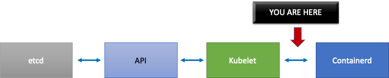

# Kubernetes 스케일링 이론

## 노드 vs. 이탈률

흔히 Kubernetes의 확장성을 논의할 때 우리는 단일 클러스터에 있는 노드 수로 이야기합니다. 흥미롭게도, 이것은 확장성을 이해하기 위한 가장 유용한 지표는 아닙니다. 예를 들어, 많지만 고정된 수의 포드가 있는 5,000노드 클러스터는 초기 설정 이후 컨트롤 플레인에 큰 부담을 주지 않을 것입니다. 하지만 1,000개의 노드 클러스터를 사용하여 1분 이내에 수명이 짧은 작업 10,000개를 만들려고 시도한다면 컨트롤 플레인에 지속적인 압박을 가할 것입니다. 

단순히 노드 수를 사용하여 스케일링을 이해하는 것은 오해의 소지가 있습니다. 특정 기간 내에 발생하는 변화율의 관점에서 생각하는 것이 좋습니다(Prometheus 쿼리가 일반적으로 기본적으로 사용하는 간격이므로 여기서는 5분 간격을 설명하겠습니다). 변화율의 관점에서 문제를 구성하면 원하는 규모에 도달하기 위해 무엇을 조정해야 할지 더 잘 알 수 있는 이유를 살펴보겠습니다. 

## 초당 쿼리 수 생각하기

쿠버네티스는 쿠버네티스 체인의 다음 링크에 과부하가 걸리지 않도록 Kubelet, Scheduler, Kube Controller Manager, API 서버 등 각 구성 요소에 대해 여러 가지 보호 메커니즘을 갖추고 있습니다. 예를 들어, Kubelet에는 API 서버에 대한 호출을 일정 속도로 제한하는 플래그가 있습니다. 이러한 보호 메커니즘은 항상 그런 것은 아니지만 일반적으로 초당 허용 쿼리 또는 QPS로 표현됩니다. 

이러한 QPS 설정을 변경할 때는 각별한 주의를 기울여야 합니다. Kubelet의 초당 쿼리와 같은 하나의 병목 현상을 제거하면 다른 다운스트림 구성 요소에도 영향을 미칩니다. 이로 인해 시스템이 일정 속도 이상으로 과부하를 겪을 수 있고 또 그렇게 될 것이므로, 서비스 체인의 각 부분을 이해하고 모니터링하는 것이 Kubernetes에서 워크로드를 성공적으로 확장하는 데 중요합니다.

!!! note 
    API 서버는 API Priority 및 Fairness 도입으로 더 복잡한 시스템을 가지고 있으며, 이에 대해 별도로 논의할 것입니다.

!!! note 
    주의: 일부 지표는 적합한 것처럼 보이지만 사실 다른 것을 측정하는 경우가 있습니다. 예를 들어 `kubelet_http_inflight_requests`는 Kubelet의 지표 서버에만 관련이 있으며, Kubelet에서 API 서버 요청의 수가 아닙니다. 이로 인해 Kubelet의 QPS 플래그를 잘못 구성할 수 있습니다. 특정 Kubelet에 대한 감사 로그 쿼리가 지표를 확인하는 더 신뢰할 수 있는 방법일 수 있습니다.

## 분산 컴포넌트 스케일링

EKS는 관리형 서비스이므로 Kubernetes 구성 요소를 두 범주로 나누겠습니다. 하나는 etcd, Kube Controller Manager 및 Scheduler(다이어그램 왼쪽 부분)를 포함하는 AWS 관리형 구성 요소와 Kubelet, 컨테이너 런타임과 같은 고객이 구성할 수 있는 구성 요소, 네트워킹 및 스토리지 드라이버와 같이 AWS API를 호출하는 다양한 오퍼레이터(다이어그램 오른쪽)입니다. API 우선 순위 및 공정성 설정은 고객이 구성할 수 있으므로 AWS에서 관리하더라도 API 서버는 중간에 둡니다. 


## 업스트림 및 다운스트림 병목 현상

각 서비스를 모니터링할 때는 지표를 양방향으로 검토하여 병목 현상을 찾는 것이 중요합니다. Kubelet을 예로 들어 이 작업을 수행하는 방법을 알아보겠습니다. Kubelet은 API 서버와 컨테이너 런타임 모두에 대해 통신합니다. 구성 요소 중 하나에 문제가 있는지 여부를 감지하려면 **어떻게**, **무엇**을 모니터링해야 할까요?

### 노드당 파드 수는 몇 개인가요?

한 노드에서 실행할 수 있는 파드 수와 같은 확장 수치를 살펴보면 업스트림이 지원하는 노드당 110개의 파드를 액면 그대로 사용할 수 있습니다. 

!!! note
    https://kubernetes.io/docs/setup/best-practices/cluster-large/

하지만 워크로드는 업스트림의 확장성 테스트에서 테스트한 것보다 더 복잡할 수 있습니다. 프로덕션에서 실행하려는 파드의 개수만큼 서비스를 제공할 수 있도록 Kubelet이 Containerd 런타임을 “따라잡고” 있는지 확인해봅니다.


지나치게 단순화하자면, Kubelet은 컨테이너 런타임 (우리의 경우 Containerd) 에서 파드의 상태를 가져오고 있습니다. 상태를 너무 빨리 변경하는 파드가 너무 많으면 어떻게 될까요? 변경률이 너무 높으면 [컨테이너 런타임에 대한] 요청이 타임아웃될 수 있습니다.

!!! note 
    쿠버네티스는 끊임없이 진화하고 있으며, 이 서브 시스템은 현재 변화를 겪고 있습니다. https://github.com/kubernetes/enhancements/issues/3386




위 그래프에서 파드 라이프사이클 이벤트 생성 기간 지표의 타임아웃 값에 도달했음을 나타내는 납작한 선을 볼 수 있습니다. 자체 클러스터에서 이를 확인하려면 다음 PromQL 구문을 사용할 수 있습니다.

```
increase(kubelet_pleg_relist_duration_seconds_bucket{instance="$instance"}[$__rate_interval])
```

이러한 타임아웃 동작을 목격하면 노드가 가능한 한도를 초과했다는 것을 알 수 있습니다. 계속 진행하기 전에 타임아웃의 원인을 수정해야 합니다. 이는 노드당 포드 수를 줄이거나 많은 양의 재시도를 유발하여 이탈률에 영향을 줄 수 있는 오류를 찾아냄으로써 달성할 수 있습니다. 중요한 점은 노드가 고정된 수 대신 할당된 파드의 회전율을 처리할 수 있는지 여부를 이해하는 가장 좋은 방법은 지표를 사용하는 것입니다.

## 지표별 확장

지표를 사용하여 시스템을 최적화한다는 개념은 오래되었지만 사람들이 Kubernetes 여정을 시작하면서 간과되는 경우가 많습니다. 특정 숫자 (예: 노드당 110개의 포드) 에 초점을 맞추는 대신 시스템의 병목 지점을 찾는 데 도움이 되는 지표를 찾는 데 집중합니다. 이러한 지표에 대한 올바른 임계값을 이해하면 시스템이 최적으로 구성되어 있다는 확신을 가질 수 있습니다. 

### 변경으로 인한 영향

문제를 일으킬 수 있는 일반적인 패턴은 의심스러워 보이는 첫 번째 메트릭이나 로그 오류에 집중하는 것입니다. Kubelet의 전송 시간이 더 일찍 초과된 것을 확인했을 때 Kubelet이 전송할 수 있는 초당 속도를 높이는 등 무작위로 시도할 수 있지만, 먼저 발견된 오류의 다운스트림에서 모든 것을 전체적으로 살펴보는 것이 좋습니다.*목적에 맞게 변경하고 데이터를 바탕으로 변경하세요*.

Kubelet의 다운스트림은 컨테이너 런타임 (포드 오류), EC2 API와 통신하는 스토리지 드라이버(CSI), 네트워크 드라이버(CNI) 와 같은 데몬셋 등입니다. 


Kubelet이 런타임을 따라가지 못하는 이전 예를 계속해 보겠습니다. 노드를 너무 조밀하게 빈팩하면 오류가 발생하는 경우가 많습니다. 


워크로드에 적합한 노드 크기를 설계할 때 이러한 신호는 시스템에 불필요한 압력을 가하여 규모와 성능을 모두 제한할 수 있으므로 간과하기 쉬운 신호입니다.

### 불필요한 오류로 인한 비용

Kubernetes 컨트롤러는 오류 상황이 발생할 때 재시도하는 데 탁월하지만, 여기에는 비용이 따릅니다. 이러한 재시도는 Kube 컨트롤러 관리자와 같은 구성 요소에 대한 압력을 가중시킬 수 있습니다. 규모 테스트의 중요한 부분은 이러한 오류를 모니터링하는 것입니다.

발생하는 오류가 적을수록 시스템에서 문제를 더 쉽게 찾아낼 수 있습니다. 주요 작업 (예: 업그레이드) 전에 클러스터에 오류가 없는지 정기적으로 확인함으로써 예상치 못한 이벤트 발생 시 로그 문제 해결을 간소화할 수 있습니다.

#### 시야 넓히기

1,000개의 노드가 있는 대규모 클러스터에서는 병목 현상을 개별적으로 찾아보고 싶지 않습니다. PromQL에서는 topk라는 함수를 사용하여 데이터 집합에서 가장 높은 값을 찾을 수 있습니다. K는 변수로, 원하는 항목 수를 배치합니다.여기서는 세 개의 노드를 사용하여 클러스터의 모든 Kubelet이 포화 상태인지 여부를 파악합니다.지금까지 레이턴시를 살펴보았는데, 이제 Kubelet이 이벤트를 삭제하는지 살펴보겠습니다. 

```
topk(3, increase(kubelet_pleg_discard_events{}[$__rate_interval]))
```

이 문장을 분해해 보겠습니다.

* Grafana 변수 `$__rate_interval`을 사용하여 필요한 네 개의 샘플을 얻을 수 있도록 합니다. 이렇게 하면 복잡한 모니터링 주제를 간단한 변수로 처리할 수 있습니다.
* `topk`는 상위 결과만 표시하며 숫자 3은 결과를 세 개로 제한합니다. 이는 클러스터 전체 지표에 유용한 함수입니다.
* `{}`는  필터가 없음을 나타냅니다. 일반적으로 스크래핑 규칙의 작업 이름을 입력하겠지만, 이러한 이름이 다양하기 때문에 비워둡니다.

#### 문제를 반으로 나누기

시스템의 병목 현상을 해결하기 위해 업스트림 또는 다운스트림에 문제가 있음을 보여주는 지표를 찾는 접근 방식을 취합니다. 이렇게 하면 문제를 반으로 나눌 수 있습니다.또한 이는 지표 데이터를 표시하는 방식의 핵심 원칙이기도 합니다. 

이 프로세스부터 시작하는 것이 좋습니다. API 서버를 사용하면 클라이언트 애플리케이션이나 컨트롤 플레인에 문제가 있는지 확인할 수 있기 때문입니다.