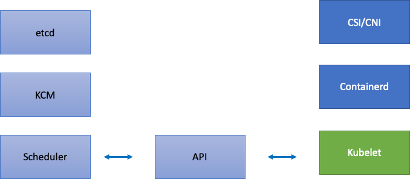

# Kubernetes 擴展理論

## 節點 vs. 更新率
通常在討論 Kubernetes 的可擴展性時,我們會以單個叢集中的節點數量來衡量。有趣的是,這很少是了解可擴展性的最有用指標。例如,一個有 5,000 個節點但具有大量但固定數量的 pod 的叢集,在初始設置後不會對控制平面造成太大壓力。但是,如果我們嘗試在不到一分鐘的時間內在 1,000 個節點的叢集中創建 10,000 個短期作業,它將對控制平面施加巨大的持續壓力。

僅使用節點數量來理解擴展可能會產生誤導。最好以特定時間段內發生的變化率(讓我們在此討論中使用 5 分鐘的間隔,因為這是 Prometheus 查詢通常默認使用的間隔)來思考。讓我們探討一下,以變化率的角度來框定問題,為什麼可以讓我們更好地了解需要調整哪些部分才能實現所需的擴展。

## 以每秒查詢次數思考
Kubernetes 為每個組件 - Kubelet、調度器、Kube 控制器管理器和 API 服務器 - 都有一些保護機制,以防止下一個 Kubernetes 鏈路被淹沒。例如,Kubelet 有一個標誌可以限制每秒對 API 服務器的調用次數。這些保護機制通常(但不總是)以每秒允許的查詢次數或 QPS 來表示。

在更改這些 QPS 設置時必須格外小心。消除一個瓶頸,例如 Kubelet 上的每秒查詢次數,將對下游組件產生影響。這可能會而且肯定會在一定速率以上淹沒系統,因此了解和監控服務鏈的每個部分對於成功擴展 Kubernetes 上的工作負載至關重要。

!!! 注意
    API 服務器有一個更複雜的系統,引入了 API 優先級和公平性,我們將單獨討論。

!!! 注意
    請小心,有些指標看起來很合適,但實際上卻在測量其他東西。例如,`kubelet_http_inflight_requests` 僅與 Kubelet 中的指標服務器有關,而不是從 Kubelet 到 apiserver 的請求數量。這可能會導致我們錯誤地配置 Kubelet 上的 QPS 標誌。對特定 Kubelet 的審計日誌進行查詢將是檢查指標的更可靠方式。

## 擴展分佈式組件
由於 EKS 是一項管理服務,讓我們將 Kubernetes 組件分為兩類:AWS 管理的組件,包括 etcd、Kube 控制器管理器和調度器(在左側部分的圖示);以及客戶可配置的組件,如 Kubelet、容器運行時和調用 AWS API 的各種操作員(如網絡和存儲驅動程序,在右側部分的圖示)。我們將 API 服務器放在中間,儘管它是由 AWS 管理的,但客戶可以配置 API 優先級和公平性的設置。


## 上游和下游瓶頸
在監控每個服務時,重要的是要從兩個方向查看指標,以尋找瓶頸。讓我們通過使用 Kubelet 作為示例來學習如何做到這一點。Kubelet 與 API 服務器和容器運行時通信; **我們需要監控什麼**和**如何**監控,以檢測任一組件是否遇到問題?

### 每個節點的 Pod 數量
當我們查看擴展數字時,例如一個節點可以運行多少個 pod,我們可能會直接採用上游支持的 110 個 pod 每節點的數字。

!!! 注意
    https://kubernetes.io/docs/setup/best-practices/cluster-large/

但是,您的工作負載可能比在上游可擴展性測試中測試的更複雜。為了確保我們可以在生產中運行所需數量的 pod,讓我們確保 Kubelet 能夠 "跟上" Containerd 運行時的步伐。


簡單地說,Kubelet 從容器運行時(在我們的例子中是 Containerd)獲取 pod 的狀態。但是,如果 pod 狀態變化太快,請求 [到容器運行時] 可能會超時。

!!! 注意
    Kubernetes 在不斷發展,此子系統目前正在進行更改。https://github.com/kubernetes/enhancements/issues/3386


在上圖中,我們看到一條平坦的線,表示我們剛好達到了 pod 生命週期事件生成持續時間指標的超時值。如果您想在自己的叢集中看到這一點,可以使用以下 PromQL 語法。

```
increase(kubelet_pleg_relist_duration_seconds_bucket{instance="$instance"}[$__rate_interval])
```

如果我們看到這種超時行為,我們就知道已經將節點推過了它所能承受的限度。在繼續之前,我們需要解決導致超時的原因。這可以通過減少每個節點的 pod 數量或尋找可能導致大量重試(從而影響更新率)的錯誤來實現。重要的是要記住,指標是了解節點是否能夠處理分配的 pod 的更新率的最佳方式,而不是使用固定數字。

## 根據指標擴展
雖然使用指標來優化系統的概念已經存在很長時間,但在人們開始使用 Kubernetes 的過程中,它往往被忽視了。我們不再關注特定數字(例如每個節點 110 個 pod),而是將精力集中在尋找有助於我們發現系統瓶頸的指標上。了解這些指標的正確閾值可以讓我們對系統是否經過最佳配置有很高的信心。

### 變更的影響
一個可能會給我們帶來麻煩的常見模式是,專注於看起來可疑的第一個指標或日誌錯誤。當我們之前看到 Kubelet 超時時,我們可以嘗試隨機做一些事情,例如增加 Kubelet 被允許每秒發送的速率等。但是,在查看我們發現的錯誤下游的整個情況之前,最好是在有目的和數據支持的情況下進行每一次更改。

Kubelet 下游是 Containerd 運行時(pod 錯誤)、諸如存儲驅動程序(CSI)和網絡驅動程序(CNI)等 DaemonSet,它們會調用 EC2 API 等。



讓我們繼續之前的示例,即 Kubelet 無法跟上運行時。有幾個點可能會將節點密集地打包到觸發錯誤的程度。


在為我們的工作負載設計正確的節點大小時,這些很容易被忽視的信號可能會對系統施加不必要的壓力,從而限制了我們的擴展能力和性能。

### 不必要錯誤的代價

當出現錯誤情況時,Kubernetes 控制器擅長重試,但這是有代價的。這些重試可能會增加對 Kube 控制器管理器等組件的壓力。在進行規模測試時,監控此類錯誤是一個重要原則。

當發生較少錯誤時,更容易發現系統中的問題。通過在重大操作(如升級)之前定期確保我們的叢集沒有錯誤,我們可以簡化在發生意外事件時對日誌的故障排除。

#### 擴大我們的視野

在擁有數千個節點的大規模叢集中,我們不想逐個尋找瓶頸。在 PromQL 中,我們可以使用名為 topk 的函數在數據集中找到最高值;K 是我們放置要獲取的項目數量的變量。在這裡,我們使用三個節點來了解叢集中的所有 Kubelet 是否都已飽和。到目前為止,我們一直在查看延遲,現在讓我們看看 Kubelet 是否正在丟棄事件。

```
topk(3, increase(kubelet_pleg_discard_events{}[$__rate_interval]))
```

分解這個語句。

* 我們使用 Grafana 變量 `$__rate_interval` 來確保它獲得所需的四個樣本。這繞過了監控中一個複雜的主題,使用了一個簡單的變量。
* `topk` 給出了我們僅前幾個結果,數字 3 將這些結果限制為三個。對於叢集範圍的指標,這是一個有用的函數。
* `{}` 告訴我們沒有過濾器,通常您會在其中放置抓取規則的作業名稱,但由於這些名稱會有所不同,因此我們將其留空。

#### 將問題一分為二

要解決系統中的瓶頸,我們將採用尋找一個指標的方法,該指標可以向我們顯示上游或下游是否存在問題,因為這允許我們將問題一分為二。這也將成為我們顯示指標數據的核心原則之一。

一個開始這個過程的好地方是 API 服務器,因為它允許我們看到客戶端應用程序或控制平面是否存在問題。