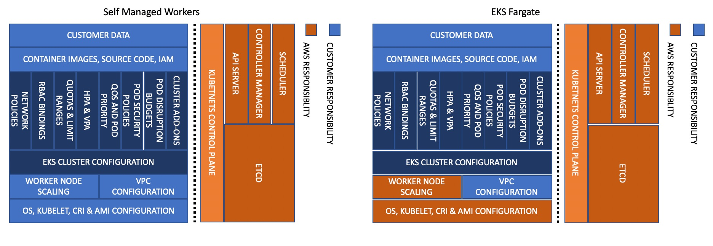
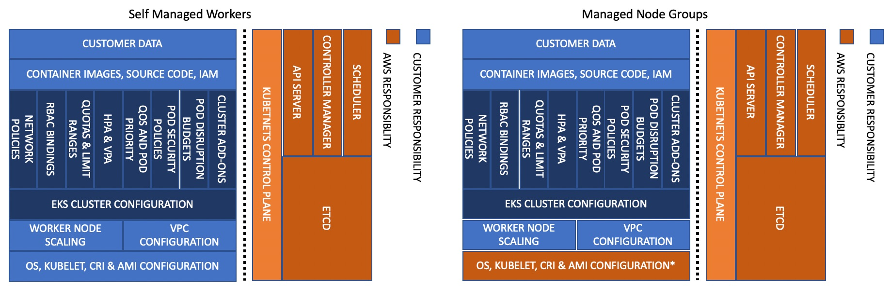

# Amazon EKS Best Practices Guide for Security
This guide provides advice about protecting information, systems, and assets that are reliant on EKS while delivering business value through risk assessments and mitigation strategies. The guidance herein is part of a series of best practices guides that AWS is publishing to help customers implement EKS in accordance with best practices. Guides for Performance, Operational Excellence, Cost Optimization, and Reliability will be available in the coming months. 

## How to use this guide
This guide is meant for security practitioner who are responsible for implementing and monitoring the effectiveness of security controls for EKS clusters and the workloads they support. The guide is organized into different topic areas for easier consumption. Each topic starts with a brief overview, followed by a list of recommendations and best practices for securing your EKS clusters. The topics do not need to read in a particular order. 

## Understanding the Shared Responsibility Model
Security and compliance are considered shared responsibilities when using a managed service like EKS. Generally speaking, AWS is responsible for security "of" the cloud whereas you, the customer, are responsible for security "in" the cloud. With EKS, AWS is responsible for managing of the EKS managed Kubernetes control plane. This includes the Kubernetes masters, the ETCD database, and other infrastructure necessary for AWS to deliver a secure and reliable service. As a consumer of EKS, you are largely responsible for the topics in this guide, e.g. IAM, pod security, runtime security, network security, and so forth. 

When it comes to infrastructure security, AWS will assume additional responsibilities as you move from self-managed workers, to managed node groups, to Fargate. For example, with Fargate, AWS becomes responsible for securing the underlying instance/runtime used to run your Pods. 

AWS will also assume responsibility for securing and maintaining the underlying instance when you use Managed Node Groups (MNG).  However, unlike Fargate, MNGs will not automatically scale your infrastructure/cluster.  That can be handled by the [cluster-autoscaler](https://github.com/kubernetes/autoscaler/blob/master/cluster-autoscaler/cloudprovider/aws/README.md) or other technologies such as native AWS autoscaling, SpotInst's [Ocean](https://spot.io/solutions/kubernetes-2/), or Atlassian's [Escalator](https://github.com/atlassian/escalator). 

Before designing your system, it is important to know where the line of demarcation is between your responsibilities and the provider of the service (AWS).

For additional information about the shared responsibility model, see https://aws.amazon.com/compliance/shared-responsibility-model/

## Introduction
There are several security best practice areas that are pertinent when using a managed Kubernetes service like EKS:

+ Identity and Access Management 
+ Pod Security
+ Runtime Security
+ Network Security
+ Multi-tenancy
+ Detective Controls
+ Infrastructure Security
+ Data Encryption and Secrets Management
+ Regulatory Compliance
+ Incident Response

As part of designing any system, you need to think about its security implications and the practices that can affect your security posture. For example, you need to control who can perform actions against a set of resources. You also need the ability to quickly identify security incidents, protect your systems and services from unauthorized access, and maintain the confidentiality and integrity of data through data protection. Having a well-defined and rehearsed set of process for responding to security incidents will improve your security posture too. These tools and techniques are important because they support objectives such as preventing financial loss or complying with regulatory obligations.

AWS helps organizations achieve their security and compliance goals by offering a rich set of security services that have evolved based on feedback from a broad set of security conscious customers. By offering a highly secure foundation, customers can spend less time on “undifferentiated heavy lifting” and more time on achieving their business objectives. 

## Feedback
This guide is being released on GitHub so as to collect direct feedback and suggestions from the broader EKS/Kubernetes community. If you have a best practice that you feel we ought to include in the guide, please file an issue or submit a PR in the GitHub repository. Our intention is to update the guide periodically as new features are added to the service or when a new best practice evolves. 

## Further Reading
[Kubernetes Security Whitepaper](https://github.com/kubernetes/community/blob/master/wg-security-audit/findings/Kubernetes%20White%20Paper.pdf), Sponsored by the Security Audit Working Group, this Whitepaper describes key aspects of the Kubernetes attack surface and security architecture with the aim of helping security practitioners make sound design and implementation decisions. 
