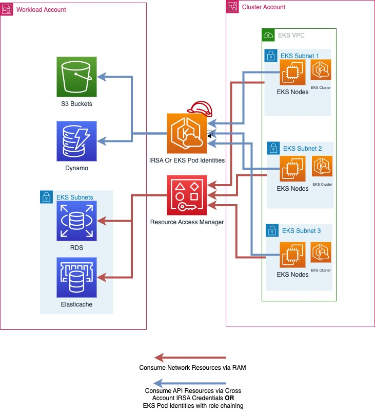
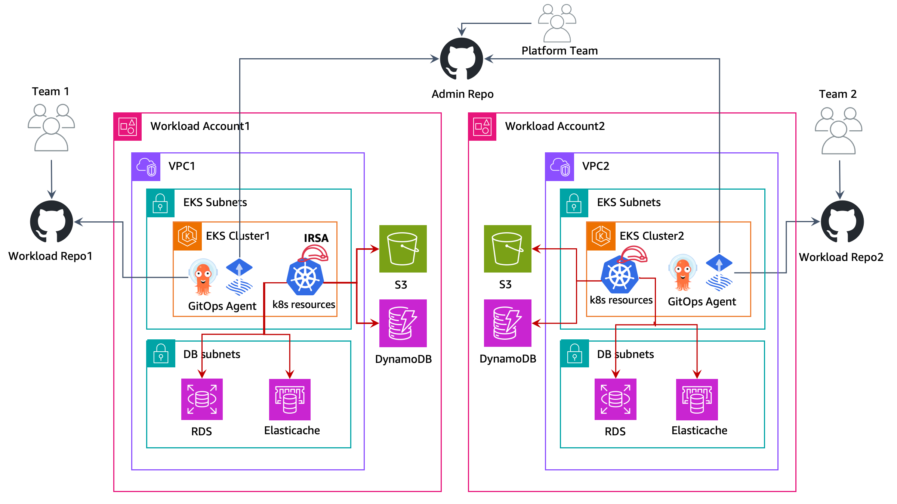

# Multi Account Strategy 

AWS recommends using a [multi account strategy](https://docs.aws.amazon.com/whitepapers/latest/organizing-your-aws-environment/organizing-your-aws-environment.html) and AWS organizations to help isolate and manage your business applications and data. There are [many benefits](https://docs.aws.amazon.com/whitepapers/latest/organizing-your-aws-environment/benefits-of-using-multiple-aws-accounts.html) to using a multi account strategy.

There are many benefits to using a multi account strategy with EKS:

+ Increased AWS API service quotas. Quotas are applied to AWS accounts, and using multiple accounts for your workloads increases the overall quota available to your workloads.
+ Simpler Identity and Access Management (IAM) policies. Granting workloads and the operators that support them access to only their own AWS accounts means less time crafting fine-grained IAM policies to achieve the principle of least privilege.
+ Improved Isolation. By design, all resources provisioned within an account are logically isolated from resources provisioned in other accounts. This isolation boundary provides you with a way to limit the risks of an application-related issue, misconfiguration, or malicious actions. If an issue occurs within one account, impacts to workloads contained in other accounts can be either reduced or eliminated. 
+ More benefits, as described in the [AWS Multi Account Strategy Whitepaper](https://docs.aws.amazon.com/whitepapers/latest/organizing-your-aws-environment/benefits-of-using-multiple-aws-accounts.html#group-workloads-based-on-business-purpose-and-ownership)

The following sections will explain how to implement a multi account strategy for your EKS workloads using either a centralized, or de-centralized EKS cluster approach.

## Planning for a Multi Workload Account Strategy for Multi Tenant Clusters

In a multi account AWS strategy, resources that belong to a given workload such as S3 buckets, ElastiCache clusters and DynamoDB Tables are all created in an AWS account that contains all the resources for that workload. These are referred to as a workload account. Deploying resources into a dedicated workload account is similar to deploying kubernetes resources into a dedicated namespace. 

Workload accounts can then be further broken down by software development lifecycle or other requirements if appropriate. For example a given workload can have a production account, a development account, or accounts for hosting instances of that workload in a specific region. [More information](https://docs.aws.amazon.com/whitepapers/latest/organizing-your-aws-environment/organizing-workload-oriented-ous.html) is available in this AWS whitepaper.

You can adopt the following approaches when implementing EKS Multi account strategy:

## Centralized EKS Cluster

In this approach, your EKS Cluster will be deployed in a single AWS account called the `Cluster Account`. Using [IAM roles for Service Accounts (IRSA)](https://docs.aws.amazon.com/eks/latest/userguide/iam-roles-for-service-accounts.html) and [AWS Resource Access Manager (RAM)](https://aws.amazon.com/ram/) you can adapt a multi account strategy for your multi tenant EKS cluster. The cluster account will contain the VPC, subnets, EKS cluster, EC2/Fargate compute resources(nodes), and any additional networking or configurations needed to run your EKS cluster.

In a multi workload account strategy for multi tenant cluster, AWS accounts typically align with [kubernetes namespaces](https://kubernetes.io/docs/concepts/overview/working-with-objects/namespaces/) as a mechanism for isolating groups of resources. [Best practices for tenant isolation](/security/docs/multitenancy/) within an EKS cluster should still be followed when implementing a multi account strategy for multi tenant EKS clusters.

It is possible to have multiple `cluster accounts` in your AWS organization, and it is a best practice to have multiple `cluster accounts` that align with your software development lifecycle needs. For workloads operating at a very large scale, you may require multiple `cluster accounts` to ensure that there are enough kubernetes and AWS service quotas available to all your workloads.

|  |
|:--:|
| In the above diagram, AWS RAM is used to share subnets from a cluster account into a workload account. Then workloads running in EKS pods use IRSA to assume a role in their workload account and consume their AWS resources. |

 
### Implementing a Multi Workload Account Strategy for Multi Tenant Cluster

#### Sharing Subnets With AWS Resource Access Manager 

[AWS Resource Access Manager](https://aws.amazon.com/ram/) (RAM) allows you to share resources across AWS accounts. 

If [RAM is enabled for your AWS Organization](https://docs.aws.amazon.com/ram/latest/userguide/getting-started-sharing.html#getting-started-sharing-orgs), you can share the VPC Subnets from the Cluster account to your workload accounts. This will allow AWS resources owned by your workload accounts, such as ElastiCache Clusters or RDS DBs to be deployed into the same VPC as your EKS cluster, and be consumable by the workloads running on your EKS cluster.

To share a resource via RAM, open up RAM in the AWS console of the cluster account and select "Resource Shares" and "Create Resource Share". Name your Resource Share and Select the subnets you want to share. Select Next again and enter the 12 digit account IDs for the workload accounts you wish to share the subnets with, select next again, and click Create resource share to finish. After this step, the workload account can deploy resources into those subnets.

RAM shares can also be created programmatically, or with infrastructure as code.

### Accessing AWS API Resources with IAM Roles For Service Accounts
 
[IAM Roles for Service Accounts (IRSA)](https://docs.aws.amazon.com/eks/latest/userguide/iam-roles-for-service-accounts.html) allows you to deliver temporary AWS credentials to your workloads running on EKS. IRSA can be used to get temporary credentials for IAM roles in the workload accounts from the cluster account. This allows your workloads running on your EKS clusters in the cluster account to consume AWS API resources, such as S3 buckets hosted in the workload account seemlessly, and use IAM authentication for resources like AWS RDS Databases or AWS EFS FileSystems. 

AWS API resources and other Resources that use IAM authentication in a workload account can only be accessed by credentials for IAM roles in that same workload account, except where cross account access is capable and has been explicity enabled.

#### Enabling IRSA for cross account access

To enable IRSA for workloads in your Cluster Account to access resources in your Workload accounts, you first must create an IAM OIDC identity provider in your workload account. This can be done with the same procedure for setting up IRSA, except the Identity Provider will be created in the workload account: https://docs.aws.amazon.com/eks/latest/userguide/enable-iam-roles-for-service-accounts.html

Then when configuring IRSA for your workloads on EKS, you can [follow the same steps as the documentation](https://docs.aws.amazon.com/eks/latest/userguide/associate-service-account-role.html), but use the [12 digit account id of the workload account](https://docs.aws.amazon.com/eks/latest/userguide/cross-account-access.html) as mentioned in the section "Example Create an identity provider from another account's cluster".

After this is configured, your application running in EKS will be able to directly use its service account to assume a role in the workload account, and use resources within it.

## De-centralized EKS Clusters

In this approach, EKS clusters are deployed to respective workload AWS Accounts and live along side with other AWS resources like S3 buckets, VPCs,DynamoDB tables, etc., Each workload account is independent, self-sufficient, and operated by respective Business Unit/Application teams. This model allows the creation of reusuable blueprints for various cluster capabilities (AI/ML cluster, Batch processing, General purpose, etc.,) and vend the clusters based on the application team requirements. Both application and platform teams operate out of their respective [GitOps](https://www.weave.works/technologies/gitops/) repositories to manage the deployments to the workload clusters.

GitOps is a way of managing application and infrastructure deployment so that the whole system is described declaratively in a Git repository. It’s an operational model that offers you the ability to manage the state of multiple Kubernetes clusters using the best practices of version control, immutable artifacts, and automation. In this multi cluster model, each workload cluster is bootstrapped with multiple Git repos, allowing each team (application, platform, security, etc.,) to deploy their respective changes on the cluster. 

You would utilize [IAM roles for Service Accounts (IRSA)](https://docs.aws.amazon.com/eks/latest/userguide/iam-roles-for-service-accounts.html) in each account to allow your EKS workloads to get temporary aws credentials to securely access other AWS resources. IAM roles are created in respective workload AWS Accounts and map them to k8s service accounts to provide temporary IAM access. So, no cross-account access is required in this approach. Follow the [IAM roles for Service Accounts](https://docs.aws.amazon.com/eks/latest/userguide/iam-roles-for-service-accounts.html) documentation on how to setup in each workload account.

## Centralized vs De-centralized EKS clusters

The decision to run with a Centralized or De-centralized will depend on your requirements. This table demonstrates the key differences with each strategy.

|# |Centralized EKS cluster | De-centralized EKS clusters |
|:--|:--|:--|
|Cluster Management:  |Managing a single EKS cluster is easier than administrating multiple clusters | An Efficient cluster management automation is necessary to reduce the operational overhead of managing multiple EKS clusters|
|Cost Efficiency: | Allows reuse of EKS cluster and network resources, which promotes cost efficiency | Requires networking and cluster setups per workload, which requires additional resources|
|Resilience: | Multiple workloads on the centralized cluster may be impacted if a cluster becomes impaired | If a cluster becomes impaired, the damage is limited to only the workloads that run on that cluster. All other workloads are unaffected |
|Isolation & Security:|Isolation/Soft Multi-tenancy is achieved using k8s native constructs like `Namespaces`. Workloads may share the underlying resources like CPU, memory, etc. AWS resources are isolated into their own workload accounts which by default are not accessible from other AWS accounts. |Stronger isolation on compute resources as the workloads run in individual clusters and nodes that don't share any resources. AWS resources are isolated into their own workload accounts which by default are not accessible from other AWS accounts.|
|Performance & Scalabity:|As workloads grow to very large scales you may encounter kubernetes and AWS service quotas in the cluster account. You can deploy addtional cluster accounts to scale even further|As more clusters and VPCs are present, each workload has more available k8s and AWS service quota|
|Networking: | Single VPC is used per cluster, allowing for simpler connectivity for applications on that cluster | Routing must be established between the de-centralized EKS cluster VPCs |
|Kubernetes Access Management: |Need to maintain many different roles and users in the cluster to provide access to all workload teams and ensure kubernetes resources are properly segregated| Simplified access management as each cluster is dedicated to a workload/team|
|AWS Access Management: |AWS resources are deployed into to their own account which can only be accessed by default with IAM roles in the workload account.|AWS resources are deployed into to their own account which can only be accessed by default with IAM roles in the workload account.|
