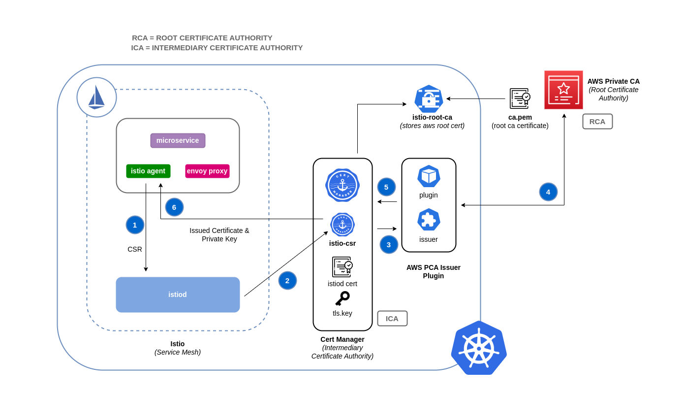
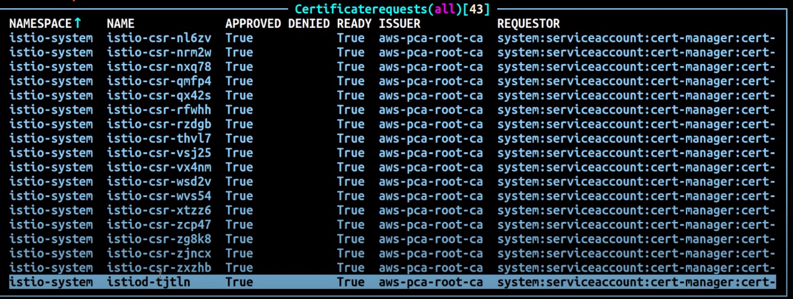

# Network security
Network security has several facets.  The first involves the application of rules which restrict the flow of network traffic between services.  The second involves the encryption of traffic while it is in transit.  The mechanisms to implement these security measures on EKS are varied but often include the following items:

#### Traffic control
+ Network Policies
+ Security Groups
#### Encryption in transit
+ Service Mesh
+ Container Network Interfaces (CNIs)
+ Nitro Instances
+ ACM Private CA with cert-manager

## Network policy
Within a Kubernetes cluster, all Pod to Pod communication is allowed by default.  While this flexibility may help promote experimentation, it is not considered secure.  Kubernetes network policies give you a mechanism to restrict network traffic between Pods (often referred to as East/West traffic) and between Pods and external services. Kubernetes network policies operate at layers 3 and 4 of the OSI model.  Network policies use pod selectors and labels to identify source and destination pods, but can also include IP addresses, port numbers, protocol number, or a combination of these. [Calico](https://docs.projectcalico.org/introduction/), is an open source policy engine from [Tigera](https://tigera.io) that works well with EKS. In addition to implementing the full set of Kubernetes network policy features, Calico supports extended network polices with a richer set of features, including support for layer 7 rules, e.g. HTTP, when integrated with Istio. Isovalent, the maintainers of [Cilium](https://cilium.readthedocs.io/en/stable/intro/), have also extended the network policies to include partial support for layer 7 rules, e.g. HTTP.  Cilium also has support for DNS hostnames which can be useful for restricting traffic between Kubernetes Services/Pods and resources that run within or outside of your VPC. By contrast, Calico Enterprise includes a feature that allows you to map a Kubernetes network policy to an AWS security group, as well as DNS hostnames.

!!! attention
    When you first provision an EKS cluster, the Calico policy engine is not installed by default. The manifests for installing Calico can be found in the VPC CNI repository at [https://github.com/aws/amazon-vpc-cni-k8s/tree/master/config](https://github.com/aws/amazon-vpc-cni-k8s/tree/master/config).

Calico policies can be scoped to Namespaces, Pods, service accounts, or globally.  When policies are scoped to a service account, it associates a set of ingress/egress rules with that service account.  With the proper RBAC rules in place, you can prevent teams from overriding these rules, allowing IT security professionals to safely delegate administration of namespaces.

You can find a list of common Kubernetes network policies at [https://github.com/ahmetb/kubernetes-network-policy-recipes](https://github.com/ahmetb/kubernetes-network-policy-recipes).  A similar set of rules for Calico are available at [https://docs.projectcalico.org/security/calico-network-policy](https://docs.projectcalico.org/security/calico-network-policy).

## Recommendations

### Create a default deny policy
As with RBAC policies, network policies should adhere to the policy of least privileged access.  Start by creating a deny all policy that restricts all inbound and outbound traffic from a namespace or create a global policy using Calico.

_Kubernetes network policy_
```yaml
apiVersion: networking.k8s.io/v1
kind: NetworkPolicy
metadata:
  name: default-deny
  namespace: default
spec:
  podSelector: {}
  policyTypes:
  - Ingress
  - Egress
```


!!! tip
    The image above was created by the network policy viewer from [Tufin](https://orca.tufin.io/netpol/).

_Calico global network policy_
```yaml
apiVersion: projectcalico.org/v3
kind: GlobalNetworkPolicy
metadata:
  name: default-deny
spec:
  selector: all()
  types:
  - Ingress
  - Egress
```

### Create a rule to allow DNS queries
Once you have the default deny all rule in place, you can begin layering on additional rules, such as a global rule that allows pods to query CoreDNS for name resolution. You begin by labeling the namespace:

```
kubectl label namespace kube-system name=kube-system
```

Then add the network policy:

```yaml
apiVersion: networking.k8s.io/v1
kind: NetworkPolicy
metadata:
  name: allow-dns-access
  namespace: default
spec:
  podSelector:
    matchLabels: {}
  policyTypes:
  - Egress
  egress:
  - to:
    - namespaceSelector:
        matchLabels:
          name: kube-system
    ports:
    - protocol: UDP
      port: 53
```


_Calico global policy equivalent_

```yaml
apiVersion: projectcalico.org/v3
kind: GlobalNetworkPolicy
metadata:
  name: allow-dns-egress
spec:
  selector: all()
  types:
  - Egress
  egress:
  - action: Allow
    protocol: UDP
    destination:
      namespaceSelector: name == "kube-system"
      ports:
      - 53
```

The following is an example of how to associate a network policy with a service account while preventing users associated with the readonly-sa-group from editing the service account my-sa in the default namespace:

```yaml
apiVersion: v1
kind: ServiceAccount
metadata:
  name: my-sa
  namespace: default
  labels:
    name: my-sa
---
apiVersion: rbac.authorization.k8s.io/v1
kind: Role
metadata:
  namespace: default
  name: readonly-sa-role
rules:
# Allows the subject to read a service account called my-sa
- apiGroups: [""]
  resources: ["serviceaccounts"]
  resourceNames: ["my-sa"]
  verbs: ["get", "watch", "list"]
---
apiVersion: rbac.authorization.k8s.io/v1
kind: RoleBinding
metadata:
  namespace: default
  name: readonly-sa-rolebinding
# Binds the readonly-sa-role to the RBAC group called readonly-sa-group.
subjects:
- kind: Group
  name: readonly-sa-group
  apiGroup: rbac.authorization.k8s.io
roleRef:
  kind: Role
  name: readonly-sa-role
  apiGroup: rbac.authorization.k8s.io
---
apiVersion: projectcalico.org/v3
kind: NetworkPolicy
metadata:
  name: netpol-sa-demo
  namespace: default
# Allows all ingress traffic to services in the default namespace that reference
# the service account called my-sa
spec:
  ingress:
    - action: Allow
      source:
        serviceAccounts:
          selector: 'name == "my-sa"'
  selector: all()
```

### Incrementally add rules to selectively allow the flow of traffic between namespaces/pods
Start by allowing Pods within a Namespace to communicate with each other and then add custom rules that further restrict Pod to Pod communication within that Namespace.

### Log network traffic metadata
[AWS VPC Flow Logs](https://docs.aws.amazon.com/vpc/latest/userguide/flow-logs.html) captures metadata about the traffic flowing through a VPC, such as source and destination IP address and port along with accepted/dropped packets. This information could be analyzed to look for suspicious or unusual activity between resources within the VPC, including Pods.  However, since the IP addresses of pods frequently change as they are replaced, Flow Logs may not be sufficient on its own.  Calico Enterprise extends the Flow Logs with pod labels and other metadata, making it easier to decipher the traffic flows between pods.

### Use encryption with AWS load balancers
The [AWS Application Load Balancer](https://docs.aws.amazon.com/elasticloadbalancing/latest/application/introduction.html) (ALB) and [Network Load Balancer](https://docs.aws.amazon.com/elasticloadbalancing/latest/network/introduction.html) (NLB) both have support for transport encryption (SSL and TLS).  The `alb.ingress.kubernetes.io/certificate-arn` annotation for the ALB lets you to specify which certificates to add to the ALB.  If you omit the annotation the controller will attempt to add certificates to listeners that require it by matching the available [AWS Certificate Manager (ACM)](https://docs.aws.amazon.com/acm/latest/userguide/acm-overview.html) certificates using the host field. Starting with EKS v1.15 you can use the service.beta.kubernetes.io/aws-load-balancer-ssl-cert annotation with the NLB as shown in the example below.

```yaml
apiVersion: v1
kind: Service
metadata:
  name: demo-app
  namespace: default
  labels:
    app: demo-app
  annotations:
     service.beta.kubernetes.io/aws-load-balancer-type: "nlb"
     service.beta.kubernetes.io/aws-load-balancer-ssl-cert: "<certificate ARN>"
     service.beta.kubernetes.io/aws-load-balancer-ssl-ports: "443"
     service.beta.kubernetes.io/aws-load-balancer-backend-protocol: "http"
spec:
  type: LoadBalancer
  ports:
  - port: 443
    targetPort: 80
    protocol: TCP
  selector:
    app: demo-app
---
kind: Deployment
apiVersion: apps/v1
metadata:
  name: nginx
  namespace: default
  labels:
    app: demo-app
spec:
  replicas: 1
  selector:
    matchLabels:
      app: demo-app
  template:
    metadata:
      labels:
        app: demo-app
    spec:
      containers:
        - name: nginx
          image: nginx
          ports:
            - containerPort: 443
              protocol: TCP
            - containerPort: 80
              protocol: TCP
```

### Additional Resources
+ [Kubernetes & Tigera: Network Policies, Security, and Audit](https://youtu.be/lEY2WnRHYpg)
+ [Calico Enterprise](https://www.tigera.io/tigera-products/calico-enterprise/)
+ [Cilium](https://cilium.readthedocs.io/en/stable/intro/)
+ [NetworkPolicy Editor](https://cilium.io/blog/2021/02/10/network-policy-editor) an interactive policy editor from Cilium
+ [Kinvolk's Network Policy Advisor](https://kinvolk.io/blog/2020/03/writing-kubernetes-network-policies-with-inspektor-gadgets-network-policy-advisor/) Suggests network policies based on an analysis of network traffic

## Security groups
EKS uses [AWS VPC Security Groups](https://docs.aws.amazon.com/vpc/latest/userguide/VPC_SecurityGroups.html) (SGs) to control the traffic between the Kubernetes control plane and the cluster's worker nodes. Security groups are also used to control the traffic between worker nodes, and other VPC resources, and external IP addresses.  When you provision an EKS cluster (with Kubernetes version 1.14-eks.3 or greater), a cluster security group is automatically created for you.  This security group allows unfettered communication between the EKS control plane and the nodes from managed node groups. For simplicity, it is recommended that you add the cluster SG to all node groups, including unmanaged node groups.

Prior to Kubernetes version 1.14 and EKS version eks.3, there were separate security groups configured for the EKS control plane and node groups. The minimum and suggested rules for the control plane and node group security groups can be found at [https://docs.aws.amazon.com/eks/latest/userguide/sec-group-reqs.html](https://docs.aws.amazon.com/eks/latest/userguide/sec-group-reqs.html).  The minimum rules for the _control plane security group_ allows port 443 inbound from the worker node SG. This rule is what allows the kubelets to communicate with the Kubernetes API server.  It also includes port 10250 for outbound traffic to the worker node SG; 10250 is the port that the kubelets listen on. Similarly, the minimum _node group_ rules allow port 10250 inbound from the control plane SG and 443 outbound to the control plane SG.  Finally there is a rule that allows unfettered communication between nodes within a node group.

If you need to control communication between services that run within the cluster and service the run outside the cluster such as an RDS database, consider [security groups for pods](https://docs.aws.amazon.com/eks/latest/userguide/security-groups-for-pods.html). With security groups for pods, you can assign an **existing** security group to a collection of pods.

!!! warning
    If you reference a security group that does not exist prior to the creation of the pods, the pods will not get scheduled.

You can control which pods are assigned to a security group by creating a `SecurityGroupPolicy` object and specifying a `PodSelector` or a `ServiceAccountSelector`. Setting the selectors to `{}` will assign the SGs referenced in the `SecurityGroupPolicy` to all pods in a namespace or all Service Accounts in a namespace. Be sure you've familiarized yourself with all the [considerations](https://docs.aws.amazon.com/eks/latest/userguide/security-groups-for-pods.html#security-groups-pods-considerations) before implementing security groups for pods.

!!! important
    If you use SGs for pods you **must** create SGs that allow port 53 outbound to the cluster security group.  Similarly, you **must** update the cluster security group to accept port 53 inbound traffic from the pod security group.

!!! important
    The [limits for security groups](https://docs.aws.amazon.com/vpc/latest/userguide/amazon-vpc-limits.html#vpc-limits-security-groups) still apply when using security groups for pods so use them judiciously.

!!! important
    You **must** create rules for inbound traffic from the cluster security group (kubelet) for all of the probes configured for pod.

!!! warning
    There is a [bug](https://github.com/aws/amazon-vpc-cni-k8s/pull/1212) that currently prevents the kubelet from communicating with pods that are assigned to SGs. The current workaround involves running `sudo sysctl net.ipv4.tcp_early_demux=0` on the affected worker nodes.  This is fixed in CNI v1.7.3, [https://github.com/aws/amazon-vpc-cni-k8s/releases/tag/v1.7.3](https://github.com/aws/amazon-vpc-cni-k8s/releases/tag/v1.7.3).

!!! important
    Security groups for pods relies on a feature known as [ENI trunking](https://docs.aws.amazon.com/AmazonECS/latest/developerguide/container-instance-eni.html) which was created to increase the ENI density of an EC2 instance. When a pod is assigned to an SG, a VPC controller associates a branch ENI from the node group with the pod. If there aren't enough branch ENIs available in a node group at the time the pod is scheduled, the pod will stay in pending state. The number of branch ENIs an instance can support varies by instance type/family. See [https://docs.aws.amazon.com/eks/latest/userguide/security-groups-for-pods.html#supported-instance-types](https://docs.aws.amazon.com/eks/latest/userguide/security-groups-for-pods.html#supported-instance-types) for further details.

While security groups for pods offers an AWS-native way to control network traffic within and outside of your cluster without the overhead of a policy daemon, other options are available. For example, the Cilium policy engine allows you to reference a DNS name in a network policy. Calico Enterprise includes an option for mapping network policies to AWS security groups. If you've implemented a service mesh like Istio, you can use an egress gateway to restrict network egress to specific, fully qualified domains or IP addresses. For further information about this option, read the three part series on [egress traffic control in Istio](https://istio.io/blog/2019/egress-traffic-control-in-istio-part-1/).

## Encryption in transit
Applications that need to conform to PCI, HIPAA, or other regulations may need to encrypt data while it is in transit.  Nowadays TLS is the de facto choice for encrypting traffic on the wire.  TLS, like it's predecessor SSL, provides secure communications over a network using cryptographic protocols.  TLS uses symmetric encryption where the keys to encrypt the data are generated based on a shared secret that is negotiated at the beginning of the session. The following are a few ways that you can encrypt data in a Kubernetes environment.

### Nitro Instances
Traffic exchanged between the following Nitro instance types, e.g. C5n, G4, I3en, M5dn, M5n, P3dn, R5dn, and R5n, is automatically encrypted by default.  When there's an intermediate hop, like a transit gateway or a load balancer, the traffic is not encrypted. See [Encryption in transit](https://docs.aws.amazon.com/AWSEC2/latest/UserGuide/data-protection.html#encryption-transit) for further details on encryption in transit as well as the complete list of instances types that support network encryption by default.

### Container Network Interfaces (CNIs)
[WeaveNet](https://www.weave.works/oss/net/) can be configured to automatically encrypt all traffic using NaCl encryption for sleeve traffic, and IPsec ESP for fast datapath traffic.

### Service Mesh
Encryption in transit can also be implemented with a service mesh like App Mesh, Linkerd v2, and Istio. AppMesh supports [mTLS](https://docs.aws.amazon.com/app-mesh/latest/userguide/mutual-tls.html) with X.509 certificates or Envoy's Secret Discovery Service(SDS). Linkerd and Istio both have support for mTLS.

The [aws-app-mesh-examples](https://github.com/aws/aws-app-mesh-examples) GitHub repository provides walkthroughs for configuring mTLS using X.509 certificates and SPIRE as SDS provider with your Envoy container:

+ [Configuring mTLS using X.509 certificates](https://github.com/aws/aws-app-mesh-examples/tree/main/walkthroughs/howto-k8s-mtls-file-based)
+ [Configuring TLS using SPIRE (SDS)](https://github.com/aws/aws-app-mesh-examples/tree/main/walkthroughs/howto-k8s-mtls-sds-based)

App Mesh also supports [TLS encryption](https://docs.aws.amazon.com/app-mesh/latest/userguide/virtual-node-tls.html) with a private certificate issued by [AWS Certificate Manager](https://docs.aws.amazon.com/acm/latest/userguide/acm-overview.html) (ACM) or a certificate stored on the local file system of the virtual node.

The [aws-app-mesh-examples](https://github.com/aws/aws-app-mesh-examples) GitHub repository provides walkthroughs for configuring TLS using certificates issued by ACM and certificates that are packaged with your Envoy container:
+ [Configuring TLS with File Provided TLS Certificates](https://github.com/aws/aws-app-mesh-examples/tree/master/walkthroughs/howto-tls-file-provided)
+ [Configuring TLS with AWS Certificate Manager](https://github.com/aws/aws-app-mesh-examples/tree/master/walkthroughs/tls-with-acm)

### Ingress Controllers and Load Balancers
Ingress controllers are a way for you to intelligently route HTTP/S traffic that emanates from outside the cluster to services running inside the cluster. Oftentimes, these Ingresses are fronted by a layer 4 load balancer, like the Classic Load Balancer or the Network Load Balancer (NLB). Encrypted traffic can be terminated at different places within the network, e.g. at the load balancer, at the ingress resource, or the Pod. How and where you terminate your SSL connection will ultimately be dictated by your organization's network security policy. For instance, if you have a policy that requires end-to-end encryption, you will have to decrypt the traffic at the Pod. This will place additional burden on your Pod as it will have to spend cycles establishing the initial handshake. Overall SSL/TLS processing is very CPU intensive. Consequently, if you have the flexibility, try performing the SSL offload at the Ingress or the load balancer.

An ingress controller can be configured to terminate SSL/TLS connections. An example for how to terminate SSL/TLS connections at the NLB appears [above](#use-encryption-with-aws-load-balancers). Additional examples for SSL/TLS termination appear below.

+ [Securing EKS Ingress With Contour And Let’s Encrypt The GitOps Way](https://aws.amazon.com/blogs/containers/securing-eks-ingress-contour-lets-encrypt-gitops/)
+ [How do I terminate HTTPS traffic on Amazon EKS workloads with ACM?](https://aws.amazon.com/premiumsupport/knowledge-center/terminate-https-traffic-eks-acm/)

!!! attention
    Some Ingresses, like the ALB ingress controller, implement the SSL/TLS using Annotations instead of as part of the Ingress Spec.

### ACM Private CA with cert-manager
You can enable TLS and mTLS to secure your EKS application workloads at the ingress, on the pod, and between pods using ACM Private Certificate Authority (CA) and [cert-manager](https://cert-manager.io/), a popular Kubernetes add-on to distribute, renew, and revoke certificates. ACM Private CA is a highly-available, secure, managed CA without the upfront and maintenance costs of managing your own CA. If you are using the default Kubernetes certificate authority, there is an opportunity to improve your security and meet compliance requirements with ACM Private CA. ACM Private CA secures private keys in FIPS 140-2 Level 3 hardware security modules (very secure), compared with the default CA storing keys encoded in memory (less secure). A centralized CA also gives you more control and improved auditability for private certificates both inside and outside of a Kubernetes environment. [Learn more about ACM Private CA and its benefits here](https://aws.amazon.com/certificate-manager/private-certificate-authority/).

#### Setup Instructions
Start by creating a Private CA by following procedures provided in the [ACM Private CA tech docs](https://docs.aws.amazon.com/acm-pca/latest/userguide/create-CA.html). Once you have a Private CA, install cert-manager using [regular installation instructions](https://cert-manager.io/docs/installation/). After installing cert-manager, install the Private CA Kubernetes cert-manager plugin by following the [setup instructions in GitHub](https://github.com/cert-manager/aws-privateca-issuer#setup). The plugin lets cert-manager request private certificates from ACM Private CA.

Now that you have a Private CA and an EKS cluster with cert-manager and the plugin installed, it’s time to set permissions and create the issuer. Update IAM permissions of the EKS node role to allow access to ACM Private CA. Replace the `<CA_ARN>` with the value from your Private CA:

```
{
    "Version": "2012-10-17",
    "Statement": [
        {
            "Sid": "awspcaissuer",
            "Action": [
                "acm-pca:DescribeCertificateAuthority",
                "acm-pca:GetCertificate",
                "acm-pca:IssueCertificate"
            ],
            "Effect": "Allow",
            "Resource": "<CA_ARN>"
        }
    ]
}
```
[Service Roles for IAM Accounts, or IRSA](https://docs.aws.amazon.com/eks/latest/userguide/iam-roles-for-service-accounts.html) can also be used. Please see the Additional Resources section below for complete examples.

Create an Issuer in Amazon EKS by creating a Custom Resource Definition file named cluster-issuer.yaml with the following text in it, replacing `<CA_ARN>` and `<Region>` information with your Private CA.

```
apiVersion: awspca.cert-manager.io/v1beta1
kind: AWSPCAClusterIssuer
metadata:
          name: demo-test-root-ca
spec:
          arn: <CA_ARN>
          region: <Region>
```

Deploy the Issuer you created.

```
kubectl apply -f cluster-issuer.yaml
```

Your EKS cluster is configured to request certificates from Private CA. You can now use cert-manager's `Certificate` resource to issue certificates by changing the `issuerRef` field's values to the Private CA Issuer you created above. For more details on how to specify and request Certificate resources, please check cert-manager's [Certificate Resources guide](https://cert-manager.io/docs/usage/certificate/). [See examples here](https://github.com/cert-manager/aws-privateca-issuer/tree/main/config/samples/).

### ACM Private CA with Istio and cert-manager
If you are running Istio in your EKS cluster, you can disable the Istio control plane (specifically `istiod`) from functioning as the root Certificate Authority (CA), and configure ACM Private CA as the root CA. 

#### How Certificate Signing Works in Istio (Default)
Workloads in Kubernetes are identified using service accounts. If you don't specify a service account, Kubernetes will automatically assign one to your workload. Also, service accounts automatically mount an associated token. This token is used by the service account for workloads to authenticate against the Kubernetes API. The service account may be sufficient as an identity for Kubernetes but Istio has its own identity management system and CA. When a workload starts up with its envoy sidecar proxy, it needs an identity assigned from Istio in order for it to be deemed as trustworthy and allowed to communicate with other services in the mesh.

To get this identity from Istio, the `istio-agent` sends a request known as a certificate signing request (or CSR) to the Istio control plane. This CSR contains the service account token so that the workload's identity can be verified before being processed. This verification process is handled by `istiod`, which acts as both the Registration Authority (or RA) and the CA. The RA serves as a gatekeeper that makes sure only verified CSR makes it through to the CA. Once the CSR is verified, it will be forwarded to the CA which will then issue a certificate containing a [SPIFFE](https://spiffe.io/) identity with the service account. This certificate is called a SPIFFE verifiable identity document (or SVID). The SVID is assigned to the requesting service for identification purposes and to encrypt the traffic in transit between the communicating services.


#### How Certificate Signing Works in Istio with ACM Private CA
You can use a cert-manager add-on called the Istio Certificate Signing Request agent ([istio-csr](https://cert-manager.io/docs/projects/istio-csr/)) to integrate Istio with ACM Private CA. This agent allows Istio workloads and control plane components to be secured with cert manager issuers, in this case ACM Private CA. The *istio-csr* agent exposes the same service that *istiod* serves in the default config of validating incoming CSRs. Except, after verification, it will convert the requests into resources that cert manager supports (i.e. integrations with external CA issuers). 

Whenever there's a CSR from a workload, it will be forwarded to *istio-csr*, which will request certificates from ACM Private CA. This communication between *istio-csr* and ACM Private CA is enabled by the [AWS Private CA issuer plugin](https://github.com/cert-manager/aws-privateca-issuer). Cert manager uses this plugin to request TLS certificates from ACM Private CA. The issuer plugin will communicate with the ACM Private CA service to request a signed certificate for the workload. Once the certificate has been signed, it will be returned to *istio-csr*, which will read the signed request, and return it to the workload that initiated the CSR.




#### Setup Instructions
1. Start by following the same [setup instructions](https://aws.github.io/aws-eks-best-practices/security/docs/network/#setup-instructions) outlined above to complete the following:
* Create a Private CA
* Install cert-manager
* Install the issuer plugin
* Set permissions and create an issuer. The issuer represents the CA and is used to sign `istiod` and mesh workload certificates. It will communicate with ACM Private CA.
2. Create an `istio-system` namespace. This is where the `istiod certificate` and other Istio resources will be deployed.
3. Install Istio CSR configured with AWS Private CA Issuer Plugin. You can preserve the certificate signing requests for workloads to verify that they get approved and signed (`preserveCertificateRequests=true`).

```bash
helm install -n cert-manager cert-manager-istio-csr jetstack/cert-manager-istio-csr \
	--set "app.certmanager.issuer.group=awspca.cert-manager.io" \
	--set "app.certmanager.issuer.kind=AWSPCAClusterIssuer" \
	--set "app.certmanager.issuer.name=<the-name-of-the-issuer-you-created>" \
	--set "app.certmanager.preserveCertificateRequests=true" \
	--set "app.server.maxCertificateDuration=48h" \
	--set "app.tls.certificateDuration=24h" \
	--set "app.tls.istiodCertificateDuration=24h" \
	--set "app.tls.rootCAFile=/var/run/secrets/istio-csr/ca.pem" \
	--set "volumeMounts[0].name=root-ca" \
	--set "volumeMounts[0].mountPath=/var/run/secrets/istio-csr" \
	--set "volumes[0].name=root-ca" \
	--set "volumes[0].secret.secretName=istio-root-ca"
```
4. Install Istio with custom configurations to replace `istiod` with `cert-manager istio-csr` as the certificate provider for the mesh. This process can be carried out using the [Istio Operator](https://tetrate.io/blog/what-is-istio-operator/). 

```yaml
apiVersion: install.istio.io/v1alpha1
kind: IstioOperator
metadata:
  name: istio
  namespace: istio-system
spec:
  profile: "demo"
  hub: gcr.io/istio-release
  values:
   global:
     # Change certificate provider to cert-manager istio agent for istio agent
    caAddress: cert-manager-istio-csr.cert-manager.svc:443
  components:
    pilot:
      k8s:
        env:
          # Disable istiod CA Sever functionality
        - name: ENABLE_CA_SERVER
          value: "false"
        overlays:
        - apiVersion: apps/v1
          kind: Deployment
          name: istiod
          patches:

            # Mount istiod serving and webhook certificate from Secret mount
          - path: spec.template.spec.containers.[name:discovery].args[7]
            value: "--tlsCertFile=/etc/cert-manager/tls/tls.crt"
          - path: spec.template.spec.containers.[name:discovery].args[8]
            value: "--tlsKeyFile=/etc/cert-manager/tls/tls.key"
          - path: spec.template.spec.containers.[name:discovery].args[9]
            value: "--caCertFile=/etc/cert-manager/ca/root-cert.pem"

          - path: spec.template.spec.containers.[name:discovery].volumeMounts[6]
            value:
              name: cert-manager
              mountPath: "/etc/cert-manager/tls"
              readOnly: true
          - path: spec.template.spec.containers.[name:discovery].volumeMounts[7]
            value:
              name: ca-root-cert
              mountPath: "/etc/cert-manager/ca"
              readOnly: true

          - path: spec.template.spec.volumes[6]
            value:
              name: cert-manager
              secret:
                secretName: istiod-tls
          - path: spec.template.spec.volumes[7]
            value:
              name: ca-root-cert
              configMap:
                defaultMode: 420
                name: istio-ca-root-cert
```

5. Deploy the above custom resource you created.

```bash
istioctl operator init
kubectl apply -f istio-custom-config.yaml
```

6. Now you can deploy a workload to the mesh in your EKS cluster and [enforce mTLS](https://istio.io/latest/docs/reference/config/security/peer_authentication/). 



#### Additional Resources
+ [How to implement cert-manager and the ACM Private CA plugin to enable TLS in EKS](https://aws.amazon.com/blogs/security/tls-enabled-kubernetes-clusters-with-acm-private-ca-and-amazon-eks-2/).
+ [Setting up end-to-end TLS encryption on Amazon EKS with the new AWS Load Balancer Controller and ACM Private CA](https://aws.amazon.com/blogs/containers/setting-up-end-to-end-tls-encryption-on-amazon-eks-with-the-new-aws-load-balancer-controller/).
+ [Private CA Kubernetes cert-manager plugin on Github](https://github.com/cert-manager/aws-privateca-issuer).
+ [Private CA Kubernetes cert-manager plugin user guide](https://docs.aws.amazon.com/acm-pca/latest/userguide/PcaKubernetes.html).

## Tooling
+ [Verifying Service Mesh TLS in Kubernetes, Using ksniff and Wireshark](https://itnext.io/verifying-service-mesh-tls-in-kubernetes-using-ksniff-and-wireshark-2e993b26bf95)
+ [ksniff](https://github.com/eldadru/ksniff)
+ [egress-operator](https://github.com/monzo/egress-operator) An operator and DNS plugin to control egress traffic from your cluster without protocol inspection
