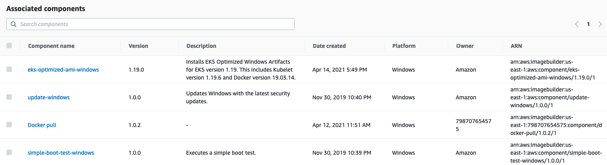
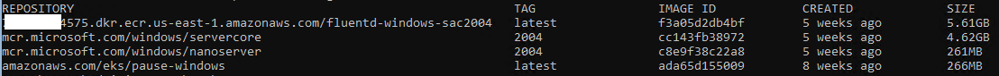
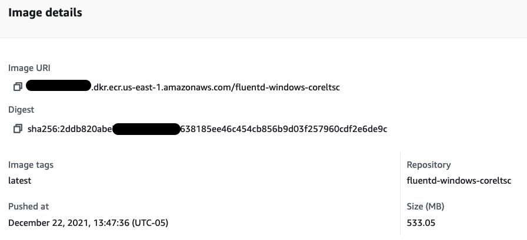

# Patching Windows Servers and Containers

Patching Windows Server is a standard management task for Windows Administrators. This can be accomplished using different tools like Amazon System Manager - Patch Manager, WSUS, System Center Configuration Manager, and many others. However, Windows nodes in an Amazon EKS cluster should not be treated as an ordinary Windows servers. They should be treated as an immutable server. Simply put, avoid updating an existing node, just launch a new one based on an new updated AMI.

Using [EC2 Image Builder](https://aws.amazon.com/image-builder/) you can automate AMIs build, by creating recipes and adding components.

The following example shows **components**, which can be pre-existing ones built by AWS (Amazon-managed) as well as the components you create (Owned by me). Pay close attention to the Amazon-managed component called **update-windows**, this updates Windows Server before generating the AMI through the EC2 Image Builder pipeline.



EC2 Image Builder allows you to build AMI's based off Amazon Managed Public AMIs and customize them to meet your business requirements. You can then associate those AMIs with Launch Templates which allows you to link a new AMI to the Auto Scaling Group created by the EKS Nodegroup. After that is complete, you can begin terminating the existing Windows Nodes and new ones will be launched based on the new updated AMI.

## Pushing and pulling Windows images
Amazon publishes EKS optimized AMIs that include two cached Windows container images.  
  
    mcr.microsoft.com/windows/servercore
    mcr.microsoft.com/windows/nanoserver



Cached images are updated following the updates on the main OS. When Microsoft releases a new Windows update that directly affects the Windows container base image, the update will be launched as an ordinary Windows Update on the main OS. Keeping the environment up-to-date offers a more secure environment at the Node and Container level.

The size of a Windows container image influences push/pull operations which can lead to slow container startup times. [Caching Windows container images](https://aws.amazon.com/blogs/containers/speeding-up-windows-container-launch-times-with-ec2-image-builder-and-image-cache-strategy/) allows the expensive I/O operations (file extraction) to occur on the AMI build creation instead of the container launch. As a result, all the necessary image layers will be extracted on the AMI and will be ready to be used, speeding up the time a Windows container launches and can start accepting traffic. During a push operation, only the layers that compose your image are uploaded to the repository.

The following example shows that on the Amazon ECR the **fluentd-windows-sac2004** images have only **390.18MB**. This is the amount of upload that happened during the push operation.

The following example shows a [fluentd Windows ltsc](https://github.com/fluent/fluentd-docker-image/blob/master/v1.14/windows-ltsc2019/Dockerfile) image pushed to an Amazon ECR repository.  The size of the layer stored in ECR is **533.05MB**.



 The output below from `docker image ls` , the size of the fluentd v1.14-windows-ltsc2019-1 is **6.96GB** on disk, but that doesn't mean it downloaded and extracted that amount of data.

In practice, during the pull operation only the **compressed 533.05MB** will be downloaded and extracted.

```bash
REPOSITORY                                                              TAG                        IMAGE ID       CREATED         SIZE
111122223333.dkr.ecr.us-east-1.amazonaws.com/fluentd-windows-coreltsc   latest                     721afca2c725   7 weeks ago     6.96GB
fluent/fluentd                                                          v1.14-windows-ltsc2019-1   721afca2c725   7 weeks ago     6.96GB
amazonaws.com/eks/pause-windows                                         latest                     6392f69ae6e7   10 months ago   255MB
```

The size column shows the overall size of image, 6.96GB. Breaking it down:

* Windows Server Core 2019 LTSC Base image = 5.74GB
* Fluentd Uncompressed Base Image = 6.96GB
* Difference on disk = 1.2GB
* Fluentd [compressed final image ECR](https://docs.aws.amazon.com/AmazonECR/latest/userguide/repository-info.html) = 533.05MB

The base image already exists on the local disk, resulting in the total amount on disk being 1.2GB additional. The next time you see the amount of GBs in the size column, don't worry too much, likely more than 70% is already on disk as a cached container image. 

## Reference
[Speeding up Windows container launch times with EC2 Image builder and image cache strategy](https://aws.amazon.com/blogs/containers/speeding-up-windows-container-launch-times-with-ec2-image-builder-and-image-cache-strategy/)


