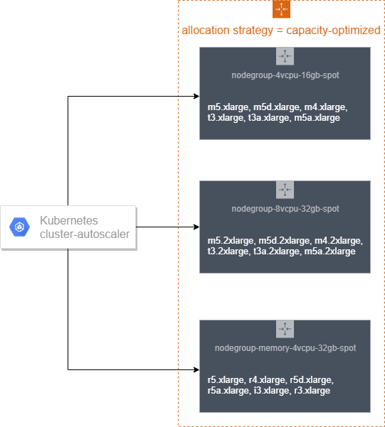
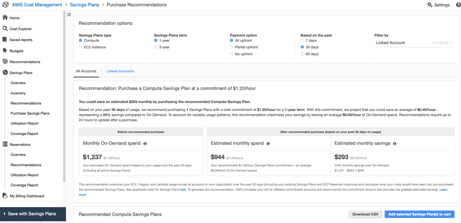

= Cost-effective resources

Cost Effective resources means using the appropriate services, resources, and configurations for your workloads running on a Kubernetes cluster, which will result in cost savings.

== Recommendations

=== Ensure that the infrastructure used to deploy the containerized service matches the application profile and scaling needs

There are several types of Kubernetes autoscaling supported in Amazon EKS - https://docs.aws.amazon.com/eks/latest/userguide/cluster-autoscaler.html[Cluster Autoscaler], https://docs.aws.amazon.com/eks/latest/userguide/horizontal-pod-autoscaler.html[Horizontal Pod Autoscaler] and https://docs.aws.amazon.com/eks/latest/userguide/vertical-pod-autoscaler.html[Vertical Pod Autoscaler]. This section covers two of them, Cluster Auto Scaler and Horizontal Pod Autoscaler.

=== Use Cluster Autoscaler to adjust the size of a Kubernetes cluster to meet the current needs

The https://github.com/kubernetes/autoscaler/tree/master/cluster-autoscaler[Kubernetes Cluster Autoscaler] automatically adjusts the number of nodes in the EKS cluster when pods fail to launch due to lack of resources or when nodes in the cluster are underutilized and their pods can be rescheduled onto other nodes in the cluster. The Cluster Autoscaler scales worker nodes within any specified Auto Scaling group and runs as a deployment in your EKS cluster.

Amazon EKS with EC2 managed node groups automate the provisioning and lifecycle management of nodes (Amazon EC2 instances) for Amazon EKS Kubernetes clusters. All managed nodes are provisioned as part of an Amazon EC2 Auto Scaling group that is managed for you by Amazon EKS and all resources including Amazon EC2 instances and Auto Scaling groups run within your AWS account. Amazon EKS tags managed node group resources so that they can be discovered the Kubernetes Cluster Autoscaler.

The documentation at https://docs.aws.amazon.com/eks/latest/userguide/cluster-autoscaler.html provides detailed guidance on setting up a Managed Node Group and then deploying Kubernetes Cluster Auto Scaler. If you are running a stateful application across multiple Availability Zones that is backed by Amazon EBS volumes and using the Kubernetes Cluster Autoscaler, you should configure multiple node groups, each scoped to a single Availability Zone.

_Cluster Autoscaler logs for EC2 based Worker Nodes -_
image:../images/cluster-auto-scaler.png[Kubernetes Cluster Auto Scaler logs]

When a pod cannot be scheduled due to lack of available resources, Cluster Autoscaler determines that the cluster must scale out and increases the size of the node group. When multiple node groups are used, Cluster Autoscaler chooses one based on the Expander configuration. Currently, the following strategies are supported in EKS:

* *random* - default expander, selects the instance group randomly
* *most-pods* - selects the instance group that schedules the most amount of pods.
* *least-waste* - selects the node group that will have the least idle CPU (if tied, unused memory) after scale-up. This is useful when you have different classes of nodes, for example, high CPU or high memory nodes, and only want to expand those when there are pending pods that need a lot of those resources.
* *priority* - selects the node group that has the highest priority assigned by the user

You can use the *random* placement strategy for the Expander in Cluster Autoscaler, if EC2 Spot instances are being used as worker nodes. This is the default expander, and arbitrarily chooses a node-group when the cluster must scale out. The random expander maximizes your ability to leverage multiple Spot capacity pools.

https://github.com/kubernetes/autoscaler/blob/master/cluster-autoscaler/expander/priority/readme.md[*Priority*] based expander selects an expansion option based on priorities assigned by a user to scaling groups. Sample priorities can be to let Autoscaler first try to scale out a spot instance node group and then, if it cannot, falls back to scaling out an on-demand node group.

*most-pods* based expander is useful when you are using nodeSelector to make sure certain pods land on certain nodes.

From the https://docs.aws.amazon.com/eks/latest/userguide/cluster-autoscaler.html[documentation] to specify *least-waste* as the expander type for the Cluster Autoscaling configuration:

----
    spec:
      containers:
      - command:
        - ./cluster-autoscaler
        - --v=4
        - --stderrthreshold=info
        - --cloud-provider=aws
        - --skip-nodes-with-local-storage=false
        - --expander=least-waste
        - --node-group-auto-discovery=asg:tag=k8s.io/cluster-autoscaler/enabled,k8s.io/cluster-autoscaler/<YOUR CLUSTER NAME>
        - --balance-similar-node-groups
        - --skip-nodes-with-system-pods=false
----

=== Deploy Horizontal Pod Autoscaling to automatically scales the number of pods in a deployment, replication controller, or replica set based on that resource's CPU utilization or other application related metrics

The https://kubernetes.io/docs/tasks/run-application/horizontal-pod-autoscale/[Kubernetes Horizontal Pod Autoscaler] automatically scales the number of pods in a deployment, replication controller, or replica set based on resource metrics like CPU utilization or with custom metrics support, on some other application-provided metrics. This can help your applications scale out to meet increased demand or scale in when resources are not needed, thus freeing up your worker nodes for other applications. When you set a target metric utilization percentage, the Horizontal Pod Autoscaler scales your application in or out to try to meet that target.

The https://github.com/awslabs/k8s-cloudwatch-adapter[k8s-cloudwatch-adapter] is an implementation of the Kubernetes Custom Metrics API and External Metrics API with integration for CloudWatch metrics. It allows you to scale your Kubernetes deployment using the Horizontal Pod Autoscaler (HPA) with CloudWatch metrics.

For an example of scaling using a resource metric like CPU, follow https://eksworkshop.com/beginner/080_scaling/test_hpa/ to deploy a sample app, perform a simple load test to test the autoscaling of pod and simulate pod autoscaling.

Refer to this https://aws.amazon.com/blogs/compute/scaling-kubernetes-deployments-with-amazon-cloudwatch-metrics/[blog] for an example of a custom metric for an application to scale according to the number of messages in the Amazon SQS (Simple Queue Service) queue.

An example of an external metric from Amazon SQS from the blog:

[,yaml]
----
apiVersion: metrics.aws/v1alpha1
kind: ExternalMetric:
  metadata:
    name: hello-queue-length
  spec:
    name: hello-queue-length
    resource:
      resource: "deployment"
    queries:
      - id: sqs_helloworld
        metricStat:
          metric:
            namespace: "AWS/SQS"
            metricName: "ApproximateNumberOfMessagesVisible"
            dimensions:
              - name: QueueName
                value: "helloworld"
          period: 300
          stat: Average
          unit: Count
        returnData: true
----

An example of an HPA utilizing this external metric:

[,yaml]
----
kind: HorizontalPodAutoscaler
apiVersion: autoscaling/v2beta1
metadata:
  name: sqs-consumer-scaler
spec:
  scaleTargetRef:
    apiVersion: apps/v1beta1
    kind: Deployment
    name: sqs-consumer
  minReplicas: 1
  maxReplicas: 10
  metrics:
  - type: External
    external:
      metricName: hello-queue-length
      targetAverageValue: 30
----

The combination of Cluster Auto Scaler for the Kubernetes worker nodes and Horizontal Pod Autoscaler for the pods, will ensure that the provisioned resources will be as close to the actual utilization as possible.

image:../images/ClusterAS-HPA.png[Kubernetes Cluster AutoScaler and HPA]
*_(Image source: https://aws.amazon.com/blogs/containers/cost-optimization-for-kubernetes-on-aws/)_*

*_Amazon EKS with Fargate_*

***Horizontal Pod Autoscaling of Pods***

Autoscaling EKS on Fargate can be done using the following mechanisms:

. Using the Kubernetes metrics server and configure auto-scaling based on CPU and/or memory usage.
. Configure autoscaling based on custom metrics like HTTP traffic using Prometheus and Prometheus metrics adapter
. Configure autoscaling based on App Mesh traffic

The above scenarios are explained in a hands-on blog on https://aws.amazon.com/blogs/containers/autoscaling-eks-on-fargate-with-custom-metrics/["Autoscaling EKS on Fargate with custom metrics]

***Vertical Pod Autoscaling***

Use the https://docs.aws.amazon.com/eks/latest/userguide/vertical-pod-autoscaler.html[Vertical Pod Autoscaler] with pods running on Fargate to optimize the CPU and memory used for your applications. However, because changing the resource allocation for a pod requires the pod to be restarted, you must set the pod update policy to either Auto or Recreate to ensure correct functionality.

== Recommendations

=== Use Down Scaling to scale down Kubernetes Deployments, StatefulSets, and/or HorizontalPodAutoscalers during non-work hours.

As part of controlling costs Down-Scaling resources that are not in-use can also have an huge impact on the overall costs. There are tools like https://github.com/hjacobs/kube-downscaler[kube-downscaler] and https://github.com/kubernetes-sigs/descheduler[Descheduler for Kubernetes].

*Kube-descaler*, can be used to Scale down Kubernetes deployments after work hours or during set periods of time.

*Descheduler for Kubernetes*, based on its policy, can find pods that can be moved and evicts them.  In its current implementation, the kubernetes descheduler does not reschedule evicted pods but relies on the default scheduler for that

*Kube-descaler*

_Installation of kube-downscaler_:

----
git clone https://github.com/hjacobs/kube-downscaler
cd kube-downscaler
kubectl apply -k deploy/
----

The example configuration uses the --dry-run as a safety flag to prevent downscaling -- remove it to enable the downscaler, e.g. by editing the deployment:

 $ kubectl edit deploy kube-downscaler

Deploy an nginx pod and schedule it to be run in the time zone - Mon-Fri 09:00-17:00 Asia/Kolkata:

 $ kubectl run nginx1 --image=nginx
 $ kubectl annotate deploy nginx1 'downscaler/uptime=Mon-Fri 09:00-17:00 Asia/Kolkata'

[NOTE]
====
The default grace period of 15 minutes applies to the new nginx deployment, i.e. if the current time is not within Mon-Fri 9-17 (Asia/Kolkata timezone), it will downscale not immediately, but after 15 minutes.
====

image::kube-down-scaler.png[Kube-down-scaler for nginx]

More advanced downscaling deployment scenarios are available at the https://github.com/hjacobs/kube-downscaler[kube-down-scaler github project].

*Kubernetes descheduler*

The descheduler can be run as a Job or CronJob inside of a k8s cluster. Descheduler's policy is configurable and includes strategies that can be enabled or disabled. Seven strategies _RemoveDuplicates_, _LowNodeUtilization_, _RemovePodsViolatingInterPodAntiAffinity_, _RemovePodsViolatingNodeAffinity_, _RemovePodsViolatingNodeTaints_, _RemovePodsHavingTooManyRestarts_, and _PodLifeTime_ are currently implemented. More details can be found in their https://github.com/kubernetes-sigs/descheduler[documentation].

A sample policy, which has the descheduler enabled for lowcpuutilization of nodes (where it covers the scenarios for both underutilized and overutilized), removing pods for too many restarts and others :

[,yaml]
----
apiVersion: "descheduler/v1alpha1"
kind: "DeschedulerPolicy"
strategies:
  "RemoveDuplicates":
     enabled: true
  "RemovePodsViolatingInterPodAntiAffinity":
     enabled: true
  "LowNodeUtilization":
     enabled: true
     params:
       nodeResourceUtilizationThresholds:
         thresholds:
           "cpu" : 20
           "memory": 20
           "pods": 20
         targetThresholds:
           "cpu" : 50
           "memory": 50
           "pods": 50
  "RemovePodsHavingTooManyRestarts":
     enabled: true
     params:
       podsHavingTooManyRestarts:
         podRestartThresholds: 100
         includingInitContainers: true
----

*Cluster Turndown*

https://github.com/kubecost/cluster-turndown[Cluster Turndown] is an automated scaledown and scaleup of a Kubernetes cluster's backing nodes based on a custom schedule and turndown criteria. This feature can be used to reduce spend during down hours and/or reduce surface area for security reasons. The most common use case is to scale non-prod environments (e.g. dev clusters) to zero during off hours. Cluster Turndown is currently in ALPHA release.

Cluster Turndown uses a Kubernetes Custom Resource Definition to create schedules. The following schedule will create a schedule that starts by turning down at the designated start date-time and turning back up at the designated end date-time (times should be in RFC3339 format, i.e. times based on offsets to UTC).

[,yaml]
----
apiVersion: kubecost.k8s.io/v1alpha1
kind: TurndownSchedule
metadata:
  name: example-schedule
  finalizers:
  - "finalizer.kubecost.k8s.io"
spec:
  start: 2020-03-12T00:00:00Z
  end: 2020-03-12T12:00:00Z
  repeat: daily
----

=== Use LimitRanges and Resource Quotas to help manage costs by constraining the amount of resources allocated at an Namespace level

By default, containers run with unbounded compute resources on a Kubernetes cluster. With resource quotas, cluster administrators can restrict resource consumption and creation on a namespace basis. Within a namespace, a Pod or Container can consume as much CPU and memory as defined by the namespace's resource quota. There is a concern that one Pod or Container could monopolize all available resources.

Kubernetes controls the allocation of resources such as CPU, memory, PersistentVolumeClaims and others using Resource Quotas and Limit Ranges. ResourceQuota is at the Namespace level, while a LimitRange applies at an container level.

*_Limit Ranges_*

A LimitRange is a policy to constrain resource allocations (to Pods or Containers) in a namespace.

The following is an example of setting an default memory request and a default memory limit using Limit Range.

[,yaml]
----
apiVersion: v1
kind: LimitRange
metadata:
  name: mem-limit-range
spec:
  limits:
  - default:
      memory: 512Mi
    defaultRequest:
      memory: 256Mi
    type: Container
----

More examples are available in the https://kubernetes.io/docs/tasks/administer-cluster/manage-resources/memory-default-namespace/[Kubernetes documentation].

*_Resource Quotas_*

When several users or teams share a cluster with a fixed number of nodes, there is a concern that one team could use more than its fair share of resources. Resource quotas are a tool for administrators to address this concern.

The following is an example of how to set quotas for the total amount memory and CPU that can be used by all Containers running in a namespace, by specifying quotas in a ResourceQuota object. This specifies that a Container must have a memory request, memory limit, cpu request, and cpu limit, and should not exceed the threshold set in the ResourceQuota.

[,yaml]
----
apiVersion: v1
kind: ResourceQuota
metadata:
  name: mem-cpu-demo
spec:
  hard:
    requests.cpu: "1"
    requests.memory: 1Gi
    limits.cpu: "2"
    limits.memory: 2Gi
----

More examples are available in the https://kubernetes.io/docs/tasks/administer-cluster/manage-resources/quota-memory-cpu-namespace/[Kubernetes documentation].

=== Use pricing models for effective utilization

The pricing details for Amazon EKS are given in the https://aws.amazon.com/eks/pricing/[pricing page]. There is a common control plane cost for both Amazon EKS on Fargate and EC2.

If you are using AWS Fargate, pricing is calculated based on the vCPU and memory resources used from the time you start to download your container image until the Amazon EKS pod terminates, rounded up to the nearest second. A minimum charge of 1 minute applies. See detailed pricing information on the https://aws.amazon.com/fargate/pricing/[AWS Fargate pricing page].

*_Amazon EKS on EC2:_*

Amazon EC2 provides a wide selection of https://aws.amazon.com/ec2/instance-types/[instance types] optimized to fit different use cases. Instance types comprise varying combinations of CPU, memory, storage, and networking capacity and give you the flexibility to choose the appropriate mix of resources for your applications. Each instance type includes one or more instance sizes, allowing you to scale your resources to the requirements of your target workload.

One of the key decision parameters apart from number of CPUs, memory, processor family type related to the instance type is the https://docs.aws.amazon.com/AWSEC2/latest/UserGuide/using-eni.html[number of Elastic network interfaces(ENI's)], which in-turn has a bearing on the maximum number of pods you can run on that EC2 Instance. The list of https://github.com/awslabs/amazon-eks-ami/blob/master/files/eni-max-pods.txt[max pods per EC2 Instance type] is maintained in a github.

***On-Demand EC2 Instances:***

With https://aws.amazon.com/ec2/pricing/[On-Demand instances], you pay for compute capacity by the hour or the second depending on which instances you run. No longer-term commitments or upfront payments are needed.

Amazon EC2 A1 instances deliver significant cost savings and are ideally suited for scale-out and ARM-based workloads that are supported by the extensive Arm ecosystem. You can now use Amazon Elastic Container Service for Kubernetes (EKS) to run containers on Amazon EC2 A1 Instances as part of a https://github.com/aws/containers-roadmap/tree/master/preview-programs/eks-arm-preview[public developer preview]. Amazon ECR now supports https://aws.amazon.com/blogs/containers/introducing-multi-architecture-container-images-for-amazon-ecr/[multi-architecture container images], which makes it simpler to deploy container images for different architectures and operating systems from the same image repository.

You can use the https://calculator.s3.amazonaws.com/index.html[AWS Simple Monthly Calculator] or the new https://calculator.aws/[pricing calculator] to get pricing for the On-Demand EC2 instances for the EKS workder nodes.

=== Use Spot EC2 Instances:

Amazon https://aws.amazon.com/ec2/pricing/[EC2 Spot instances] allow you to request spare Amazon EC2 computing capacity for up to 90% off the On-Demand price.

Spot Instances are often a great fit for stateless containerized workloads because the approach to containers and Spot Instances are similar; ephemeral and autoscaled capacity. This means they both can be added and removed while adhering to SLAs and without impacting the performance or availability of your applications.

You can create multiple nodegroups with a mix of on-demand instance types and EC2 Spot instances to leverage the advantages of pricing between these two instance types.

*_(Image source: https://ec2spotworkshops.com/using_ec2_spot_instances_with_eks/spotworkers/workers_eksctl.html)_*

A sample yaml file for eksctl to create a nodegroup with EC2 spot instances is given below. During the creation of the Node Group, we have configured a node-label so that kubernetes knows what type of nodes we have provisioned. We set the lifecycle for the nodes as Ec2Spot. We are also tainting with PreferNoSchedule to prefer pods not be scheduled on Spot Instances. This is a "`preference`" or "`soft`" version of NoSchedule, i.e. the system will try to avoid placing a pod that does not tolerate the taint on the node, but it is not required. We are using this technique to make sure that only the right type of workloads are scheduled on Spot Instances.

[,yaml]
----
apiVersion: eksctl.io/v1alpha5
kind: ClusterConfig
metadata:
  name: my-cluster-testscaling
  region: us-west-2
nodeGroups:
  - name: ng-spot
    labels:
      lifecycle: Ec2Spot
    taints:
      spotInstance: true:PreferNoSchedule
    minSize: 2
    maxSize: 5
    instancesDistribution: # At least two instance types should be specified
      instanceTypes:
        - m4.large
        - c4.large
        - c5.large
      onDemandBaseCapacity: 0
      onDemandPercentageAboveBaseCapacity: 0 # all the instances will be spot instances
      spotInstancePools: 2
----

Use the node-labels to identify the lifecycle of the nodes.

 $ kubectl get nodes --label-columns=lifecycle --selector=lifecycle=Ec2Spot

We should also deploy the https://github.com/aws/aws-node-termination-handler[AWS Node Termination Handler] on each Spot Instance. This will monitor the EC2 metadata service on the instance for an interruption notice. The termination handler consists of a ServiceAccount, ClusterRole, ClusterRoleBinding, and a DaemonSet. AWS Node Termination Handler is not only for Spot Instances, it can also catch general EC2 maintenance events, so it can be used across all the worker nodes in the cluster.

If a customer is well diversified and uses the capacity-optimized allocation strategy, Spot Instances will be available. You can use Node Affinity in your manifest file to configure this, to prefer Spot Instances, but not require them. This would allow the pods to be scheduled on On-Demand nodes if no spot instances were available or correctly labelled.

[,yaml]
----

affinity:
nodeAffinity:
  preferredDuringSchedulingIgnoredDuringExecution:
  - weight: 1
    preference:
      matchExpressions:
      - key: lifecycle
        operator: In
        values:
        - Ec2Spot
tolerations:
- key: "spotInstance"
operator: "Equal"
value: "true"
effect: "PreferNoSchedule"
----

You can do a complete workshop with EC2 spot instances at the https://ec2spotworkshops.com/using_ec2_spot_instances_with_eks.html[online EC2 Spot Workshop].

=== Use Compute Savings Plan

Compute Savings Plans, a flexible discount model that provides you with the same discounts as Reserved Instances, in exchange for a commitment to use a specific amount (measured in dollars per hour) of compute power over a one or three year period. The details are covered in the https://aws.amazon.com/savingsplans/faq/[Savings Plan launch FAQ].The plans automatically apply to any EC2 worker node regardless of region, instance family, operating system, or tenancy, including those that are part of EKS clusters. For example, you can shift from C4 to C5 instances, move a workload from Dublin to London benefiting from Savings Plan prices along the way, without having to do anything.

The AWS Cost Explorer will help you to choose a Savings Plan, and will guide you through the purchase process.

Note - The compute savings plans now also applies to https://aws.amazon.com/about-aws/whats-new/2020/08/amazon-fargate-aws-eks-included-compute-savings-plan/[AWS Fargate for AWS Elastic Kubernetes Service (EKS)].

Note - The above pricing does not include the other AWS services like Data transfer charges, CloudWatch, Elastic Load Balancer and other AWS services that may be used by the Kubernetes applications.

== Resources

Refer to the following resources to learn more about best practices for cost optimization.

=== Videos

* https://www.youtube.com/watch?v=7q5AeoKsGJw[AWS re:Invent 2019: Save up to 90% and run production workloads on Spot Instances (CMP331-R1)]

=== Documentation and Blogs

* https://aws.amazon.com/blogs/containers/cost-optimization-for-kubernetes-on-aws/[Cost optimization for Kubernetes on AWS]
* https://aws.amazon.com/blogs/compute/cost-optimization-and-resilience-eks-with-spot-instances/[Building for Cost optimization and Resilience for EKS with Spot Instances]
* https://aws.amazon.com/blogs/containers/autoscaling-eks-on-fargate-with-custom-metrics/[Autoscaling EKS on Fargate with custom metrics]
* https://docs.aws.amazon.com/eks/latest/userguide/fargate.html[AWS Fargate considerations]
* https://ec2spotworkshops.com/using_ec2_spot_instances_with_eks.html[Using Spot Instances with EKS]
* https://aws.amazon.com/blogs/containers/eks-managed-node-groups/[Extending the EKS API: Managed Node Groups]
* https://docs.aws.amazon.com/eks/latest/userguide/autoscaling.html[Autoscaling with Amazon EKS]
* https://aws.amazon.com/eks/pricing/[Amazon EKS pricing]
* https://aws.amazon.com/fargate/pricing/[AWS Fargate pricing]
* https://docs.aws.amazon.com/savingsplans/latest/userguide/what-is-savings-plans.html[Savings Plan]
* https://srcco.de/posts/saving-cloud-costs-kubernetes-aws.html[Saving Cloud Costs with Kubernetes on AWS]

=== Tools

* https://github.com/hjacobs/kube-downscaler[Kube downscaler]
* https://github.com/kubernetes-sigs/descheduler[Kubernetes Descheduler]
* https://github.com/kubecost/cluster-turndown[Cluster TurnDown]
